# Follow YouTube Channel Feature - Technical Architecture Analysis

**Task:** task-0055
**Feature:** Follow YouTube Channels and Discover Videos
**Date:** 2025-11-29
**Status:** Documentation Complete

## Overview

This document provides comprehensive technical architecture documentation for the "Follow YouTube Channel" feature in LabCastARR. The feature allows users to follow YouTube channels, discover new videos automatically via yt-dlp and Celery background tasks, and create podcast episodes from those videos.

## Table of Contents

1. [Feature Capabilities](#feature-capabilities)
2. [System Architecture](#system-architecture)
3. [Database Schema](#database-schema)
4. [API Endpoints](#api-endpoints)
5. [Backend Architecture](#backend-architecture)
6. [Frontend Architecture](#frontend-architecture)
7. [Celery Task Workflows](#celery-task-workflows)
8. [Data Flow Diagrams](#data-flow-diagrams)
9. [State Machines](#state-machines)
10. [Critical Files Reference](#critical-files-reference)
11. [Architecture Principles](#architecture-principles)

## Documentation Highlights

1. System Architecture Diagrams

- High-level architecture with all layers
- Clean Architecture implementation visualization
- Layer interactions and dependencies

2. Database Schema

- Full ERD (Entity Relationship Diagram)
- Detailed table schemas with all columns, indexes, and constraints
- Relationship mappings between entities

3. API Endpoints

- Sequence diagrams for key operations (Follow, Check, Unfollow)
- Complete endpoint reference table
- Request/response flows

4. Backend Architecture

- Clean Architecture layer diagram
- Service responsibilities breakdown
- Domain vs Application vs Infrastructure separation

5. Frontend Architecture

- Component hierarchy
- React Query hooks organization
- Data flow from UI to API

6. Celery Task Workflows

- Detailed sequence diagrams for all 3 tasks:
  - Check for new videos
  - Backfill historical videos
  - Create episode from video
- Error handling and retry logic

7. Complete Workflow Diagrams

- Follow channel end-to-end flow
- Check for new videos flow
- Auto-approve workflow
- Manual review workflow

8. State Machines

- YouTubeVideo state machine with all valid transitions
- FollowedChannel lifecycle
- CeleryTaskStatus state machine
- State transition rules table

9. Critical Files Reference

- Complete file listing organized by layer
- Purpose documentation for each file
- Easy navigation guide to the critical files of the codebase.

10. Architecture Principles

- Clean Architecture benefits
- Design patterns used (Repository, Service Layer, State, Observer, Background Job)

---

## Feature Capabilities

### Core Features

1. **Follow/Unfollow YouTube Channel**

   - Add a YouTube channel to follow by URL
   - Extract channel metadata (name, ID, thumbnail) using yt-dlp
   - Store channel preferences (auto-approve settings)
   - Delete followed channels and associated videos

2. **Check for New Videos**

   - Manual trigger via UI dropdown menu with two methods:
     1. **RSS Feed Method** (Fast) - "Search for Latest Videos (RSS Feed)"
        - Fetches YouTube RSS feed (last 10-15 videos)
        - Uses yt-dlp only for metadata extraction of new videos
        - Significantly faster (~5-10 seconds vs 30-60 seconds)
     2. **yt-dlp Full Method** (Slow) - "Search for Recent Videos (Slow API)"
        - Uses yt-dlp to fetch latest 50 videos from YouTube
        - More comprehensive but slower
   - Compares with existing videos in database
   - Creates new video records for undiscovered videos
   - Updates last check timestamp
   - Sends notifications on discovery

3. **Backfill Historical Videos**

   - Fetch past videos from a channel
   - Triggered automatically on initial follow (last 20 videos of current year)
   - Manual trigger via UI for specific year ranges
   - Limits configurable via max_videos parameter

4. **Auto-Approve Settings**

   - Enable automatic episode creation for new videos
   - Requires target podcast channel selection
   - Bypasses manual review workflow
   - Can be enabled/disabled per followed channel
   - Validates target channel configuration

5. **Notifications System**
   - Video discovery notifications
   - Search start/complete/error notifications
   - Episode creation confirmations
   - Unread count tracking
   - Real-time UI updates

### Video Discovery Methods

The system supports two independent video discovery strategies for checking YouTube channels for new videos. Users can choose which method to use based on their needs.

#### Discovery Method Comparison

| Feature                 | RSS Feed Method                             | yt-dlp Full Method                      |
| ----------------------- | ------------------------------------------- | --------------------------------------- |
| **Speed**               | Fast (~5-10 seconds)                        | Slow (~30-60 seconds)                   |
| **Video Coverage**      | Last 10-15 videos                           | Last 50 videos                          |
| **Discovery Method**    | YouTube RSS Atom feed                       | yt-dlp channel listing                  |
| **Metadata Extraction** | yt-dlp (only for new videos)                | yt-dlp (full scan)                      |
| **Best For**            | Regular checks, active channels             | Initial discovery, comprehensive scans  |
| **API Endpoint**        | `POST /v1/followed-channels/{id}/check-rss` | `POST /v1/followed-channels/{id}/check` |
| **Celery Task**         | `check_followed_channel_for_new_videos_rss` | `check_followed_channel_for_new_videos` |
| **UI Label**            | "Search for Latest Videos (RSS Feed)"       | "Search for Recent Videos (Slow API)"   |
| **Icon**                | ⚡ Zap (fast)                               | 🔄 RefreshCw (slow)                     |

#### Discovery Strategy Architecture

Both methods implement the `VideoDiscoveryStrategy` interface, following the Strategy design pattern:

```python
# Domain Service Interface
class VideoDiscoveryStrategy(ABC):
    @abstractmethod
    async def discover_new_videos(
        self,
        followed_channel: FollowedChannel,
        max_videos: int = 50
    ) -> List[YouTubeVideo]:
        pass
```

**Implementations:**

1. **RSSDiscoveryStrategy** (`backend/app/infrastructure/services/rss_discovery_strategy.py`)

   - Uses `YouTubeRSSService` to fetch RSS feed
   - Extracts video IDs from Atom XML feed
   - Checks ALL RSS entries against database
   - Sequentially fetches metadata for new videos only

2. **YtdlpDiscoveryStrategy** (`backend/app/infrastructure/services/ytdlp_discovery_strategy.py`)
   - Uses `YouTubeMetadataServiceImpl` to list channel videos
   - Fetches up to 50 videos with full metadata
   - Compares with existing videos in database

**Key Architectural Decisions:**

- No fallback between methods - they are independent workflows
- Strategy pattern allows future extensions (YouTube API v3, webhooks, etc.)
- Both methods support auto-approve workflow
- Both methods create identical notification types

---

## System Architecture

### High-Level Architecture

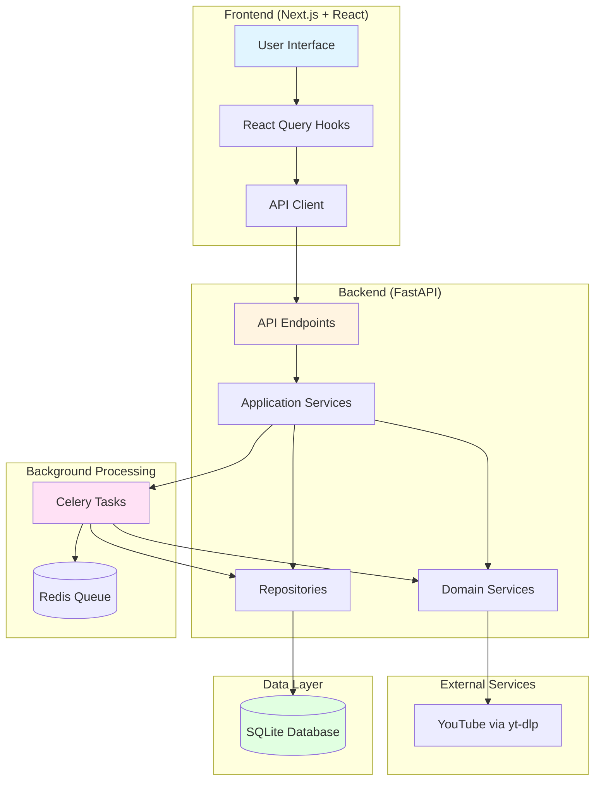

### Clean Architecture Layers

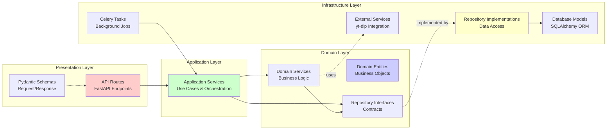

---

## Database Schema

### Entity Relationship Diagram

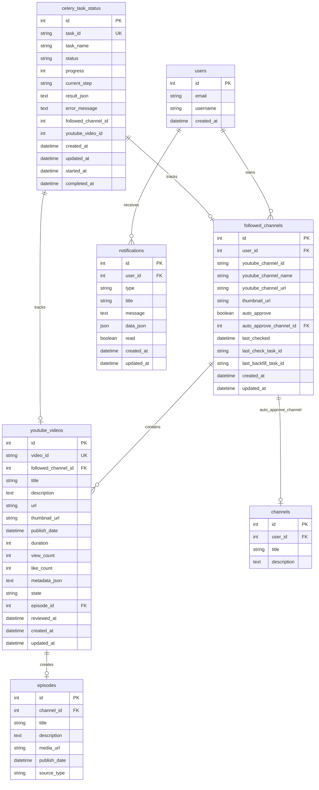

### Table Schemas

#### followed_channels

| Column                  | Type         | Constraints               | Description                             |
| ----------------------- | ------------ | ------------------------- | --------------------------------------- |
| id                      | INTEGER      | PRIMARY KEY               | Auto-increment ID                       |
| user_id                 | INTEGER      | NOT NULL, FK(users.id)    | Owner of the followed channel           |
| youtube_channel_id      | VARCHAR(255) | NOT NULL                  | YouTube channel ID (extracted from URL) |
| youtube_channel_name    | VARCHAR(255) | NOT NULL                  | Channel display name                    |
| youtube_channel_url     | VARCHAR(500) | NOT NULL                  | Original YouTube channel URL            |
| thumbnail_url           | VARCHAR(500) | NULL                      | Channel avatar/thumbnail                |
| auto_approve            | BOOLEAN      | DEFAULT FALSE             | Enable automatic episode creation       |
| auto_approve_channel_id | INTEGER      | NULL, FK(channels.id)     | Target podcast channel for auto-approve |
| last_checked            | DATETIME     | NULL                      | Last time checked for new videos        |
| last_check_task_id      | VARCHAR(255) | NULL                      | Celery task ID of last check            |
| last_backfill_task_id   | VARCHAR(255) | NULL                      | Celery task ID of last backfill         |
| created_at              | DATETIME     | DEFAULT CURRENT_TIMESTAMP | Record creation time                    |
| updated_at              | DATETIME     | DEFAULT CURRENT_TIMESTAMP | Last update time                        |

**Indexes:**

- `UNIQUE(youtube_channel_id, user_id)` - Prevent duplicate follows
- `INDEX(user_id)` - Query by user
- `INDEX(youtube_channel_id)` - Query by channel
- `INDEX(last_checked)` - Find channels needing check
- `INDEX(last_check_task_id)` - Task tracking
- `INDEX(last_backfill_task_id)` - Task tracking

#### youtube_videos

| Column              | Type         | Constraints                        | Description                      |
| ------------------- | ------------ | ---------------------------------- | -------------------------------- |
| id                  | INTEGER      | PRIMARY KEY                        | Auto-increment ID                |
| video_id            | VARCHAR(255) | UNIQUE, NOT NULL                   | YouTube video ID                 |
| followed_channel_id | INTEGER      | NOT NULL, FK(followed_channels.id) | Parent followed channel          |
| title               | VARCHAR(500) | NOT NULL                           | Video title                      |
| description         | TEXT         | NULL                               | Video description                |
| url                 | VARCHAR(500) | NOT NULL                           | YouTube video URL                |
| thumbnail_url       | VARCHAR(500) | NULL                               | Video thumbnail                  |
| publish_date        | DATETIME     | NOT NULL                           | Original publish date on YouTube |
| duration            | INTEGER      | NULL                               | Duration in seconds              |
| view_count          | INTEGER      | NULL                               | View count at discovery time     |
| like_count          | INTEGER      | NULL                               | Like count at discovery time     |
| comment_count       | INTEGER      | NULL                               | Comment count                    |
| metadata_json       | TEXT         | NULL                               | Full yt-dlp metadata as JSON     |
| state               | VARCHAR(50)  | DEFAULT 'pending_review'           | Video workflow state             |
| episode_id          | INTEGER      | NULL, FK(episodes.id)              | Created episode (if any)         |
| reviewed_at         | DATETIME     | NULL                               | When marked as reviewed          |
| created_at          | DATETIME     | DEFAULT CURRENT_TIMESTAMP          | Discovery time                   |
| updated_at          | DATETIME     | DEFAULT CURRENT_TIMESTAMP          | Last update time                 |

**States:** `pending_review`, `reviewed`, `queued`, `downloading`, `episode_created`, `discarded`

**Indexes:**

- `UNIQUE(video_id)` - Prevent duplicates
- `INDEX(followed_channel_id)` - Query by channel
- `INDEX(state)` - Filter by state
- `INDEX(publish_date)` - Sort by date
- `INDEX(followed_channel_id, state)` - Combined filter
- `INDEX(episode_id)` - Link to episodes

#### celery_task_status

| Column              | Type         | Constraints               | Description                   |
| ------------------- | ------------ | ------------------------- | ----------------------------- |
| id                  | INTEGER      | PRIMARY KEY               | Auto-increment ID             |
| task_id             | VARCHAR(255) | UNIQUE, NOT NULL          | Celery task UUID              |
| task_name           | VARCHAR(255) | NOT NULL                  | Human-readable task name      |
| status              | VARCHAR(50)  | DEFAULT 'PENDING'         | Task status                   |
| progress            | INTEGER      | DEFAULT 0                 | Progress percentage (0-100)   |
| current_step        | VARCHAR(255) | NULL                      | Current operation description |
| result_json         | TEXT         | NULL                      | Task result (for SUCCESS)     |
| error_message       | TEXT         | NULL                      | Error details (for FAILURE)   |
| followed_channel_id | INTEGER      | NULL                      | Related followed channel      |
| youtube_video_id    | INTEGER      | NULL                      | Related YouTube video         |
| created_at          | DATETIME     | DEFAULT CURRENT_TIMESTAMP | Task creation time            |
| updated_at          | DATETIME     | DEFAULT CURRENT_TIMESTAMP | Last update time              |
| started_at          | DATETIME     | NULL                      | When task started processing  |
| completed_at        | DATETIME     | NULL                      | When task finished            |

**Statuses:** `PENDING`, `STARTED`, `PROGRESS`, `SUCCESS`, `FAILURE`, `RETRY`

**Indexes:**

- `INDEX(task_id)` - Query by task ID
- `INDEX(status)` - Filter by status
- `INDEX(followed_channel_id)` - Related channel tasks
- `INDEX(youtube_video_id)` - Related video tasks
- `INDEX(created_at)` - Sort by creation time

#### notifications

| Column     | Type         | Constraints               | Description            |
| ---------- | ------------ | ------------------------- | ---------------------- |
| id         | INTEGER      | PRIMARY KEY               | Auto-increment ID      |
| user_id    | INTEGER      | NOT NULL, FK(users.id)    | Notification recipient |
| type       | VARCHAR(50)  | NOT NULL                  | Notification type      |
| title      | VARCHAR(255) | NOT NULL                  | Notification title     |
| message    | TEXT         | NOT NULL                  | Notification message   |
| data_json  | JSON         | NULL                      | Structured data        |
| read       | BOOLEAN      | DEFAULT FALSE             | Read status            |
| created_at | DATETIME     | DEFAULT CURRENT_TIMESTAMP | Creation time          |
| updated_at | DATETIME     | DEFAULT CURRENT_TIMESTAMP | Last update time       |

**Types:** `video_discovered`, `episode_created`, `channel_search_started`, `channel_search_completed`, `channel_search_error`

**Indexes:**

- `INDEX(user_id, read, created_at)` - Unread queries
- `INDEX(user_id, created_at)` - User timeline

---

## API Endpoints

### Followed Channels API Sequence

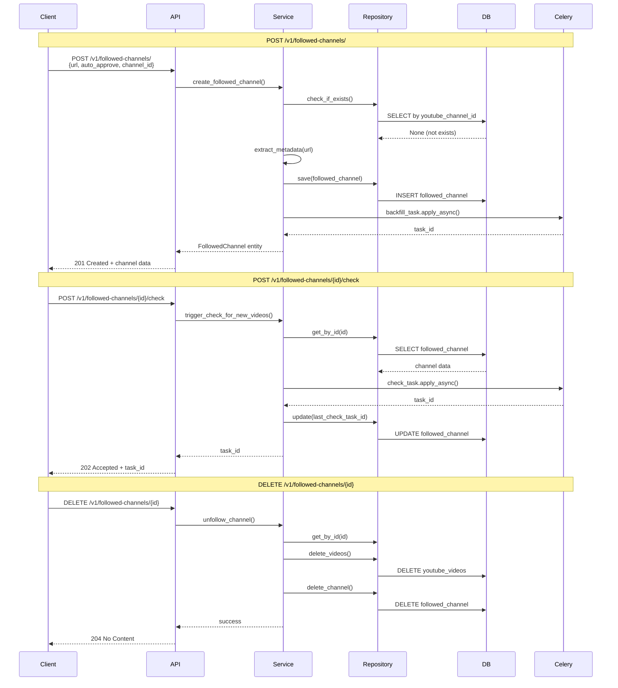

### API Endpoint Summary

| Method | Endpoint                                 | Description                           | Status Code    |
| ------ | ---------------------------------------- | ------------------------------------- | -------------- |
| POST   | `/v1/followed-channels/`                 | Follow a new YouTube channel          | 201 Created    |
| GET    | `/v1/followed-channels/`                 | List all followed channels for user   | 200 OK         |
| GET    | `/v1/followed-channels/{id}`             | Get specific followed channel         | 200 OK         |
| PUT    | `/v1/followed-channels/{id}`             | Update auto-approve settings          | 200 OK         |
| DELETE | `/v1/followed-channels/{id}`             | Unfollow channel                      | 204 No Content |
| POST   | `/v1/followed-channels/{id}/check`       | Trigger check for new videos (yt-dlp) | 202 Accepted   |
| POST   | `/v1/followed-channels/{id}/check-rss`   | Trigger check using RSS feed (fast)   | 202 Accepted   |
| POST   | `/v1/followed-channels/{id}/backfill`    | Backfill historical videos            | 202 Accepted   |
| GET    | `/v1/youtube-videos/`                    | List discovered videos (with filters) | 200 OK         |
| GET    | `/v1/youtube-videos/{id}`                | Get specific video                    | 200 OK         |
| POST   | `/v1/youtube-videos/{id}/review`         | Mark video as reviewed                | 200 OK         |
| POST   | `/v1/youtube-videos/{id}/discard`        | Mark video as discarded               | 200 OK         |
| POST   | `/v1/youtube-videos/{id}/create-episode` | Create episode from video             | 202 Accepted   |
| GET    | `/v1/notifications/`                     | List user notifications               | 200 OK         |
| GET    | `/v1/notifications/unread-count`         | Get unread notification count         | 200 OK         |
| POST   | `/v1/notifications/{id}/read`            | Mark notification as read             | 200 OK         |
| POST   | `/v1/notifications/mark-all-read`        | Mark all as read                      | 200 OK         |
| DELETE | `/v1/notifications/{id}`                 | Delete notification                   | 204 No Content |

---

## Backend Architecture

### Clean Architecture Implementation

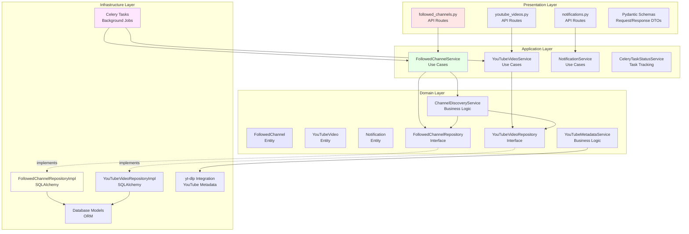

### Service Layer Responsibilities

#### Application Services (Use Cases)

**FollowedChannelService**

- `create_followed_channel()` - Follow a new YouTube channel
- `get_followed_channels()` - List all followed channels for user
- `get_followed_channel()` - Get single channel details
- `update_followed_channel()` - Update auto-approve settings
- `delete_followed_channel()` - Unfollow channel
- `trigger_check_for_new_videos()` - Queue check task
- `trigger_backfill()` - Queue backfill task

**YouTubeVideoService**

- `get_youtube_videos()` - List videos with filters
- `get_youtube_video()` - Get single video
- `mark_video_reviewed()` - Review a video
- `discard_video()` - Discard a video
- `create_episode_from_video()` - Queue episode creation
- `get_video_stats()` - Get stats by channel

**NotificationService**

- `create_notification()` - Create new notification
- `get_user_notifications()` - List notifications
- `get_unread_count()` - Count unread
- `mark_as_read()` - Mark notification read
- `mark_all_as_read()` - Mark all read
- `delete_notification()` - Delete notification

#### Domain Services (Business Logic)

**VideoDiscoveryStrategy (Interface)**

- `discover_new_videos()` - Find new videos from YouTube channel using specific strategy

**YouTubeMetadataService (Interface)**

- `extract_channel_metadata()` - Get channel info from URL
- `extract_video_metadata()` - Get video info from URL
- `list_channel_videos()` - List videos from channel

**Implementations** (Infrastructure Layer)

- `YtdlpDiscoveryStrategy` - Discovery using yt-dlp channel listing
- `RSSDiscoveryStrategy` - Discovery using YouTube RSS feeds
- `YouTubeMetadataServiceImpl` - Uses yt-dlp for metadata extraction
- `YouTubeRSSService` - Fetches and parses YouTube Atom RSS feeds

---

## Frontend Architecture

### Component Hierarchy

```mermaid
graph TB
    subgraph "Pages (App Router)"
        ChannelsPage[/subscriptions/channels/page.tsx<br/>Followed Channels Page]
        VideosPage[/subscriptions/videos/page.tsx<br/>Discovered Videos Page]
    end

    subgraph "Feature Components"
        FollowModal[follow-channel-modal.tsx<br/>Follow Channel Form]
        ChannelsList[followed-channels-list.tsx<br/>Channel Cards Grid]
        VideosList[video-list.tsx<br/>Video Cards Grid]
        VideoCard[youtube-video-card.tsx<br/>Individual Video Card]
        NotifBell[notification-bell.tsx<br/>Notification Icon + Dropdown]
    end

    subgraph "React Query Hooks"
        Hook1[useFollowedChannels<br/>List, Create, Update, Delete]
        Hook2[useYouTubeVideos<br/>List, Review, Discard]
        Hook3[useNotifications<br/>List, Mark Read]
        Hook4[useTaskStatus<br/>Poll Task Progress]
    end

    subgraph "API Client"
        APIClient[lib/api.ts<br/>HTTP Client with Auth]
    end

    ChannelsPage --> FollowModal
    ChannelsPage --> ChannelsList
    VideosPage --> VideosList
    VideosList --> VideoCard
    FollowModal --> Hook1
    ChannelsList --> Hook1
    ChannelsList --> Hook4
    VideosList --> Hook2
    VideoCard --> Hook2
    NotifBell --> Hook3
    Hook1 --> APIClient
    Hook2 --> APIClient
    Hook3 --> APIClient
    Hook4 --> APIClient

    style ChannelsPage fill:#e1f5ff
    style FollowModal fill:#ffe1f5
    style Hook1 fill:#fff4e1
    style APIClient fill:#e1ffe1
```

### React Query Hooks

#### useFollowedChannels.ts

```typescript
// Query hooks
useFollowedChannels() → GET /v1/followed-channels/
useFollowedChannel(id) → GET /v1/followed-channels/{id}

// Mutation hooks
useFollowChannel() → POST /v1/followed-channels/
useUpdateFollowedChannel() → PUT /v1/followed-channels/{id}
useUnfollowChannel() → DELETE /v1/followed-channels/{id}
useTriggerCheck() → POST /v1/followed-channels/{id}/check (yt-dlp method)
useTriggerCheckRss() → POST /v1/followed-channels/{id}/check-rss (RSS method)
useBackfillChannel() → POST /v1/followed-channels/{id}/backfill
```

#### useYouTubeVideos.ts

```typescript
// Query hooks
useYouTubeVideos(filters) → GET /v1/youtube-videos/
useYouTubeVideo(id) → GET /v1/youtube-videos/{id}

// Mutation hooks
useMarkVideoReviewed() → POST /v1/youtube-videos/{id}/review
useDiscardVideo() → POST /v1/youtube-videos/{id}/discard
useCreateEpisodeFromVideo() → POST /v1/youtube-videos/{id}/create-episode
```

#### useNotifications.ts

```typescript
// Query hooks
useNotifications() → GET /v1/notifications/
useUnreadCount() → GET /v1/notifications/unread-count

// Mutation hooks
useMarkNotificationRead() → POST /v1/notifications/{id}/read
useMarkAllRead() → POST /v1/notifications/mark-all-read
useDeleteNotification() → DELETE /v1/notifications/{id}
```

#### useTaskStatus.ts

```typescript
// Polling hook
useTaskStatus(taskId, options) → GET /v1/celery-tasks/{taskId}
// Auto-polls every 2 seconds while task is running
```

---

## Celery Task Workflows

### Task 1: Check for New Videos

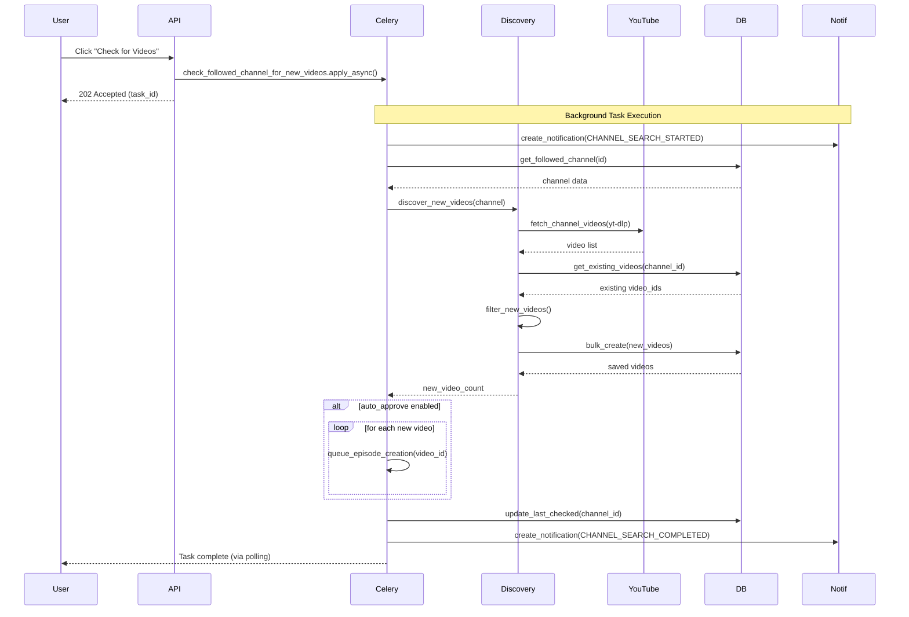

**File:** `backend/app/infrastructure/tasks/channel_check_tasks.py`

**Function:** `check_followed_channel_for_new_videos(followed_channel_id: int, user_id: int)`

**Steps:**

1. Create "search started" notification
2. Get followed channel from database
3. Call `discovery_service.discover_new_videos(channel)`
   - Fetches videos using yt-dlp
   - Compares with existing videos
   - Creates new YouTubeVideo entities
4. If auto_approve: Queue episode creation for each video
5. Update `last_checked` timestamp
6. Create "search completed" notification
7. Return video count

**Error Handling:**

- Autoretry on ConnectionError/TimeoutError (max 3 retries)
- Exponential backoff (60s, 120s, 600s)
- Creates "search error" notification on failure

### Task 2: Backfill Channel Videos

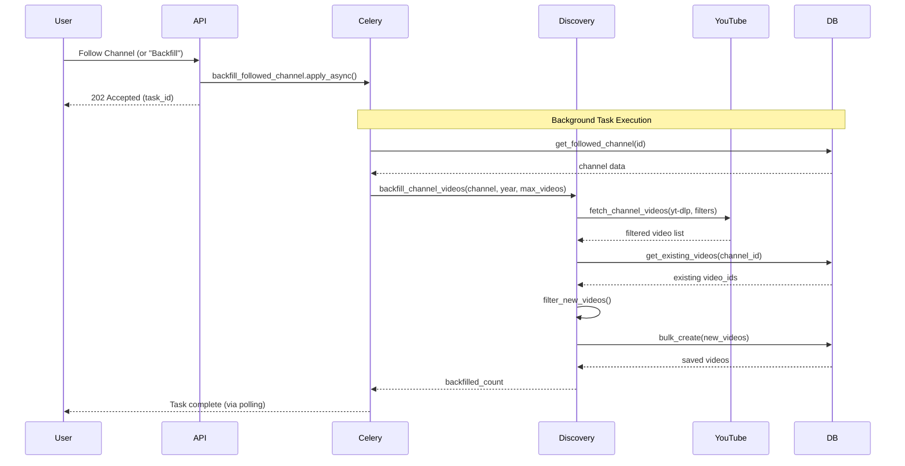

**File:** `backend/app/infrastructure/tasks/backfill_channel_task.py`

**Function:** `backfill_followed_channel(followed_channel_id: int, year: int, max_videos: int)`

**Steps:**

1. Get followed channel from database
2. Call `discovery_service.backfill_channel_videos(channel, year, max_videos)`
   - Fetches videos from specified year (or all if None)
   - Limits to max_videos count
   - Creates YouTubeVideo entities
3. Return count of videos backfilled

**Default Behavior:**

- On initial follow: Backfill last 20 videos from current year
- Manual trigger: Can specify year and max_videos

### Task 3: Create Episode from Video

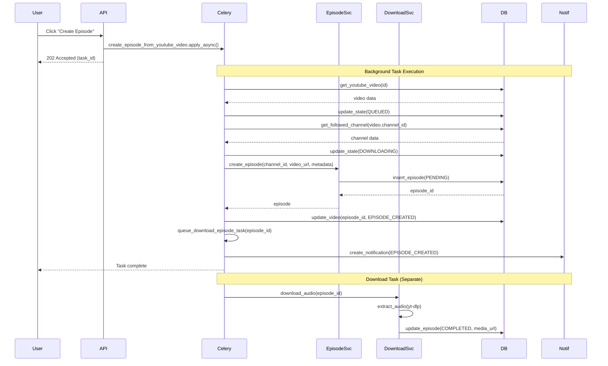

**File:** `backend/app/infrastructure/tasks/create_episode_from_video_task.py`

**Function:** `create_episode_from_youtube_video(youtube_video_id: int, channel_id: int, user_id: int)`

**Steps:**

1. Get YouTubeVideo from database
2. Update state: PENDING_REVIEW/REVIEWED → QUEUED
3. Get FollowedChannel for metadata
4. Update state: QUEUED → DOWNLOADING
5. Create Episode entity with video metadata
6. Save episode (PENDING state)
7. Update YouTubeVideo: link episode_id, state = EPISODE_CREATED
8. Queue `download_episode_task` for audio extraction
9. Create "episode created" notification

**State Flow:**

```
YouTubeVideo: PENDING_REVIEW → QUEUED → DOWNLOADING → EPISODE_CREATED
Episode: PENDING → (download task) → COMPLETED
```

---

## Data Flow Diagrams

### Complete Follow Channel Workflow

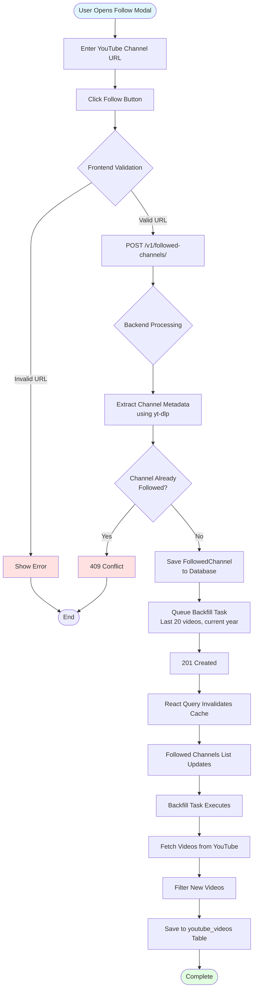

### Check for New Videos Workflow

```mermaid
flowchart TD
    Start([User Clicks Check]) --> Trigger[POST /v1/followed-channels/{id}/check]
    Trigger --> QueueTask[Queue Celery Task]
    QueueTask --> Return[202 Accepted + task_id]
    Return --> Poll[Frontend Polls Task Status]

    QueueTask --> TaskStart[Task Starts]
    TaskStart --> Notif1[Create SEARCH_STARTED<br/>Notification]
    Notif1 --> GetChannel[Get FollowedChannel<br/>from Database]
    GetChannel --> Discover[Call Discovery Service]
    Discover --> FetchYT[Fetch Videos from YouTube<br/>using yt-dlp]
    FetchYT --> GetExisting[Get Existing Videos<br/>from Database]
    GetExisting --> Compare[Compare video_ids]
    Compare --> NewVideos{New Videos<br/>Found?}

    NewVideos -->|Yes| SaveNew[Save New Videos<br/>to Database]
    NewVideos -->|No| UpdateTime1[Update last_checked]

    SaveNew --> AutoApprove{Auto-Approve<br/>Enabled?}
    AutoApprove -->|Yes| QueueEpisodes[Queue Episode Creation<br/>for Each Video]
    AutoApprove -->|No| UpdateTime2[Update last_checked]

    QueueEpisodes --> Notif2[Create SEARCH_COMPLETED<br/>Notification with count]
    UpdateTime1 --> Notif3[Create SEARCH_COMPLETED<br/>Notification 0 videos]
    UpdateTime2 --> Notif2

    Notif2 --> TaskDone[Task Status = SUCCESS]
    Notif3 --> TaskDone
    TaskDone --> PollUpdate[Frontend Detects Complete]
    PollUpdate --> Refresh[Refresh Video List]
    Refresh --> ShowNotif[Show Notification]
    ShowNotif --> Complete([Complete])

    Poll -.polls every 2s.-> TaskDone

    style Start fill:#e1f5ff
    style Complete fill:#e1ffe1
    style TaskStart fill:#fff4e1
```

### Auto-Approve Workflow

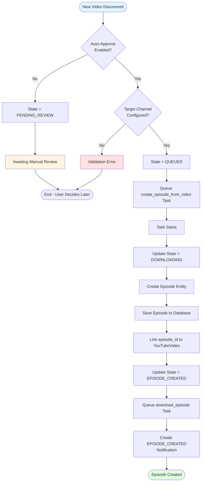

### Manual Review Workflow

```mermaid
flowchart TD
    Start([User Opens Videos List]) --> Filter[Filter by PENDING_REVIEW]
    Filter --> Display[Display Video Cards]
    Display --> UserAction{User Action}

    UserAction -->|Review| Review[POST /youtube-videos/{id}/review]
    UserAction -->|Discard| Discard[POST /youtube-videos/{id}/discard]
    UserAction -->|Create Episode| Create[POST /youtube-videos/{id}/create-episode]

    Review --> StateReview[Update State = REVIEWED]
    Discard --> StateDiscard[Update State = DISCARDED]

    StateReview --> EndReview[Video Marked for Later]
    StateDiscard --> EndDiscard[Video Ignored]

    Create --> StateQueue[Update State = QUEUED]
    StateQueue --> PromptChannel{Target Channel<br/>Selected?}
    PromptChannel -->|No| ShowPrompt[Show Channel Selector]
    ShowPrompt --> SelectChannel[User Selects Channel]
    SelectChannel --> QueueTask[Queue Episode Creation]
    PromptChannel -->|Yes| QueueTask

    QueueTask --> TaskExec[Task Creates Episode]
    TaskExec --> Download[Task Queues Download]
    Download --> Notif[Notification Created]
    Notif --> Complete([Episode Created])

    EndReview --> End([End])
    EndDiscard --> End

    style Start fill:#e1f5ff
    style Complete fill:#e1ffe1
```

---

## State Machines

### YouTubeVideo State Machine

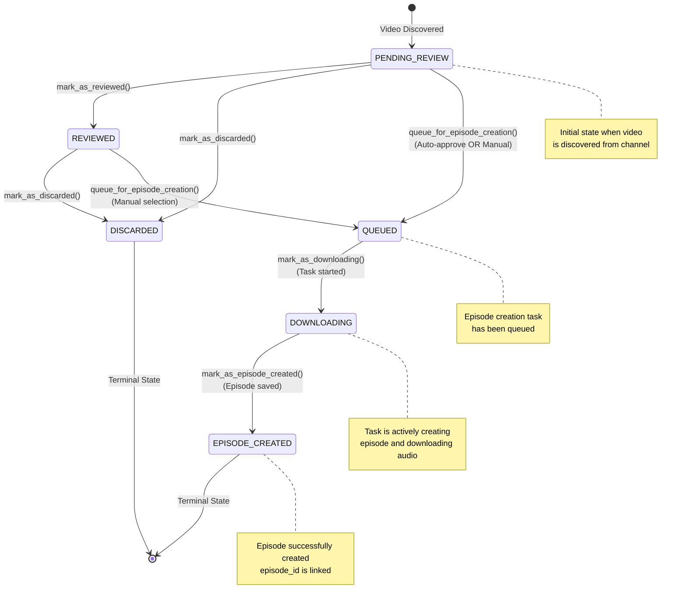

### State Transition Rules

| From State     | To State        | Method                         | Conditions               | Side Effects               |
| -------------- | --------------- | ------------------------------ | ------------------------ | -------------------------- |
| PENDING_REVIEW | REVIEWED        | `mark_as_reviewed()`           | None                     | Sets reviewed_at timestamp |
| PENDING_REVIEW | DISCARDED       | `mark_as_discarded()`          | None                     | Terminal state             |
| PENDING_REVIEW | QUEUED          | `queue_for_episode_creation()` | Target channel specified | Queues Celery task         |
| REVIEWED       | DISCARDED       | `mark_as_discarded()`          | None                     | Terminal state             |
| REVIEWED       | QUEUED          | `queue_for_episode_creation()` | Target channel specified | Queues Celery task         |
| QUEUED         | DOWNLOADING     | `mark_as_downloading()`        | Task started             | None                       |
| DOWNLOADING    | EPISODE_CREATED | `mark_as_episode_created()`    | Episode saved            | Links episode_id           |

**Invalid Transitions** (will raise `InvalidStateTransitionError`):

- Cannot go from DISCARDED to any state
- Cannot go from EPISODE_CREATED to any state
- Cannot skip states (e.g., PENDING_REVIEW → DOWNLOADING)

### FollowedChannel Lifecycle

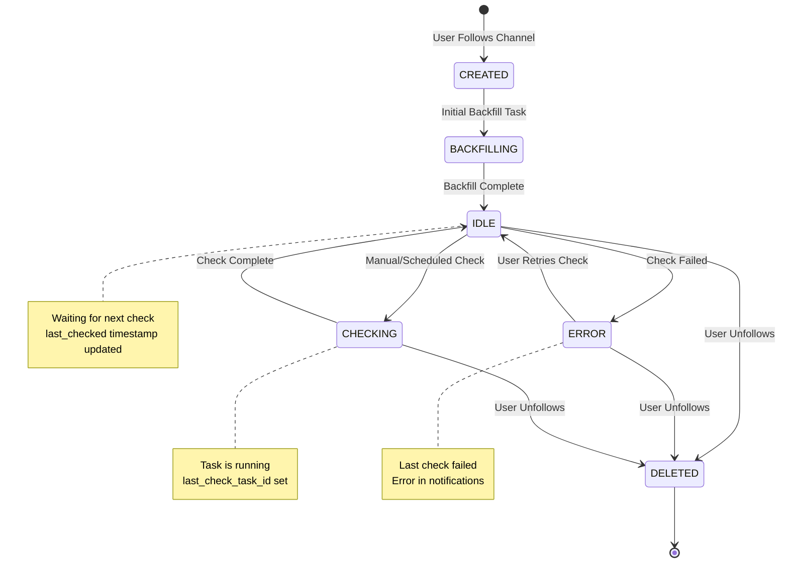

### CeleryTaskStatus State Machine

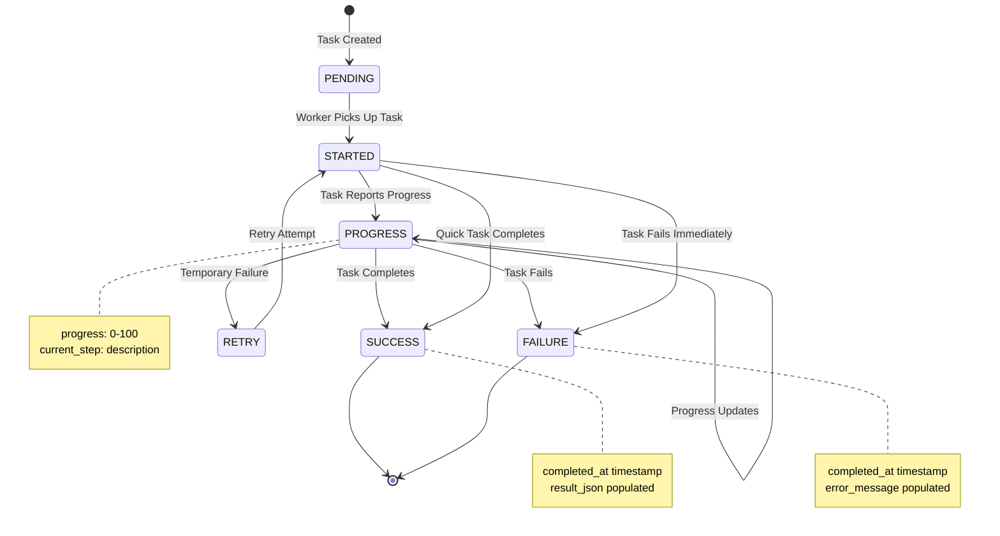

---

## Critical Files Reference

### Backend Files

#### Domain Layer

| File                                                                                                                                   | Purpose                                    |
| -------------------------------------------------------------------------------------------------------------------------------------- | ------------------------------------------ |
| [backend/app/domain/entities/followed_channel.py](../../backend/app/domain/entities/followed_channel.py)                               | FollowedChannel entity with business logic |
| [backend/app/domain/entities/youtube_video.py](../../backend/app/domain/entities/youtube_video.py)                                     | YouTubeVideo entity with state machine     |
| [backend/app/domain/entities/notification.py](../../backend/app/domain/entities/notification.py)                                       | Notification entity                        |
| [backend/app/domain/entities/celery_task_status.py](../../backend/app/domain/entities/celery_task_status.py)                           | Task status entity                         |
| [backend/app/domain/repositories/followed_channel_repository.py](../../backend/app/domain/repositories/followed_channel_repository.py) | Repository interface                       |
| [backend/app/domain/repositories/youtube_video_repository.py](../../backend/app/domain/repositories/youtube_video_repository.py)       | Repository interface                       |
| [backend/app/domain/services/video_discovery_strategy.py](../../backend/app/domain/services/video_discovery_strategy.py)               | Video discovery strategy interface         |
| [backend/app/domain/services/youtube_metadata_service.py](../../backend/app/domain/services/youtube_metadata_service.py)               | Metadata service interface                 |

#### Application Layer

| File                                                                                                                                   | Purpose                         |
| -------------------------------------------------------------------------------------------------------------------------------------- | ------------------------------- |
| [backend/app/application/services/followed_channel_service.py](../../backend/app/application/services/followed_channel_service.py)     | Use cases for followed channels |
| [backend/app/application/services/youtube_video_service.py](../../backend/app/application/services/youtube_video_service.py)           | Use cases for YouTube videos    |
| [backend/app/application/services/notification_service.py](../../backend/app/application/services/notification_service.py)             | Use cases for notifications     |
| [backend/app/application/services/celery_task_status_service.py](../../backend/app/application/services/celery_task_status_service.py) | Use cases for task tracking     |

#### Infrastructure Layer

| File                                                                                                                                                                 | Purpose                              |
| -------------------------------------------------------------------------------------------------------------------------------------------------------------------- | ------------------------------------ |
| [backend/app/infrastructure/database/models/followed_channel.py](../../backend/app/infrastructure/database/models/followed_channel.py)                               | SQLAlchemy model                     |
| [backend/app/infrastructure/database/models/youtube_video.py](../../backend/app/infrastructure/database/models/youtube_video.py)                                     | SQLAlchemy model                     |
| [backend/app/infrastructure/database/models/notification.py](../../backend/app/infrastructure/database/models/notification.py)                                       | SQLAlchemy model                     |
| [backend/app/infrastructure/database/models/celery_task_status.py](../../backend/app/infrastructure/database/models/celery_task_status.py)                           | SQLAlchemy model                     |
| [backend/app/infrastructure/repositories/followed_channel_repository_impl.py](../../backend/app/infrastructure/repositories/followed_channel_repository_impl.py)     | Repository implementation            |
| [backend/app/infrastructure/repositories/youtube_video_repository_impl.py](../../backend/app/infrastructure/repositories/youtube_video_repository_impl.py)           | Repository implementation            |
| [backend/app/infrastructure/repositories/notification_repository_impl.py](../../backend/app/infrastructure/repositories/notification_repository_impl.py)             | Repository implementation            |
| [backend/app/infrastructure/repositories/celery_task_status_repository_impl.py](../../backend/app/infrastructure/repositories/celery_task_status_repository_impl.py) | Repository implementation            |
| [backend/app/infrastructure/services/ytdlp_discovery_strategy.py](../../backend/app/infrastructure/services/ytdlp_discovery_strategy.py)                             | yt-dlp discovery strategy            |
| [backend/app/infrastructure/services/rss_discovery_strategy.py](../../backend/app/infrastructure/services/rss_discovery_strategy.py)                                 | RSS feed discovery strategy          |
| [backend/app/infrastructure/services/youtube_rss_service.py](../../backend/app/infrastructure/services/youtube_rss_service.py)                                       | YouTube RSS feed fetcher/parser      |
| [backend/app/infrastructure/services/youtube_metadata_service_impl.py](../../backend/app/infrastructure/services/youtube_metadata_service_impl.py)                   | Metadata service using yt-dlp        |
| [backend/app/infrastructure/tasks/channel_check_tasks.py](../../backend/app/infrastructure/tasks/channel_check_tasks.py)                                             | Check for new videos (yt-dlp method) |
| [backend/app/infrastructure/tasks/channel_check_rss_tasks.py](../../backend/app/infrastructure/tasks/channel_check_rss_tasks.py)                                     | Check for new videos (RSS method)    |
| [backend/app/infrastructure/tasks/backfill_channel_task.py](../../backend/app/infrastructure/tasks/backfill_channel_task.py)                                         | Backfill historical videos task      |
| [backend/app/infrastructure/tasks/create_episode_from_video_task.py](../../backend/app/infrastructure/tasks/create_episode_from_video_task.py)                       | Create episode task                  |

#### Presentation Layer

| File                                                                                                                                   | Purpose                          |
| -------------------------------------------------------------------------------------------------------------------------------------- | -------------------------------- |
| [backend/app/presentation/api/v1/followed_channels.py](../../backend/app/presentation/api/v1/followed_channels.py)                     | API routes for followed channels |
| [backend/app/presentation/api/v1/youtube_videos.py](../../backend/app/presentation/api/v1/youtube_videos.py)                           | API routes for YouTube videos    |
| [backend/app/presentation/api/v1/notifications.py](../../backend/app/presentation/api/v1/notifications.py)                             | API routes for notifications     |
| [backend/app/presentation/api/v1/celery_tasks.py](../../backend/app/presentation/api/v1/celery_tasks.py)                               | API routes for task status       |
| [backend/app/presentation/schemas/followed_channel_schemas.py](../../backend/app/presentation/schemas/followed_channel_schemas.py)     | Pydantic schemas                 |
| [backend/app/presentation/schemas/youtube_video_schemas.py](../../backend/app/presentation/schemas/youtube_video_schemas.py)           | Pydantic schemas                 |
| [backend/app/presentation/schemas/notification_schemas.py](../../backend/app/presentation/schemas/notification_schemas.py)             | Pydantic schemas                 |
| [backend/app/presentation/schemas/celery_task_status_schemas.py](../../backend/app/presentation/schemas/celery_task_status_schemas.py) | Pydantic schemas                 |

### Frontend Files

| File                                                                                                                                                         | Purpose                             |
| ------------------------------------------------------------------------------------------------------------------------------------------------------------ | ----------------------------------- |
| [frontend/src/app/subscriptions/channels/page.tsx](../../frontend/src/app/subscriptions/channels/page.tsx)                                                   | Followed channels page              |
| [frontend/src/app/subscriptions/videos/page.tsx](../../frontend/src/app/subscriptions/videos/page.tsx)                                                       | Discovered videos page              |
| [frontend/src/components/features/subscriptions/follow-channel-modal.tsx](../../frontend/src/components/features/subscriptions/follow-channel-modal.tsx)     | Follow channel form modal           |
| [frontend/src/components/features/subscriptions/followed-channels-list.tsx](../../frontend/src/components/features/subscriptions/followed-channels-list.tsx) | Channel cards grid                  |
| [frontend/src/components/features/subscriptions/video-list.tsx](../../frontend/src/components/features/subscriptions/video-list.tsx)                         | Video cards grid                    |
| [frontend/src/components/features/subscriptions/youtube-video-card.tsx](../../frontend/src/components/features/subscriptions/youtube-video-card.tsx)         | Individual video card               |
| [frontend/src/components/layout/notification-bell.tsx](../../frontend/src/components/layout/notification-bell.tsx)                                           | Notification dropdown               |
| [frontend/src/hooks/use-followed-channels.ts](../../frontend/src/hooks/use-followed-channels.ts)                                                             | React Query hooks for channels      |
| [frontend/src/hooks/use-youtube-videos.ts](../../frontend/src/hooks/use-youtube-videos.ts)                                                                   | React Query hooks for videos        |
| [frontend/src/hooks/use-notifications.ts](../../frontend/src/hooks/use-notifications.ts)                                                                     | React Query hooks for notifications |
| [frontend/src/hooks/use-task-status.ts](../../frontend/src/hooks/use-task-status.ts)                                                                         | React Query polling hook            |

---

## Architecture Principles

### Clean Architecture Benefits Observed

1. **Separation of Concerns**

   - Domain logic independent of frameworks (FastAPI, SQLAlchemy)
   - Business rules in domain entities
   - Infrastructure details abstracted

2. **Dependency Inversion**

   - Application layer depends on repository interfaces
   - Infrastructure implements interfaces
   - Easy to swap implementations (e.g., different database)

3. **Testability**

   - Domain entities can be tested in isolation
   - Services can be tested with mock repositories
   - Clear boundaries for unit tests

4. **Maintainability**
   - Changes to database don't affect domain logic
   - Changes to external APIs (yt-dlp) isolated to infrastructure
   - Clear file organization

### Design Patterns Used

1. **Repository Pattern**

   - Abstract data access
   - Interface in domain, implementation in infrastructure
   - Supports unit testing with mocks

2. **Service Layer Pattern**

   - Application services coordinate use cases
   - Domain services encapsulate business logic
   - Clear separation of responsibilities

3. **Strategy Pattern**

   - `VideoDiscoveryStrategy` interface with multiple implementations
   - `YtdlpDiscoveryStrategy` for comprehensive channel scans
   - `RSSDiscoveryStrategy` for fast recent video checks
   - Allows adding new discovery methods (YouTube API v3, webhooks, etc.)
   - No coupling between strategies - independent workflows

4. **State Pattern**

   - YouTubeVideo state machine
   - Invalid transitions prevented
   - State-specific behaviors

5. **Observer Pattern (via Notifications)**

   - Events trigger notifications
   - Decoupled notification creation
   - Users informed of background task results

6. **Background Job Pattern**
   - Long-running tasks offloaded to Celery
   - Non-blocking API responses
   - Progress tracking via task status

---

## Summary

This feature demonstrates a well-architected system following Clean Architecture principles with:

- **Clear layer separation** (Presentation → Application → Domain → Infrastructure)
- **Domain-driven design** (Entities with business logic, state machines)
- **Robust task orchestration** (Celery for background jobs, status tracking)
- **User-centric notifications** (Real-time feedback on discoveries and operations)
- **External service abstraction** (yt-dlp integration isolated in infrastructure)
- **Scalable frontend** (React Query for caching, polling, mutations)

The architecture supports future enhancements while maintaining code quality and testability.

---

**End of Document**
