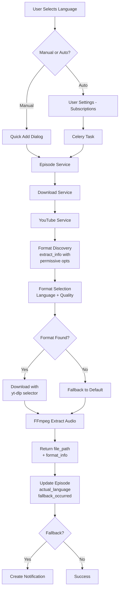

# Custom Language Audio Download Feature

## Overview

This feature enables users to download YouTube videos with audio tracks in languages other than the default/original language. It supports both manual video additions (via the "Quick Add" dialog) and automatic downloads from channel subscriptions.

**Status:** ✅ Implemented and Working (February 2026)

---

## Table of Contents

1. [Architecture Overview](#architecture-overview)
2. [How YouTube Serves Multi-Language Audio](#how-youtube-serves-multi-language-audio)
3. [The Root Cause of Previous Failures](#the-root-cause-of-previous-failures)
4. [The Solution](#the-solution)
5. [Format Discovery Process](#format-discovery-process)
6. [Format Selection Strategy](#format-selection-strategy)
7. [Implementation Details](#implementation-details)
8. [User Workflows](#user-workflows)
9. [Testing & Verification](#testing--verification)
10. [Troubleshooting](#troubleshooting)

---

## Architecture Overview



---

## How YouTube Serves Multi-Language Audio

### Audio Format Types

YouTube provides audio in two distinct format categories:

#### 1. DASH Audio-Only Formats
- **Protocol:** `https`
- **Codec:** `mp4a` (AAC) or `opus` (WebM)
- **Characteristics:**
  - Pure audio streams with no video component
  - Typically only available in the **original language**
  - Format IDs: `139`, `140`, `249`, `251`, etc.
  - Bitrate-based quality: 48kbps (low), 128kbps (medium), 160kbps (high)

**Example:**
```
139   m4a   audio only   https   mp4a.40.5   49k   [en] English original (default), low
140   m4a   audio only   https   mp4a.40.2  129k   [en] English original (default), medium
```

#### 2. HLS Muxed Formats (Multi-Language Dubbed Audio)
- **Protocol:** `m3u8` / `m3u8_native`
- **Codec:** `avc1` (H.264 video) + `mp4a` (AAC audio)
- **Characteristics:**
  - Combined video+audio streams
  - **This is where dubbed multi-language audio lives**
  - Format IDs: `91-X`, `92-X`, `93-X`, `94-X`, `95-X`, `96-X` (where X is the language index)
  - Resolution-based quality: 144p, 240p, 360p, 480p, 720p, 1080p

**Example:**
```
91-1   mp4   256x144   m3u8   avc1.4D400C   mp4a.40.5   [es]
92-1   mp4   426x240   m3u8   avc1.4D4015   mp4a.40.5   [es]
93-12  mp4   640x360   m3u8   avc1.4D401E   mp4a.40.2   [es]
94-12  mp4   854x480   m3u8   avc1.4D401E   mp4a.40.2   [es]
```

### Key Insight

**Multi-language dubbed audio tracks are ONLY available in HLS muxed formats.** You cannot get Spanish, French, German, etc. audio from DASH audio-only streams. This is a YouTube platform limitation, not a yt-dlp limitation.

---

## The Root Cause of Previous Failures

### The Bugs

The system was explicitly configured to **skip HLS manifests**, making multi-language audio invisible to yt-dlp:

#### Bug 1: Skipping HLS Manifests
```python
# OLD (BROKEN) - in youtube_service.py
'extractor_args': {
    'youtube': {
        'player_client': ['android', 'web'],
        'skip': ['hls', 'dash']  # ❌ This skips ALL HLS formats!
    }
}
```

**Impact:** yt-dlp would discover only 5-10 formats (DASH audio-only + a few basic HTTPS formats), missing the 90+ HLS muxed formats that contain dubbed audio.

#### Bug 2: Restrictive Player Clients
```python
'player_client': ['android', 'web']  # ❌ Missing android_vr and web_safari
```

**Impact:** Even if HLS wasn't skipped, these clients don't expose all HLS manifests. The `android_vr` and `web_safari` clients are required for full format discovery.

#### Bug 3: Incorrect `remote_components` Format
```python
'remote_components': 'ejs:github'  # ❌ String instead of list
```

**Impact:** yt-dlp was iterating the string character-by-character, producing warnings like `Ignoring unsupported remote component(s): :, j, t, h, i, s, b, g, e, u`. The JS challenge solver never activated, causing "n challenge solving failed" errors.

#### Bug 4: Missing `extractor_args` in Custom Download Path
The custom-format download path (when user selects a specific language) was missing `extractor_args` entirely, falling back to yt-dlp's defaults which don't expose all HLS formats.

### Test Results

**Before Fix (Restrictive Config):**
```
Total formats discovered: 5
m3u8 protocol formats: 0
Languages found: ['en']
Spanish audio available: NO
```

**After Fix (Permissive Config):**
```
Total formats discovered: 121
m3u8 protocol formats: 90
Languages found: ['ar', 'de', 'en', 'es', 'fr', 'hi', 'id', 'it', 'ja', 'nl', 'pl', 'pt', 'ro', 'zh-Hans']
Spanish audio available: YES (6 HLS muxed formats)
```

---

## The Solution

### Permissive yt-dlp Configuration

```python
# CORRECT (WORKING) - in youtube_service.py
'extractor_args': {
    'youtube': {
        'player_client': ['android_vr', 'web', 'web_safari'],  # ✅ Full client coverage
        'skip': [],  # ✅ Don't skip ANY protocols
    }
},
'remote_components': ['ejs:github'],  # ✅ List format for JS challenge solver
```

### Applied in Three Locations

1. **Base `ydl_opts`** (line 66-74) - Used for default downloads
2. **`_extract_metadata_sync`** (line 164-175) - Used for metadata extraction
3. **Custom-format download path** (line 216-245) - Used when user selects specific language/quality

---

## Format Discovery Process

### Step 1: Extract All Formats

```python
def _extract_metadata_sync(self, url: str) -> Dict[str, Any]:
    opts = {
        'quiet': True,
        'no_warnings': True,
        'remote_components': ['ejs:github'],
        'extractor_args': {
            'youtube': {
                'player_client': ['android_vr', 'web', 'web_safari'],
                'skip': [],
            }
        },
    }
    with yt_dlp.YoutubeDL(opts) as ydl:
        return ydl.extract_info(url, download=False)
```

**What happens:**
1. yt-dlp queries YouTube using `android_vr`, `web`, and `web_safari` player clients
2. Deno-based JS challenge solver handles YouTube's anti-bot protections
3. HLS manifests are fetched and parsed
4. Returns 100+ formats including all language variants

### Step 2: Parse and Filter Formats

The `AudioFormatSelectionService._get_audio_formats()` method identifies audio formats:

```python
def _get_audio_formats(self, formats: List[Dict[str, Any]]) -> List[Dict[str, Any]]:
    for fmt in formats:
        vcodec = fmt.get('vcodec', '')
        acodec = fmt.get('acodec', '')
        language = fmt.get('language')
        protocol = fmt.get('protocol', '')
        
        # Three categories:
        # 1. DASH audio-only (vcodec=none, has acodec)
        if vcodec == 'none' and acodec and acodec != 'none':
            audio_formats.append(fmt)
        
        # 2. Explicitly marked "audio only"
        elif 'audio only' in format_note:
            audio_formats.append(fmt)
        
        # 3. HLS multi-language (has language tag + m3u8 protocol)
        elif language and protocol in ('m3u8', 'm3u8_native', 'https'):
            audio_formats.append(fmt)
            fmt['_requires_audio_extraction'] = True  # Flag for FFmpeg
```

---

## Format Selection Strategy

### Three-Tier Fallback Chain

The `AudioFormatSelectionService.build_format_selector()` creates a yt-dlp selector string:

```python
format_selector = (
    f'bestaudio[language^={lang}]/'          # Tier 1: DASH audio-only in language
    f'best[language^={lang}][height<=480]/'   # Tier 2: HLS muxed (low res) in language
    f'best[language^={lang}]/'                # Tier 3: HLS muxed (any res) in language
    + DEFAULT_FORMAT                           # Tier 4: Fallback to any language
)
```

**Example for Spanish (`es`):**
```
bestaudio[language^=es]/best[language^=es][height<=480]/best[language^=es]/bestaudio[ext=m4a]/bestaudio[ext=mp3]/bestaudio/best[height<=480]
```

### Selection Logic

1. **Tier 1 - DASH Audio-Only:** Try to find a Spanish DASH audio-only stream (rarely available for dubbed content)
2. **Tier 2 - HLS Muxed (Low Res):** Try to find a Spanish HLS muxed stream at 480p or lower (optimal bandwidth)
3. **Tier 3 - HLS Muxed (Any Res):** Try to find a Spanish HLS muxed stream at any resolution
4. **Tier 4 - Fallback:** Use the default format selector (best available audio in any language)

### Quality Bands

When user selects a quality tier, the selector is further refined:

| Quality Tier | DASH Audio Bitrate | HLS Muxed Resolution |
|--------------|-------------------|---------------------|
| Low          | 48-64 kbps        | 144p, 240p          |
| Medium       | 96-160 kbps       | 360p, 480p          |
| High         | 160-256 kbps      | 720p, 1080p+        |

---

## Implementation Details

### Data Flow

#### 1. Frontend → Backend

**Quick Add Dialog:**
```typescript
// frontend/src/components/features/episodes/quick-add-dialog.tsx
const handleSubmit = async () => {
  await episodesApi.create({
    channel_id: channelId,
    video_url: videoUrl,
    preferred_audio_language: useCustomLanguage ? selectedLanguage : null,
    preferred_audio_quality: useCustomLanguage ? selectedQuality : null,
    tags: tags
  });
};
```

**User Settings:**
```typescript
// frontend/src/components/features/settings/settings-interface.tsx
<Select
  value={settings.preferred_audio_language || 'default'}
  onValueChange={(value) => handleChange('preferred_audio_language', value === 'default' ? null : value)}
>
  <SelectItem value="default">Default (Original)</SelectItem>
  <SelectItem value="en">English</SelectItem>
  <SelectItem value="es">Spanish</SelectItem>
  {/* ... */}
</Select>
```

#### 2. Episode Service

```python
# backend/app/application/services/episode_service.py
async def create_episode_from_url(
    self,
    channel_id: int,
    video_url: str,
    preferred_audio_language: Optional[str] = None,
    preferred_audio_quality: Optional[str] = None,
    tags: Optional[List[str]] = None
) -> Episode:
    # Resolve preferences: provided > user setting > default
    final_language = preferred_audio_language or user_settings.preferred_audio_language
    final_quality = preferred_audio_quality or user_settings.preferred_audio_quality
    
    # Create episode entity
    episode = Episode.create_episode(
        # ...
        preferred_audio_language=final_language,
        requested_audio_quality=final_quality,
    )
```

#### 3. Download Service

```python
# backend/app/infrastructure/services/download_service.py
async def download_episode_audio(self, episode: Episode) -> Episode:
    file_path, format_info = await self.youtube_service.download_audio(
        url=episode.video_url,
        output_path=output_path,
        audio_language=episode.preferred_audio_language,
        audio_quality=episode.requested_audio_quality
    )
    
    # Update episode with actual results
    episode.actual_audio_language = format_info['actual_language']
    episode.actual_audio_quality = format_info['actual_quality']
    
    # Create notification if fallback occurred
    if format_info['fallback_occurred']:
        await self.notification_service.create_notification(
            user_id=episode.channel.user_id,
            type=NotificationType.LANGUAGE_FALLBACK,
            title="Audio Language Fallback",
            message=format_info['fallback_reason']
        )
```

#### 4. YouTube Service

```python
# backend/app/infrastructure/services/youtube_service.py
async def download_audio(
    self,
    url: str,
    audio_language: Optional[str] = None,
    audio_quality: Optional[str] = None
) -> tuple:
    # Build format selector
    format_selector, preferred_kbps = format_selection_service.build_format_selector(
        audio_language, audio_quality
    )
    
    # Configure download with permissive extractor_args
    download_opts = {
        'quiet': True,
        'no_warnings': True,
        'remote_components': ['ejs:github'],
        'format': format_selector,
        'extractor_args': {
            'youtube': {
                'player_client': ['android_vr', 'web', 'web_safari'],
                'skip': [],
            }
        },
        'postprocessors': [{
            'key': 'FFmpegExtractAudio',
            'preferredcodec': 'mp3',
            'preferredquality': preferred_kbps,
        }],
        # ...
    }
    
    # Download
    file_path, info = await loop.run_in_executor(
        None, self._download_audio_sync, url, download_opts
    )
    
    # Build format_info
    format_info = self._build_format_info(info, audio_language, audio_quality)
    
    return (file_path, format_info)
```

### Database Schema

```python
# Episode entity fields
class Episode:
    # User preferences (what they requested)
    preferred_audio_language: Optional[str]  # ISO 639-1 code (e.g., "es")
    requested_audio_quality: Optional[str]   # "low" | "medium" | "high"
    
    # Actual results (what was downloaded)
    actual_audio_language: Optional[str]     # ISO 639-1 code or None
    actual_audio_quality: Optional[str]      # "low" | "medium" | "high" or None
    
    # Metadata
    source_type: str  # "youtube" | "upload"
```

### FFmpeg Audio Extraction

When a HLS muxed format is selected, yt-dlp uses FFmpeg to extract the audio:

```python
'postprocessors': [{
    'key': 'FFmpegExtractAudio',
    'preferredcodec': 'mp3',
    'preferredquality': preferred_kbps,  # e.g., "192"
}]
```

**Process:**
1. yt-dlp downloads the muxed stream (video+audio container)
2. FFmpeg extracts the audio track: `ffmpeg -i input.mp4 -vn -acodec libmp3lame -q:a 2 output.mp3`
3. Original muxed file is deleted (`keepvideo: False`)
4. Final MP3 file is returned

---

## User Workflows

### Workflow 1: Manual Video Addition with Custom Language

1. User clicks "Add Episode" button
2. Quick Add Dialog opens
3. User pastes YouTube URL
4. User toggles "Use Custom Language" switch
5. User selects language (e.g., "Spanish") and quality (e.g., "Medium")
6. User clicks "Add Episode"
7. Backend:
   - Extracts metadata
   - Discovers 121 formats (including Spanish HLS muxed)
   - Selects `93-12` (360p Spanish muxed)
   - Downloads and extracts audio with FFmpeg
   - Updates episode: `actual_audio_language='es'`, `fallback_occurred=False`
8. Episode appears in list with Spanish audio

### Workflow 2: Automatic Download from Subscription

1. User goes to Settings → Subscriptions
2. User sets "Preferred Audio Language" to "Spanish"
3. User sets "Preferred Audio Quality" to "Medium"
4. User follows a YouTube channel
5. Celery beat scheduler triggers video discovery every 6 hours
6. New video found → Celery worker creates episode
7. Episode inherits user's language preference (`preferred_audio_language='es'`)
8. Download process same as Workflow 1
9. User receives notification if language not available (fallback to default)

### Workflow 3: Fallback to Default Language

1. User requests Japanese audio for a video that only has English
2. Backend:
   - Discovers formats (no Japanese found)
   - Logs: `"No format found with language 'ja', will use fallback"`
   - Downloads best available audio (English)
   - Updates episode: `actual_audio_language='en'`, `fallback_occurred=True`
3. Notification created: "Audio Language Fallback: Requested language 'ja' but downloaded 'en'"
4. Episode appears with default language

---

## Testing & Verification

### Test Video

**URL:** `https://www.youtube.com/watch?v=zQ1POHiR8m8`  
**Title:** "Godfather of AI: We Have 2 Years Before Everything Changes!"  
**Available Languages:** ar, de, en, es, fr, hi, id, it, ja, nl, pl, pt, ro, zh-Hans

### Manual Test

```bash
cd backend
uv run python -c "
import asyncio
from app.infrastructure.services.youtube_service import YouTubeService

async def test():
    service = YouTubeService()
    file_path, format_info = await service.download_audio(
        url='https://www.youtube.com/watch?v=zQ1POHiR8m8',
        audio_language='es',
        audio_quality='medium'
    )
    print(f'File: {file_path}')
    print(f'Language: {format_info[\"actual_language\"]}')
    print(f'Fallback: {format_info[\"fallback_occurred\"]}')

asyncio.run(test())
"
```

**Expected Output:**
```
File: /path/to/backend/temp/downloads/zQ1POHiR8m8.mp3
Language: es
Fallback: False
```

### Verification Checklist

- [ ] Spanish audio file plays correctly
- [ ] File metadata shows Spanish language tag
- [ ] Episode database record: `actual_audio_language='es'`
- [ ] No fallback notification created
- [ ] Logs show: `"[DOWNLOAD] Complete for URL: ..., format_id=93-12, actual_language=es, fallback=False"`

---

## Troubleshooting

### Issue: "No formats discovered" or "Only 5 formats found"

**Cause:** yt-dlp is not using permissive `extractor_args`

**Fix:** Verify `youtube_service.py` has:
```python
'extractor_args': {
    'youtube': {
        'player_client': ['android_vr', 'web', 'web_safari'],
        'skip': [],
    }
}
```

### Issue: "n challenge solving failed" warnings

**Cause:** `remote_components` is a string instead of a list

**Fix:** Change `'ejs:github'` to `['ejs:github']`

### Issue: "Language 'XX' not available" but video has that language

**Cause:** HLS manifests are being skipped

**Fix:** Ensure `'skip': []` (empty list, not `['hls', 'dash']`)

### Issue: Downloaded audio is wrong language

**Cause:** Format selector is not matching language correctly

**Fix:** Check logs for `[FORMAT_SELECTOR] Built selector for language='XX'` and verify the selector string includes `bestaudio[language^=XX]`

### Issue: FFmpeg errors during extraction

**Cause:** FFmpeg not installed or not in PATH

**Fix:**
```bash
# macOS
brew install ffmpeg

# Ubuntu/Debian
sudo apt install ffmpeg

# Verify
ffmpeg -version
```

---

## Related Files

### Backend
- `backend/app/infrastructure/services/youtube_service.py` - Core yt-dlp integration
- `backend/app/infrastructure/services/audio_format_selection_service.py` - Format selection logic
- `backend/app/infrastructure/services/download_service.py` - Download orchestration
- `backend/app/application/services/episode_service.py` - Episode creation
- `backend/app/domain/entities/episode.py` - Episode entity with language fields

### Frontend
- `frontend/src/components/features/episodes/quick-add-dialog.tsx` - Manual video addition UI
- `frontend/src/components/features/settings/settings-interface.tsx` - User settings UI
- `frontend/src/lib/api.ts` - API client
- `frontend/src/types/index.ts` - TypeScript types

### Documentation
- `docs/tasks/task-0078-FEATURE-custom-language-audio.md` - Feature specification
- `docs/tasks/task-0078-FEATURE-custom-language-audio-full-session-3.md` - Implementation session notes

---

## References

- [yt-dlp Documentation](https://github.com/yt-dlp/yt-dlp)
- [yt-dlp Extractor Args](https://github.com/yt-dlp/yt-dlp#extractor-arguments)
- [yt-dlp Format Selection](https://github.com/yt-dlp/yt-dlp#format-selection)
- [yt-dlp PO Token Guide](https://github.com/yt-dlp/yt-dlp/wiki/PO-Token-Guide)
- [yt-dlp EJS (JS Challenge Solver)](https://github.com/yt-dlp/yt-dlp/wiki/EJS)
- [Reference Implementation](https://github.com/oliverbarreto/ytdlp-custom-audio-downloader)

---

**Last Updated:** February 23, 2026  
**Status:** ✅ Production Ready
