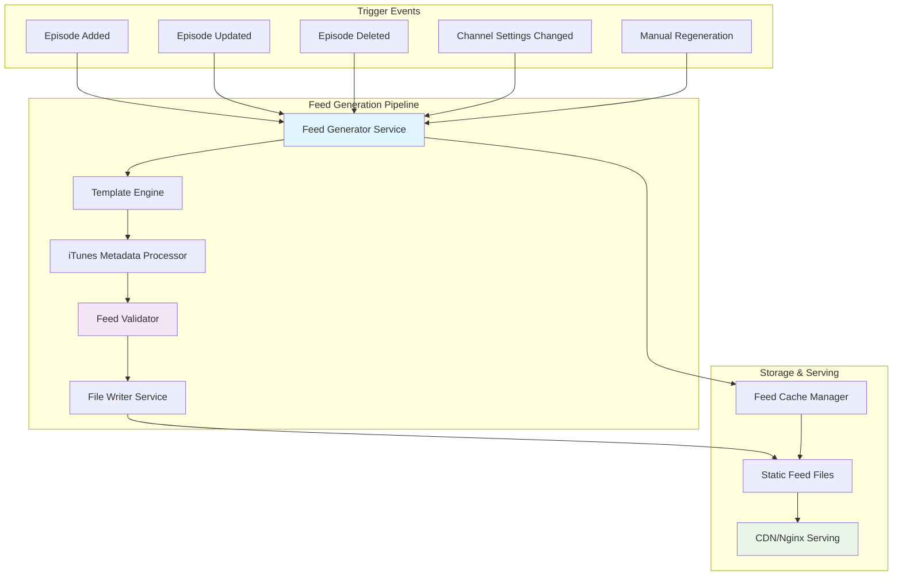
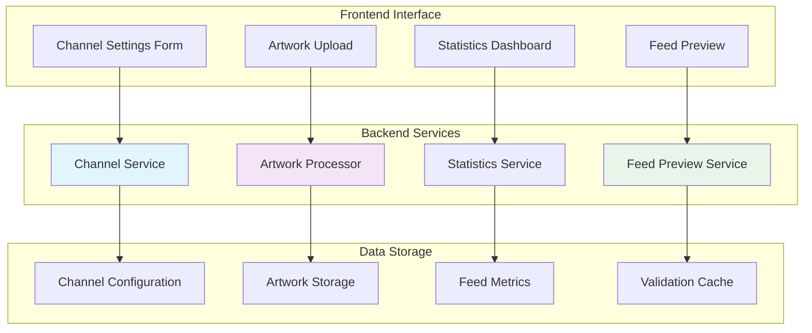

# LabCastARR - Phase 3 Implementation Plan v1.0
## RSS Feed & Channel Management System

**Phase Duration:** Weeks 5-6  
**Status:** ✅ **COMPLETED**  
**Dependencies:** Phase 2 Complete ✅  
**Last Updated:** September 9, 2025

---

## Table of Contents
- [Phase Overview](#phase-overview)
- [Technical Architecture](#technical-architecture)
- [Milestone 3.1: Core RSS Feed Generation](#milestone-31-core-rss-feed-generation)
- [Milestone 3.2: Advanced Channel Management](#milestone-32-advanced-channel-management)
- [API Specifications](#api-specifications)
- [Component Specifications](#component-specifications)
- [Database Schema Updates](#database-schema-updates)
- [Testing Strategy](#testing-strategy)
- [Risk Assessment](#risk-assessment)
- [Success Criteria](#success-criteria)

---

## Phase Overview

### Objectives
Phase 3 transforms LabCastARR from an episode management system into a full podcast platform by implementing RSS feed generation and comprehensive channel management capabilities. This phase enables podcast consumption through major platforms like Spotify, Apple Podcasts, and other podcast clients.

### Key Deliverables
1. **RSS Feed Generation System** - Standards-compliant podcast feeds
2. **Channel Management Interface** - Complete channel configuration
3. **Feed Serving Infrastructure** - Public RSS endpoints with CDN support
4. **iTunes/Spotify Integration** - Platform-specific metadata support
5. **Channel Statistics** - Feed analytics and usage metrics
6. **Feed Validation System** - Ensure feed compliance and quality

### Success Metrics
- RSS feeds validate against iTunes Podcast Specifications
- Feeds are consumable by Spotify and Apple Podcasts
- Channel settings persist and sync with feed generation
- Public RSS endpoints serve feeds without authentication
- Feed updates trigger automatically on episode changes

---

## Technical Architecture

### RSS Feed Generation Flow


### Channel Management Architecture


---

## Milestone 3.1: Core RSS Feed Generation

### Epic 3.1.1: RSS Feed Generation Engine

#### Task 3.1.1.1: PodGen Integration and Configuration
**Priority:** High  
**Effort:** 2 days  
**Dependencies:** None

**Subtasks:**
- [x] Install and configure PodGen library in backend
- [x] Create RSS feed template structure
- [x] Implement basic feed metadata mapping
- [x] Set up feed generation configuration
- [x] Create feed output directory structure

**Technical Requirements:**
```python
# Required PodGen configuration
class FeedConfig:
    title: str
    description: str
    website: str
    language: str = "en"
    category: str
    subcategory: Optional[str]
    explicit: bool = False
    author_name: str
    author_email: str
    owner_name: str
    owner_email: str
    image_url: Optional[str]
    
# Feed generation service interface
class FeedGenerationService:
    async def generate_feed(self, channel_id: int) -> FeedResult
    async def validate_feed(self, feed_content: str) -> ValidationResult
    async def publish_feed(self, channel_id: int, feed_content: str) -> bool
```

**Acceptance Criteria:**
- [x] PodGen library successfully integrated
- [x] Basic RSS feed structure generates without errors
- [x] Feed includes required iTunes metadata fields
- [x] Configuration supports all standard podcast categories

#### Task 3.1.1.2: Feed Generation Service Implementation
**Priority:** High  
**Effort:** 3 days  
**Dependencies:** Task 3.1.1.1

**Subtasks:**
- [x] Create `FeedGenerationService` with full business logic
- [x] Implement episode-to-RSS item conversion
- [x] Add iTunes-specific metadata fields
- [x] Create feed template rendering engine
- [x] Implement feed file output management

**Technical Specifications:**
```python
# app/application/services/feed_generation_service.py
class FeedGenerationService:
    def __init__(
        self,
        channel_repository: ChannelRepository,
        episode_repository: EpisodeRepository,
        file_service: FileService
    ):
        self.channel_repo = channel_repository
        self.episode_repo = episode_repository
        self.file_service = file_service
    
    async def generate_channel_feed(self, channel_id: int) -> FeedGenerationResult:
        """Generate complete RSS feed for channel"""
        # 1. Fetch channel configuration
        # 2. Fetch all completed episodes
        # 3. Generate iTunes-compatible RSS
        # 4. Validate feed structure
        # 5. Write to static file location
        # 6. Update feed metadata
        
    async def get_feed_episodes(self, channel_id: int) -> List[Episode]:
        """Get episodes suitable for feed inclusion"""
        return await self.episode_repo.find_by_channel(
            channel_id, 
            status="completed",
            limit=100,
            order_by="publication_date"
        )
```

**Feed Template Structure:**
```xml
<?xml version="1.0" encoding="UTF-8"?>
<rss version="2.0" 
     xmlns:itunes="http://www.itunes.com/dtds/podcast-1.0.dtd"
     xmlns:content="http://purl.org/rss/1.0/modules/content/"
     xmlns:atom="http://www.w3.org/2005/Atom">
  <channel>
    <title>{{ channel.name }}</title>
    <description>{{ channel.description }}</description>
    <link>{{ channel.website_url }}</link>
    <language>{{ channel.language }}</language>
    <copyright>© {{ current_year }} {{ channel.owner_name }}</copyright>
    
    <!-- iTunes-specific fields -->
    <itunes:title>{{ channel.name }}</itunes:title>
    <itunes:subtitle>{{ channel.subtitle }}</itunes:subtitle>
    <itunes:summary>{{ channel.description }}</itunes:summary>
    <itunes:author>{{ channel.author_name }}</itunes:author>
    <itunes:owner>
      <itunes:name>{{ channel.owner_name }}</itunes:name>
      <itunes:email>{{ channel.owner_email }}</itunes:email>
    </itunes:owner>
    <itunes:image href="{{ channel.image_url }}" />
    <itunes:category text="{{ channel.category }}">
      <itunes:category text="{{ channel.subcategory }}" />
    </itunes:category>
    <itunes:explicit>{{ channel.explicit_content|yesno }}</itunes:explicit>
    
    <!-- Episodes -->
    
    <item>
      <title>{{ episode.title }}</title>
      <description>{{ episode.description }}</description>
      <pubDate>{{ episode.publication_date|rfc2822 }}</pubDate>
      <enclosure url="{{ episode.audio_url }}" 
                 length="{{ episode.file_size }}" 
                 type="audio/mpeg" />
      <guid isPermaLink="false">{{ episode.guid }}</guid>
      
      <itunes:title>{{ episode.title }}</itunes:title>
      <itunes:summary>{{ episode.description|truncate:4000 }}</itunes:summary>
      <itunes:duration>{{ episode.duration|format_duration }}</itunes:duration>
      <itunes:image href="{{ episode.thumbnail_url }}" />
    </item>
    
  </channel>
</rss>
```

**Acceptance Criteria:**
- [x] Service generates valid RSS 2.0 XML
- [x] All iTunes-required fields are populated
- [x] Episodes include proper enclosure URLs
- [x] Feed validates against W3C RSS validator
- [x] Generated feeds are under 10MB (iTunes limit)

#### Task 3.1.1.3: Automatic Feed Updates System
**Priority:** High  
**Effort:** 2 days  
**Dependencies:** Task 3.1.1.2

**Subtasks:**
- [x] Create feed update event system
- [x] Implement background feed regeneration
- [x] Add feed update triggers for episode changes
- [x] Create feed update queue management
- [x] Implement feed update status tracking

**Event-Driven Updates:**
```python
# app/domain/events/feed_events.py
class FeedUpdateEvent:
    channel_id: int
    trigger_type: str  # "episode_added", "episode_updated", "settings_changed"
    triggered_by: Optional[int]  # episode_id if applicable
    priority: int = 1  # 1=high, 2=medium, 3=low

# app/application/services/feed_update_service.py
class FeedUpdateService:
    async def handle_episode_created(self, episode: Episode):
        """Trigger feed update when episode is created"""
        await self.queue_feed_update(
            episode.channel_id, 
            "episode_added",
            triggered_by=episode.id
        )
    
    async def handle_episode_status_changed(self, episode: Episode, old_status: str):
        """Update feed when episode status changes to completed"""
        if episode.status == "completed" and old_status != "completed":
            await self.queue_feed_update(episode.channel_id, "episode_completed")
    
    async def queue_feed_update(self, channel_id: int, trigger_type: str, priority: int = 1):
        """Queue feed update for background processing"""
        event = FeedUpdateEvent(
            channel_id=channel_id,
            trigger_type=trigger_type,
            priority=priority
        )
        await self.background_tasks.add_task(self.process_feed_update, event)
```

**Acceptance Criteria:**
- [x] Feed updates trigger automatically on episode changes
- [x] Feed updates trigger on channel settings changes
- [x] Background processing doesn't block API responses
- [x] Feed update queue prevents duplicate regenerations
- [x] Failed updates have retry mechanism

#### Task 3.1.1.4: Feed Serving and Caching Infrastructure
**Priority:** High  
**Effort:** 2 days  
**Dependencies:** Task 3.1.1.3

**Subtasks:**
- [x] Create public feed serving endpoints
- [x] Implement feed caching strategy
- [x] Add proper HTTP headers for podcast clients
- [x] Set up static file serving for feeds
- [x] Implement feed ETag support for caching

**API Endpoints:**
```python
# app/presentation/api/feeds.py
@router.get("/feeds/{channel_id}/feed.xml", response_class=Response)
async def serve_channel_feed(
    channel_id: int,
    request: Request,
    feed_service: FeedService = Depends(get_feed_service)
):
    """Serve RSS feed for channel (public endpoint)"""
    
    # Check if feed exists and is current
    feed_info = await feed_service.get_feed_info(channel_id)
    if not feed_info:
        raise HTTPException(status_code=404, detail="Feed not found")
    
    # Handle conditional requests (ETags)
    if_none_match = request.headers.get("if-none-match")
    if if_none_match == feed_info.etag:
        return Response(status_code=304)  # Not Modified
    
    # Serve feed with proper headers
    feed_content = await feed_service.get_feed_content(channel_id)
    
    return Response(
        content=feed_content,
        media_type="application/rss+xml",
        headers={
            "Cache-Control": "public, max-age=3600",
            "ETag": feed_info.etag,
            "Last-Modified": feed_info.last_modified.strftime("%a, %d %b %Y %H:%M:%S GMT")
        }
    )

@router.get("/feeds/{channel_id}/validate")
async def validate_feed(channel_id: int):
    """Validate feed compliance"""
    validation = await feed_service.validate_feed(channel_id)
    return validation
```

**HTTP Headers Configuration:**
```python
# Optimal headers for podcast clients
FEED_HEADERS = {
    "Content-Type": "application/rss+xml; charset=utf-8",
    "Cache-Control": "public, max-age=3600, stale-while-revalidate=86400",
    "X-Content-Type-Options": "nosniff",
    "Access-Control-Allow-Origin": "*",
    "Access-Control-Allow-Methods": "GET, HEAD, OPTIONS",
}
```

**Acceptance Criteria:**
- [x] Feed URLs are publicly accessible without authentication
- [x] Proper HTTP caching headers reduce server load
- [x] ETag support prevents unnecessary downloads
- [x] Feed URLs follow standard podcast URL patterns
- [x] Content-Type headers are correct for podcast clients

### Epic 3.1.2: iTunes and Platform Integration

#### Task 3.1.2.1: iTunes Podcast Specification Compliance
**Priority:** High  
**Effort:** 3 days  
**Dependencies:** Task 3.1.1.2

**Subtasks:**
- [x] Implement all required iTunes RSS tags
- [x] Add iTunes category and subcategory support
- [x] Create iTunes image specifications handling
- [x] Implement iTunes explicit content flags
- [x] Add iTunes podcast type support (episodic/serial)

**iTunes Required Fields:**
```python
# iTunes-specific metadata requirements
class iTunesMetadata:
    # Required Channel Fields
    title: str
    description: str  # max 4000 characters
    author: str
    owner_name: str
    owner_email: str
    image_url: str  # min 1400x1400, max 3000x3000
    category: str
    language: str
    explicit: bool
    
    # Optional Channel Fields
    subtitle: Optional[str]  # max 255 characters
    summary: Optional[str]   # max 4000 characters
    copyright: Optional[str]
    podcast_type: str = "episodic"  # or "serial"
    
    # Required Episode Fields
    episode_title: str
    episode_description: str
    episode_duration: str  # HH:MM:SS or MM:SS
    episode_pub_date: str  # RFC 2822 format
    
    # Episode GUID requirements
    guid: str  # unique and permanent
```

**iTunes Categories Implementation:**
```python
# app/domain/value_objects/podcast_category.py
class PodcastCategory:
    CATEGORIES = {
        "Arts": ["Books", "Design", "Fashion & Beauty", "Food", "Performing Arts", "Visual Arts"],
        "Business": ["Careers", "Entrepreneurship", "Investing", "Management", "Marketing", "Non-Profit"],
        "Comedy": ["Comedy Interviews", "Improv", "Stand-Up"],
        "Education": ["Courses", "How To", "Language Learning", "Self-Improvement"],
        "Fiction": ["Comedy Fiction", "Drama", "Science Fiction"],
        "Government": [],
        "History": [],
        "Health & Fitness": ["Alternative Health", "Fitness", "Medicine", "Mental Health", "Nutrition", "Sexuality"],
        "Kids & Family": ["Education for Kids", "Parenting", "Pets & Animals", "Stories for Kids"],
        "Leisure": ["Animation & Manga", "Automotive", "Aviation", "Crafts", "Games", "Hobbies", "Home & Garden", "Video Games"],
        "Music": ["Music Commentary", "Music History", "Music Interviews"],
        "News": ["Business News", "Daily News", "Entertainment News", "News Commentary", "Politics", "Sports News", "Tech News"],
        "Religion & Spirituality": ["Buddhism", "Christianity", "Hinduism", "Islam", "Judaism", "Religion", "Spirituality"],
        "Science": ["Astronomy", "Chemistry", "Earth Sciences", "Life Sciences", "Mathematics", "Natural Sciences", "Nature", "Physics", "Social Sciences"],
        "Society & Culture": ["Documentary", "Personal Journals", "Philosophy", "Places & Travel", "Relationships"],
        "Sports": ["Baseball", "Basketball", "Cricket", "Fantasy Sports", "Football", "Golf", "Hockey", "Rugby", "Running", "Soccer", "Swimming", "Tennis", "Volleyball", "Wilderness", "Wrestling"],
        "Technology": [],
        "True Crime": [],
        "TV & Film": ["After Shows", "Film History", "Film Interviews", "Film Reviews", "TV Reviews"]
    }
```

**Acceptance Criteria:**
- [x] All iTunes required fields are present in feed
- [x] Category and subcategory values are from iTunes approved list
- [x] Image URLs meet iTunes size requirements
- [x] Episode GUIDs are unique and permanent
- [x] Duration format matches iTunes specification

#### Task 3.1.2.2: Spotify Podcast Integration
**Priority:** Medium  
**Effort:** 2 days  
**Dependencies:** Task 3.1.2.1

**Subtasks:**
- [ ] Research Spotify-specific RSS requirements
- [ ] Implement Spotify Open Access Platform tags
- [ ] Add Spotify content warnings and ratings
- [ ] Create Spotify submission documentation
- [ ] Test feed validation with Spotify tools

**Spotify-Specific Enhancements:**
```xml
<!-- Spotify Open Access Platform additions -->
<spotify:countryOfOrigin>US</spotify:countryOfOrigin>
<spotify:limit>100</spotify:limit>
<spotify:rssUpdate>true</spotify:rssUpdate>

<!-- Episode-level Spotify tags -->
<spotify:contentRating>clean</spotify:contentRating>
<spotify:format>full</spotify:format>
```

**Acceptance Criteria:**
- [ ] Feed includes Spotify-recommended metadata
- [ ] Content ratings are properly set
- [ ] Feed validates with Spotify podcast tools
- [ ] Submission documentation is created

#### Task 3.1.2.3: Feed Validation and Quality Assurance
**Priority:** High  
**Effort:** 2 days  
**Dependencies:** Task 3.1.2.1

**Subtasks:**
- [x] Create RSS feed validator service
- [x] Implement iTunes-specific validation rules
- [x] Add W3C RSS validation integration
- [x] Create feed quality scoring system
- [x] Implement validation error reporting

**Feed Validation Service:**
```python
# app/application/services/feed_validation_service.py
class FeedValidationService:
    async def validate_feed(self, feed_content: str) -> ValidationResult:
        """Comprehensive feed validation"""
        errors = []
        warnings = []
        
        # XML Structure Validation
        xml_result = self._validate_xml_structure(feed_content)
        errors.extend(xml_result.errors)
        
        # RSS 2.0 Compliance
        rss_result = self._validate_rss_compliance(feed_content)
        errors.extend(rss_result.errors)
        
        # iTunes Specification Compliance
        itunes_result = self._validate_itunes_compliance(feed_content)
        warnings.extend(itunes_result.warnings)
        
        # Content Quality Checks
        quality_result = self._validate_content_quality(feed_content)
        warnings.extend(quality_result.warnings)
        
        return ValidationResult(
            is_valid=len(errors) == 0,
            errors=errors,
            warnings=warnings,
            score=self._calculate_quality_score(feed_content)
        )
    
    def _validate_itunes_compliance(self, feed_content: str) -> ValidationResult:
        """iTunes-specific validation rules"""
        soup = BeautifulSoup(feed_content, 'xml')
        errors = []
        
        # Required iTunes tags
        required_tags = ['itunes:title', 'itunes:author', 'itunes:owner', 'itunes:image']
        for tag in required_tags:
            if not soup.find(tag):
                errors.append(f"Missing required iTunes tag: {tag}")
        
        # Image size validation (external check)
        image_tag = soup.find('itunes:image')
        if image_tag:
            image_url = image_tag.get('href')
            image_validation = await self._validate_image_size(image_url)
            errors.extend(image_validation.errors)
        
        return ValidationResult(errors=errors)
```

**Quality Scoring System:**
- **RSS Compliance (40%):** Valid XML, required elements present
- **iTunes Compliance (30%):** All iTunes tags, proper formatting
- **Content Quality (20%):** Descriptions, episode count, consistency
- **Technical Quality (10%):** Image sizes, audio quality, file accessibility

**Acceptance Criteria:**
- [x] Validation catches all major RSS compliance issues
- [x] iTunes-specific validation rules are comprehensive
- [x] Quality scoring provides actionable feedback
- [x] Validation results include fix recommendations

---

## Milestone 3.2: Advanced Channel Management

### Epic 3.2.1: Channel Configuration System

#### Task 3.2.1.1: Channel Settings Backend Infrastructure
**Priority:** High  
**Effort:** 2 days  
**Dependencies:** Milestone 3.1 Complete

**Subtasks:**
- [x] Create `ChannelService` for configuration management
- [x] Implement channel settings repository
- [x] Add channel artwork storage system
- [x] Create channel validation service
- [x] Implement settings versioning and history

**Channel Service Implementation:**
```python
# app/application/services/channel_service.py
class ChannelService:
    def __init__(
        self,
        channel_repository: ChannelRepository,
        file_service: FileService,
        feed_service: FeedGenerationService
    ):
        self.channel_repo = channel_repository
        self.file_service = file_service
        self.feed_service = feed_service
    
    async def update_channel_settings(
        self, 
        channel_id: int, 
        settings: ChannelSettingsUpdate
    ) -> Channel:
        """Update channel configuration and trigger feed update"""
        
        # Validate settings
        validation = await self._validate_channel_settings(settings)
        if not validation.is_valid:
            raise ValidationError(validation.errors)
        
        # Update channel
        channel = await self.channel_repo.update(channel_id, settings.dict(exclude_unset=True))
        
        # Trigger feed regeneration
        await self.feed_service.queue_feed_update(
            channel_id, 
            trigger_type="settings_changed"
        )
        
        return channel
    
    async def upload_channel_artwork(
        self, 
        channel_id: int, 
        artwork_file: UploadFile
    ) -> str:
        """Process and store channel artwork"""
        
        # Validate image
        validation = await self._validate_artwork_file(artwork_file)
        if not validation.is_valid:
            raise ValidationError(validation.errors)
        
        # Process image (resize, optimize)
        processed_image = await self.file_service.process_channel_artwork(
            artwork_file, channel_id
        )
        
        # Update channel with new artwork URL
        artwork_url = await self.file_service.store_channel_artwork(
            processed_image, channel_id
        )
        
        await self.channel_repo.update(channel_id, {"image_url": artwork_url})
        
        return artwork_url
```

**Channel Settings Schema:**
```python
# app/presentation/schemas/channel_schemas.py
class ChannelSettingsUpdate(BaseModel):
    name: Optional[str] = Field(None, min_length=1, max_length=255)
    description: Optional[str] = Field(None, max_length=4000)
    website_url: Optional[HttpUrl] = None
    category: Optional[str] = None
    subcategory: Optional[str] = None
    language: Optional[str] = Field(None, regex="^[a-z]{2}(-[A-Z]{2})?$")
    explicit_content: Optional[bool] = None
    author_name: Optional[str] = Field(None, max_length=255)
    author_email: Optional[EmailStr] = None
    owner_name: Optional[str] = Field(None, max_length=255)
    owner_email: Optional[EmailStr] = None
    copyright: Optional[str] = Field(None, max_length=255)
    
    class Config:
        json_encoders = {HttpUrl: str}

class ChannelSettingsResponse(BaseModel):
    id: int
    name: str
    description: str
    website_url: Optional[str]
    image_url: Optional[str]
    category: str
    subcategory: Optional[str]
    language: str
    explicit_content: bool
    author_name: str
    author_email: str
    owner_name: str
    owner_email: str
    copyright: Optional[str]
    feed_url: str
    feed_last_updated: Optional[datetime]
    total_episodes: int
    feed_validation_score: Optional[float]
    
    @classmethod
    def from_entity(cls, channel: Channel) -> "ChannelSettingsResponse":
        return cls(
            id=channel.id,
            name=channel.name,
            description=channel.description,
            website_url=channel.website_url,
            image_url=channel.image_url,
            category=channel.category,
            subcategory=channel.subcategory,
            language=channel.language,
            explicit_content=channel.explicit_content,
            author_name=channel.author_name,
            author_email=channel.author_email,
            owner_name=channel.owner_name,
            owner_email=channel.owner_email,
            copyright=channel.copyright,
            feed_url=channel.feed_url,
            feed_last_updated=channel.feed_last_updated,
            total_episodes=len(channel.episodes) if channel.episodes else 0,
            feed_validation_score=channel.feed_validation_score
        )
```

**Acceptance Criteria:**
- [x] Channel settings can be updated individually
- [x] All iTunes-required fields have proper validation
- [x] Settings changes trigger automatic feed regeneration
- [x] Settings history is maintained for rollback capability
- [x] Validation errors provide clear guidance for fixes

#### Task 3.2.1.2: Channel Artwork Processing System
**Priority:** Medium  
**Effort:** 2 days  
**Dependencies:** Task 3.2.1.1

**Subtasks:**
- [ ] Create image upload and validation service
- [ ] Implement image processing and optimization
- [ ] Add multiple size generation for different platforms
- [ ] Create artwork storage and serving system
- [ ] Implement artwork URL management

**Artwork Processing Service:**
```python
# app/infrastructure/services/artwork_service.py
class ArtworkService:
    REQUIRED_SIZES = {
        "itunes_large": (3000, 3000),    # iTunes maximum
        "itunes_medium": (1400, 1400),   # iTunes minimum
        "spotify": (640, 640),           # Spotify recommended
        "thumbnail": (300, 300),         # UI thumbnails
    }
    
    async def process_channel_artwork(
        self, 
        artwork_file: UploadFile, 
        channel_id: int
    ) -> Dict[str, str]:
        """Process artwork into multiple sizes"""
        
        # Validate file
        await self._validate_artwork_file(artwork_file)
        
        # Load image
        image = Image.open(artwork_file.file)
        
        # Process each required size
        processed_images = {}
        for size_name, (width, height) in self.REQUIRED_SIZES.items():
            resized_image = await self._resize_and_optimize(image, width, height)
            
            # Generate filename
            filename = f"channel_{channel_id}_{size_name}.jpg"
            file_path = self.artwork_storage_path / filename
            
            # Save optimized image
            resized_image.save(
                file_path, 
                "JPEG", 
                quality=85, 
                optimize=True
            )
            
            processed_images[size_name] = str(file_path)
        
        return processed_images
    
    async def _validate_artwork_file(self, artwork_file: UploadFile):
        """Validate uploaded artwork meets requirements"""
        
        # File size check (max 10MB)
        if artwork_file.size > 10 * 1024 * 1024:
            raise ValidationError("Artwork file must be under 10MB")
        
        # File type check
        if artwork_file.content_type not in ["image/jpeg", "image/png"]:
            raise ValidationError("Artwork must be JPEG or PNG format")
        
        # Image dimensions check
        image = Image.open(artwork_file.file)
        width, height = image.size
        
        if width < 1400 or height < 1400:
            raise ValidationError("Artwork must be at least 1400x1400 pixels")
        
        if width != height:
            raise ValidationError("Artwork must be square (same width and height)")
        
        # Reset file position for later processing
        artwork_file.file.seek(0)
```

**Storage Structure:**
```
media/
├── channels/
│   ├── {channel_id}/
│   │   ├── artwork/
│   │   │   ├── channel_{id}_itunes_large.jpg
│   │   │   ├── channel_{id}_itunes_medium.jpg
│   │   │   ├── channel_{id}_spotify.jpg
│   │   │   └── channel_{id}_thumbnail.jpg
│   │   └── episodes/
│   │       ├── episode_{id}.mp3
│   │       └── ...
```

**Acceptance Criteria:**
- [ ] Artwork files are validated for iTunes requirements
- [ ] Multiple sizes are generated automatically
- [ ] Images are optimized for web delivery
- [ ] Old artwork is cleaned up when new artwork is uploaded
- [ ] Artwork URLs are updated in channel settings and RSS feeds

#### Task 3.2.1.3: Channel Statistics and Analytics
**Priority:** Medium  
**Effort:** 3 days  
**Dependencies:** Task 3.2.1.1

**Subtasks:**
- [ ] Create feed analytics tracking system
- [ ] Implement RSS feed access logging
- [ ] Add episode download statistics
- [ ] Create channel performance dashboard
- [ ] Implement feed subscriber estimation

**Analytics Service Implementation:**
```python
# app/application/services/channel_analytics_service.py
class ChannelAnalyticsService:
    def __init__(
        self,
        channel_repository: ChannelRepository,
        analytics_repository: AnalyticsRepository
    ):
        self.channel_repo = channel_repository
        self.analytics_repo = analytics_repository
    
    async def get_channel_statistics(self, channel_id: int) -> ChannelStatistics:
        """Get comprehensive channel statistics"""
        
        # Basic channel metrics
        channel = await self.channel_repo.find_by_id(channel_id)
        episodes = await self.episode_repo.find_by_channel(channel_id)
        
        # Feed access statistics (last 30 days)
        feed_stats = await self.analytics_repo.get_feed_access_stats(
            channel_id, 
            days=30
        )
        
        # Episode download statistics
        episode_stats = await self.analytics_repo.get_episode_download_stats(
            channel_id,
            days=30
        )
        
        return ChannelStatistics(
            channel_id=channel_id,
            total_episodes=len(episodes),
            total_duration_hours=sum(ep.duration_seconds for ep in episodes) / 3600,
            feed_requests_30days=feed_stats.total_requests,
            unique_subscribers_estimate=feed_stats.unique_ips,
            top_episodes=episode_stats.top_episodes[:5],
            growth_rate=await self._calculate_growth_rate(channel_id),
            feed_validation_score=channel.feed_validation_score,
            last_updated=datetime.utcnow()
        )
    
    async def track_feed_access(
        self, 
        channel_id: int, 
        user_agent: str, 
        ip_address: str,
        referer: Optional[str] = None
    ):
        """Track RSS feed access for analytics"""
        
        # Parse user agent for podcast client info
        client_info = self._parse_podcast_client(user_agent)
        
        access_event = FeedAccessEvent(
            channel_id=channel_id,
            ip_address=self._hash_ip(ip_address),  # Privacy-safe hashing
            user_agent=user_agent[:255],
            podcast_client=client_info.name,
            client_version=client_info.version,
            referer=referer,
            access_time=datetime.utcnow()
        )
        
        await self.analytics_repo.log_feed_access(access_event)
```

**Statistics Schema:**
```python
# app/presentation/schemas/analytics_schemas.py
class ChannelStatistics(BaseModel):
    channel_id: int
    total_episodes: int
    total_duration_hours: float
    feed_requests_30days: int
    unique_subscribers_estimate: int
    average_episode_duration: float
    most_popular_episode: Optional[EpisodeStats]
    recent_episodes: List[EpisodeStats]
    growth_metrics: GrowthMetrics
    platform_breakdown: Dict[str, int]  # podcast client breakdown
    feed_health: FeedHealthMetrics
    
class FeedHealthMetrics(BaseModel):
    validation_score: float
    last_validation: datetime
    error_count: int
    warning_count: int
    uptime_percentage: float
    average_response_time: float

class EpisodeStats(BaseModel):
    episode_id: int
    title: str
    download_count: int
    unique_listeners: int
    completion_rate: float
    publication_date: datetime
```

**Acceptance Criteria:**
- [ ] RSS feed access is tracked without exposing user privacy
- [ ] Statistics provide actionable insights for content creators
- [ ] Podcast client breakdown helps understand audience
- [ ] Growth metrics show channel performance trends
- [ ] Feed health monitoring alerts to potential issues

### Epic 3.2.2: Frontend Channel Management Interface

#### Task 3.2.2.1: Channel Settings Form and Interface
**Priority:** High  
**Effort:** 3 days  
**Dependencies:** Task 3.2.1.1

**Subtasks:**
- [x] Create channel settings page layout
- [x] Build comprehensive settings form component
- [x] Implement form validation with real-time feedback
- [x] Add category/subcategory selection interface
- [x] Create settings preview functionality

**Channel Settings Form Component:**
```typescript
// frontend/src/components/features/settings/channel-settings-form.tsx
interface ChannelSettingsFormProps {
  channelId: number;
  initialData?: ChannelSettings;
  onSave?: (settings: ChannelSettings) => void;
}

const ChannelSettingsForm: React.FC<ChannelSettingsFormProps> = ({
  channelId,
  initialData,
  onSave
}) => {
  const form = useForm<ChannelSettingsFormData>({
    resolver: zodResolver(channelSettingsSchema),
    defaultValues: initialData
  });

  const { mutate: updateSettings, isLoading } = useMutation({
    mutationFn: (data: ChannelSettingsUpdate) => 
      apiClient.updateChannelSettings(channelId, data),
    onSuccess: (updatedChannel) => {
      toast.success("Channel settings updated successfully");
      queryClient.invalidateQueries(['channel', channelId]);
      onSave?.(updatedChannel);
    },
    onError: (error) => {
      toast.error("Failed to update channel settings");
      console.error(error);
    }
  });

  return (
    <Form {...form}>
      <form onSubmit={form.handleSubmit(updateSettings)} className="space-y-6">
        {/* Basic Information Section */}
        <Card>
          <CardHeader>
            <CardTitle>Basic Information</CardTitle>
            <CardDescription>
              Essential information about your podcast channel
            </CardDescription>
          </CardHeader>
          <CardContent className="space-y-4">
            <FormField
              control={form.control}
              name="name"
              render={({ field }) => (
                <FormItem>
                  <FormLabel>Channel Name *</FormLabel>
                  <FormControl>
                    <Input 
                      placeholder="My Awesome Podcast" 
                      {...field}
                      maxLength={255}
                    />
                  </FormControl>
                  <FormDescription>
                    The name of your podcast as it will appear in podcast apps
                  </FormDescription>
                  <FormMessage />
                </FormItem>
              )}
            />
            
            <FormField
              control={form.control}
              name="description"
              render={({ field }) => (
                <FormItem>
                  <FormLabel>Description *</FormLabel>
                  <FormControl>
                    <Textarea 
                      placeholder="Tell listeners what your podcast is about..."
                      className="min-h-[120px]"
                      maxLength={4000}
                      {...field}
                    />
                  </FormControl>
                  <FormDescription>
                    A compelling description that explains what your podcast covers.
                    Maximum 4,000 characters for iTunes compatibility.
                  </FormDescription>
                  <FormMessage />
                </FormItem>
              )}
            />

            <FormField
              control={form.control}
              name="website_url"
              render={({ field }) => (
                <FormItem>
                  <FormLabel>Website URL</FormLabel>
                  <FormControl>
                    <Input 
                      type="url"
                      placeholder="https://example.com"
                      {...field}
                    />
                  </FormControl>
                  <FormDescription>
                    Your podcast's website or homepage
                  </FormDescription>
                  <FormMessage />
                </FormItem>
              )}
            />
          </CardContent>
        </Card>

        {/* Category Selection */}
        <Card>
          <CardHeader>
            <CardTitle>Category & Classification</CardTitle>
            <CardDescription>
              Help listeners find your podcast in the right category
            </CardDescription>
          </CardHeader>
          <CardContent className="space-y-4">
            <div className="grid grid-cols-1 md:grid-cols-2 gap-4">
              <FormField
                control={form.control}
                name="category"
                render={({ field }) => (
                  <FormItem>
                    <FormLabel>Primary Category *</FormLabel>
                    <Select onValueChange={field.onChange} value={field.value}>
                      <FormControl>
                        <SelectTrigger>
                          <SelectValue placeholder="Select a category" />
                        </SelectTrigger>
                      </FormControl>
                      <SelectContent>
                        {Object.keys(PODCAST_CATEGORIES).map((category) => (
                          <SelectItem key={category} value={category}>
                            {category}
                          </SelectItem>
                        ))}
                      </SelectContent>
                    </Select>
                    <FormMessage />
                  </FormItem>
                )}
              />

              <FormField
                control={form.control}
                name="subcategory"
                render={({ field }) => (
                  <FormItem>
                    <FormLabel>Subcategory</FormLabel>
                    <Select 
                      onValueChange={field.onChange} 
                      value={field.value}
                      disabled={!selectedCategory}
                    >
                      <FormControl>
                        <SelectTrigger>
                          <SelectValue placeholder="Select a subcategory" />
                        </SelectTrigger>
                      </FormControl>
                      <SelectContent>
                        {selectedCategory && PODCAST_CATEGORIES[selectedCategory].map((subcategory) => (
                          <SelectItem key={subcategory} value={subcategory}>
                            {subcategory}
                          </SelectItem>
                        ))}
                      </SelectContent>
                    </Select>
                    <FormMessage />
                  </FormItem>
                )}
              />
            </div>
          </CardContent>
        </Card>

        {/* Author Information */}
        <Card>
          <CardHeader>
            <CardTitle>Author & Owner Information</CardTitle>
            <CardDescription>
              Required for iTunes and other podcast platforms
            </CardDescription>
          </CardHeader>
          <CardContent className="space-y-4">
            <div className="grid grid-cols-1 md:grid-cols-2 gap-4">
              <FormField
                control={form.control}
                name="author_name"
                render={({ field }) => (
                  <FormItem>
                    <FormLabel>Author Name *</FormLabel>
                    <FormControl>
                      <Input {...field} placeholder="John Doe" />
                    </FormControl>
                    <FormMessage />
                  </FormItem>
                )}
              />

              <FormField
                control={form.control}
                name="author_email"
                render={({ field }) => (
                  <FormItem>
                    <FormLabel>Author Email *</FormLabel>
                    <FormControl>
                      <Input 
                        type="email"
                        {...field} 
                        placeholder="author@example.com" 
                      />
                    </FormControl>
                    <FormMessage />
                  </FormItem>
                )}
              />
            </div>
          </CardContent>
        </Card>

        {/* Advanced Settings */}
        <Card>
          <CardHeader>
            <CardTitle>Advanced Settings</CardTitle>
          </CardHeader>
          <CardContent className="space-y-4">
            <FormField
              control={form.control}
              name="explicit_content"
              render={({ field }) => (
                <FormItem className="flex flex-row items-center justify-between rounded-lg border p-4">
                  <div className="space-y-0.5">
                    <FormLabel className="text-base">
                      Explicit Content
                    </FormLabel>
                    <FormDescription>
                      Mark if your podcast contains explicit language or content
                    </FormDescription>
                  </div>
                  <FormControl>
                    <Switch
                      checked={field.value}
                      onCheckedChange={field.onChange}
                    />
                  </FormControl>
                </FormItem>
              )}
            />

            <FormField
              control={form.control}
              name="language"
              render={({ field }) => (
                <FormItem>
                  <FormLabel>Language</FormLabel>
                  <Select onValueChange={field.onChange} value={field.value}>
                    <FormControl>
                      <SelectTrigger>
                        <SelectValue placeholder="Select language" />
                      </SelectTrigger>
                    </FormControl>
                    <SelectContent>
                      <SelectItem value="en">English</SelectItem>
                      <SelectItem value="es">Spanish</SelectItem>
                      <SelectItem value="fr">French</SelectItem>
                      <SelectItem value="de">German</SelectItem>
                      {/* Add more languages as needed */}
                    </SelectContent>
                  </Select>
                  <FormMessage />
                </FormItem>
              )}
            />
          </CardContent>
        </Card>

        {/* Save Actions */}
        <div className="flex gap-4">
          <Button
            type="button"
            variant="outline"
            onClick={() => form.reset(initialData)}
            disabled={isLoading}
          >
            Reset Changes
          </Button>
          <Button type="submit" disabled={isLoading}>
            {isLoading ? "Saving..." : "Save Settings"}
          </Button>
        </div>
      </form>
    </Form>
  );
};
```

**Form Validation Schema:**
```typescript
// frontend/src/lib/validation/channel-schemas.ts
export const channelSettingsSchema = z.object({
  name: z.string().min(1, "Channel name is required").max(255),
  description: z.string().min(10, "Description must be at least 10 characters").max(4000),
  website_url: z.string().url().optional().or(z.literal("")),
  category: z.string().min(1, "Category is required"),
  subcategory: z.string().optional(),
  language: z.string().regex(/^[a-z]{2}(-[A-Z]{2})?$/, "Invalid language code"),
  explicit_content: z.boolean(),
  author_name: z.string().min(1, "Author name is required").max(255),
  author_email: z.string().email("Invalid email address"),
  owner_name: z.string().min(1, "Owner name is required").max(255),
  owner_email: z.string().email("Invalid email address"),
  copyright: z.string().max(255).optional()
});
```

**Acceptance Criteria:**
- [x] Form validates all required iTunes fields
- [x] Real-time validation provides immediate feedback
- [x] Category/subcategory selection is intuitive
- [x] Form state is preserved during navigation
- [x] Success/error states are clearly communicated

#### Task 3.2.2.2: Channel Artwork Upload Interface
**Priority:** Medium  
**Effort:** 2 days  
**Dependencies:** Task 3.2.1.2

**Subtasks:**
- [ ] Create artwork upload component with drag-and-drop
- [ ] Implement image preview and crop functionality
- [ ] Add upload progress tracking
- [ ] Create artwork requirements validation
- [ ] Implement artwork history and rollback

**Artwork Upload Component:**
```typescript
// frontend/src/components/features/settings/artwork-upload.tsx
interface ArtworkUploadProps {
  channelId: number;
  currentArtworkUrl?: string;
  onUploadComplete?: (newArtworkUrl: string) => void;
}

const ArtworkUpload: React.FC<ArtworkUploadProps> = ({
  channelId,
  currentArtworkUrl,
  onUploadComplete
}) => {
  const [dragActive, setDragActive] = useState(false);
  const [selectedFile, setSelectedFile] = useState<File | null>(null);
  const [previewUrl, setPreviewUrl] = useState<string | null>(null);
  
  const { mutate: uploadArtwork, isLoading } = useMutation({
    mutationFn: (file: File) => apiClient.uploadChannelArtwork(channelId, file),
    onSuccess: (artworkUrl) => {
      toast.success("Artwork uploaded successfully");
      setSelectedFile(null);
      setPreviewUrl(null);
      onUploadComplete?.(artworkUrl);
    },
    onError: (error) => {
      toast.error("Failed to upload artwork");
    }
  });

  const handleDrop = useCallback((e: DragEvent) => {
    e.preventDefault();
    setDragActive(false);
    
    const files = Array.from(e.dataTransfer?.files || []);
    const imageFile = files.find(file => file.type.startsWith('image/'));
    
    if (imageFile) {
      handleFileSelect(imageFile);
    }
  }, []);

  const handleFileSelect = (file: File) => {
    // Validate file
    if (file.size > 10 * 1024 * 1024) {
      toast.error("File size must be under 10MB");
      return;
    }

    if (!["image/jpeg", "image/png"].includes(file.type)) {
      toast.error("File must be JPEG or PNG format");
      return;
    }

    setSelectedFile(file);
    
    // Create preview
    const reader = new FileReader();
    reader.onload = (e) => {
      setPreviewUrl(e.target?.result as string);
    };
    reader.readAsDataURL(file);
  };

  return (
    <Card>
      <CardHeader>
        <CardTitle>Channel Artwork</CardTitle>
        <CardDescription>
          Upload high-quality square artwork for your podcast. 
          Minimum 1400x1400 pixels, maximum 3000x3000 pixels.
        </CardDescription>
      </CardHeader>
      <CardContent>
        <div className="space-y-4">
          {/* Current Artwork Display */}
          {currentArtworkUrl && !selectedFile && (
            <div className="flex items-center space-x-4">
              <div className="relative w-32 h-32">
                <Image
                  src={currentArtworkUrl}
                  alt="Current channel artwork"
                  fill
                  className="object-cover rounded-lg"
                />
              </div>
              <div>
                <p className="text-sm font-medium">Current Artwork</p>
                <p className="text-sm text-muted-foreground">
                  Click "Choose File" or drag a new image to replace
                </p>
              </div>
            </div>
          )}

          {/* File Upload Area */}
          <div
            className={cn(
              "border-2 border-dashed rounded-lg p-8 text-center transition-colors",
              dragActive ? "border-primary bg-primary/5" : "border-muted-foreground/25",
              isLoading && "opacity-50 pointer-events-none"
            )}
            onDragOver={(e) => {
              e.preventDefault();
              setDragActive(true);
            }}
            onDragLeave={() => setDragActive(false)}
            onDrop={handleDrop}
          >
            {selectedFile ? (
              // File selected preview
              <div className="space-y-4">
                <div className="relative w-40 h-40 mx-auto">
                  <Image
                    src={previewUrl!}
                    alt="Selected artwork preview"
                    fill
                    className="object-cover rounded-lg"
                  />
                </div>
                <div>
                  <p className="font-medium">{selectedFile.name}</p>
                  <p className="text-sm text-muted-foreground">
                    {(selectedFile.size / 1024 / 1024).toFixed(2)} MB
                  </p>
                </div>
                <div className="flex gap-2 justify-center">
                  <Button
                    onClick={() => uploadArtwork(selectedFile)}
                    disabled={isLoading}
                  >
                    {isLoading ? "Uploading..." : "Upload Artwork"}
                  </Button>
                  <Button
                    variant="outline"
                    onClick={() => {
                      setSelectedFile(null);
                      setPreviewUrl(null);
                    }}
                  >
                    Cancel
                  </Button>
                </div>
              </div>
            ) : (
              // Upload prompt
              <div className="space-y-4">
                <div className="mx-auto w-12 h-12 text-muted-foreground">
                  <ImageIcon className="w-full h-full" />
                </div>
                <div>
                  <p className="text-lg font-medium">
                    Drag and drop artwork here
                  </p>
                  <p className="text-sm text-muted-foreground">
                    or click to browse files
                  </p>
                </div>
                <input
                  type="file"
                  accept="image/jpeg,image/png"
                  onChange={(e) => {
                    const file = e.target.files?.[0];
                    if (file) handleFileSelect(file);
                  }}
                  className="hidden"
                  id="artwork-upload"
                />
                <label htmlFor="artwork-upload">
                  <Button variant="outline" as="span">
                    Choose File
                  </Button>
                </label>
              </div>
            )}
          </div>

          {/* Requirements */}
          <div className="text-sm space-y-2">
            <p className="font-medium">Requirements:</p>
            <ul className="text-muted-foreground space-y-1">
              <li>• Square format (same width and height)</li>
              <li>• Minimum size: 1400x1400 pixels</li>
              <li>• Maximum size: 3000x3000 pixels</li>
              <li>• Format: JPEG or PNG</li>
              <li>• File size: Under 10MB</li>
              <li>• RGB color space (not CMYK)</li>
            </ul>
          </div>
        </div>
      </CardContent>
    </Card>
  );
};
```

**Acceptance Criteria:**
- [ ] Drag and drop functionality works smoothly
- [ ] File validation matches iTunes requirements
- [ ] Upload progress is visible to users
- [ ] Preview functionality works before upload
- [ ] Error messages are clear and actionable

#### Task 3.2.2.3: RSS Feed Display and Management
**Priority:** High  
**Effort:** 2 days  
**Dependencies:** Milestone 3.1 Complete

**Subtasks:**
- [x] Create RSS feed URL display component
- [x] Implement feed regeneration trigger
- [x] Add feed validation status display
- [x] Create feed preview functionality
- [x] Implement copy-to-clipboard for feed URL

**RSS Feed Management Component:**
```typescript
// frontend/src/components/features/settings/rss-feed-management.tsx
interface RSSFeedManagementProps {
  channelId: number;
  feedUrl: string;
  lastUpdated?: Date;
  validationScore?: number;
}

const RSSFeedManagement: React.FC<RSSFeedManagementProps> = ({
  channelId,
  feedUrl,
  lastUpdated,
  validationScore
}) => {
  const [copied, setCopied] = useState(false);
  
  const { mutate: regenerateFeed, isLoading: isRegenerating } = useMutation({
    mutationFn: () => apiClient.regenerateChannelFeed(channelId),
    onSuccess: () => {
      toast.success("RSS feed regenerated successfully");
      queryClient.invalidateQueries(['channel', channelId]);
    }
  });

  const { mutate: validateFeed, isLoading: isValidating } = useMutation({
    mutationFn: () => apiClient.validateChannelFeed(channelId),
    onSuccess: (validation) => {
      if (validation.isValid) {
        toast.success("RSS feed is valid");
      } else {
        toast.error(`Feed validation failed: ${validation.errors.join(', ')}`);
      }
    }
  });

  const copyFeedUrl = async () => {
    try {
      await navigator.clipboard.writeText(feedUrl);
      setCopied(true);
      toast.success("Feed URL copied to clipboard");
      setTimeout(() => setCopied(false), 2000);
    } catch (error) {
      toast.error("Failed to copy URL");
    }
  };

  const getValidationColor = (score?: number) => {
    if (!score) return "gray";
    if (score >= 90) return "green";
    if (score >= 70) return "yellow";
    return "red";
  };

  return (
    <Card>
      <CardHeader>
        <CardTitle>RSS Feed</CardTitle>
        <CardDescription>
          Your podcast RSS feed URL for podcast apps and platforms
        </CardDescription>
      </CardHeader>
      <CardContent className="space-y-6">
        {/* Feed URL Display */}
        <div>
          <Label className="text-sm font-medium mb-2 block">
            RSS Feed URL
          </Label>
          <div className="flex items-center gap-2">
            <Input
              value={feedUrl}
              readOnly
              className="font-mono text-sm"
              onClick={(e) => e.target.select()}
            />
            <Button
              variant="outline"
              size="sm"
              onClick={copyFeedUrl}
              className="shrink-0"
            >
              {copied ? (
                <>
                  <CheckIcon className="w-4 h-4 mr-2" />
                  Copied
                </>
              ) : (
                <>
                  <CopyIcon className="w-4 h-4 mr-2" />
                  Copy
                </>
              )}
            </Button>
          </div>
          <p className="text-xs text-muted-foreground mt-1">
            Share this URL with podcast platforms to submit your podcast
          </p>
        </div>

        {/* Feed Status */}
        <div className="flex items-center justify-between">
          <div>
            <div className="flex items-center gap-2">
              <span className="text-sm font-medium">Feed Status</span>
              {validationScore && (
                <Badge variant={getValidationColor(validationScore) as any}>
                  {validationScore}% Valid
                </Badge>
              )}
            </div>
            {lastUpdated && (
              <p className="text-xs text-muted-foreground">
                Last updated: {format(lastUpdated, 'PPp')}
              </p>
            )}
          </div>
          
          <div className="flex gap-2">
            <Button
              variant="outline"
              size="sm"
              onClick={() => validateFeed()}
              disabled={isValidating}
            >
              {isValidating ? "Validating..." : "Validate Feed"}
            </Button>
            <Button
              variant="outline"
              size="sm"
              onClick={() => regenerateFeed()}
              disabled={isRegenerating}
            >
              {isRegenerating ? "Regenerating..." : "Regenerate"}
            </Button>
          </div>
        </div>

        {/* Platform Submission Links */}
        <div>
          <Label className="text-sm font-medium mb-3 block">
            Submit to Podcast Platforms
          </Label>
          <div className="grid grid-cols-1 md:grid-cols-2 gap-3">
            <a
              href={`https://podcastsconnect.apple.com/my-podcasts/new-feed?feedUrl=${encodeURIComponent(feedUrl)}`}
              target="_blank"
              rel="noopener noreferrer"
              className="flex items-center gap-3 p-3 border rounded-lg hover:bg-muted/50 transition-colors"
            >
              <div className="w-8 h-8 bg-black rounded-full flex items-center justify-center">
                <span className="text-white text-xs font-bold">A</span>
              </div>
              <div>
                <p className="font-medium text-sm">Apple Podcasts</p>
                <p className="text-xs text-muted-foreground">Submit to iTunes</p>
              </div>
              <ExternalLinkIcon className="w-4 h-4 ml-auto text-muted-foreground" />
            </a>

            <a
              href={`https://podcasters.spotify.com/pod/dashboard/podcast/new?feedUrl=${encodeURIComponent(feedUrl)}`}
              target="_blank"
              rel="noopener noreferrer"
              className="flex items-center gap-3 p-3 border rounded-lg hover:bg-muted/50 transition-colors"
            >
              <div className="w-8 h-8 bg-green-500 rounded-full flex items-center justify-center">
                <span className="text-white text-xs font-bold">S</span>
              </div>
              <div>
                <p className="font-medium text-sm">Spotify</p>
                <p className="text-xs text-muted-foreground">Submit to Spotify</p>
              </div>
              <ExternalLinkIcon className="w-4 h-4 ml-auto text-muted-foreground" />
            </a>
          </div>
        </div>

        {/* Preview Feed */}
        <div>
          <Button
            variant="outline"
            size="sm"
            onClick={() => window.open(feedUrl, '_blank')}
            className="w-full"
          >
            <EyeIcon className="w-4 h-4 mr-2" />
            Preview RSS Feed
          </Button>
        </div>
      </CardContent>
    </Card>
  );
};
```

**Acceptance Criteria:**
- [x] Feed URL is easily copyable
- [x] Validation status is clearly displayed
- [x] Regeneration works without page refresh
- [x] Platform submission links work correctly
- [x] Feed preview opens in new tab

#### Task 3.2.2.4: Channel Statistics Dashboard
**Priority:** Medium  
**Effort:** 3 days  
**Dependencies:** Task 3.2.1.3

**Subtasks:**
- [ ] Create statistics overview cards
- [ ] Build episode performance charts
- [ ] Implement feed access analytics
- [ ] Add platform breakdown visualization
- [ ] Create downloadable reports

**Channel Statistics Dashboard:**
```typescript
// frontend/src/components/features/settings/channel-statistics.tsx
interface ChannelStatisticsProps {
  channelId: number;
}

const ChannelStatistics: React.FC<ChannelStatisticsProps> = ({ channelId }) => {
  const { data: stats, isLoading } = useQuery({
    queryKey: ['channel-statistics', channelId],
    queryFn: () => apiClient.getChannelStatistics(channelId),
    refetchInterval: 5 * 60 * 1000, // Refresh every 5 minutes
  });

  if (isLoading) {
    return <StatisticsSkeleton />;
  }

  return (
    <div className="space-y-6">
      {/* Overview Cards */}
      <div className="grid grid-cols-1 md:grid-cols-4 gap-4">
        <Card>
          <CardContent className="p-6">
            <div className="flex items-center">
              <div>
                <p className="text-2xl font-bold">{stats?.totalEpisodes || 0}</p>
                <p className="text-xs text-muted-foreground">Total Episodes</p>
              </div>
              <MicIcon className="h-4 w-4 text-muted-foreground ml-auto" />
            </div>
          </CardContent>
        </Card>

        <Card>
          <CardContent className="p-6">
            <div className="flex items-center">
              <div>
                <p className="text-2xl font-bold">
                  {Math.round(stats?.totalDurationHours || 0)}h
                </p>
                <p className="text-xs text-muted-foreground">Total Duration</p>
              </div>
              <ClockIcon className="h-4 w-4 text-muted-foreground ml-auto" />
            </div>
          </CardContent>
        </Card>

        <Card>
          <CardContent className="p-6">
            <div className="flex items-center">
              <div>
                <p className="text-2xl font-bold">
                  {stats?.feedRequests30Days || 0}
                </p>
                <p className="text-xs text-muted-foreground">
                  Feed Requests (30d)
                </p>
              </div>
              <RssIcon className="h-4 w-4 text-muted-foreground ml-auto" />
            </div>
          </CardContent>
        </Card>

        <Card>
          <CardContent className="p-6">
            <div className="flex items-center">
              <div>
                <p className="text-2xl font-bold">
                  {stats?.uniqueSubscribersEstimate || 0}
                </p>
                <p className="text-xs text-muted-foreground">Est. Subscribers</p>
              </div>
              <UsersIcon className="h-4 w-4 text-muted-foreground ml-auto" />
            </div>
          </CardContent>
        </Card>
      </div>

      {/* Charts Section */}
      <div className="grid grid-cols-1 lg:grid-cols-2 gap-6">
        {/* Episode Performance */}
        <Card>
          <CardHeader>
            <CardTitle>Episode Performance</CardTitle>
            <CardDescription>
              Download counts for your most recent episodes
            </CardDescription>
          </CardHeader>
          <CardContent>
            <ResponsiveContainer width="100%" height={300}>
              <BarChart data={stats?.episodePerformance || []}>
                <CartesianGrid strokeDasharray="3 3" />
                <XAxis 
                  dataKey="title" 
                  tick={{ fontSize: 12 }}
                  angle={-45}
                  textAnchor="end"
                  height={80}
                />
                <YAxis />
                <Tooltip />
                <Bar dataKey="downloadCount" fill="#8884d8" />
              </BarChart>
            </ResponsiveContainer>
          </CardContent>
        </Card>

        {/* Platform Breakdown */}
        <Card>
          <CardHeader>
            <CardTitle>Podcast Clients</CardTitle>
            <CardDescription>
              Which apps your listeners use most
            </CardDescription>
          </CardHeader>
          <CardContent>
            <ResponsiveContainer width="100%" height={300}>
              <PieChart>
                <Pie
                  data={stats?.platformBreakdown || []}
                  cx="50%"
                  cy="50%"
                  labelLine={false}
                  outerRadius={80}
                  fill="#8884d8"
                  dataKey="value"
                  label={({ name, percent }) => 
                    `${name} ${(percent * 100).toFixed(0)}%`
                  }
                >
                  {stats?.platformBreakdown?.map((entry, index) => (
                    <Cell 
                      key={`cell-${index}`} 
                      fill={CHART_COLORS[index % CHART_COLORS.length]} 
                    />
                  ))}
                </Pie>
                <Tooltip />
              </PieChart>
            </ResponsiveContainer>
          </CardContent>
        </Card>
      </div>

      {/* Feed Health */}
      <Card>
        <CardHeader>
          <CardTitle>Feed Health</CardTitle>
          <CardDescription>
            Status and performance of your RSS feed
          </CardDescription>
        </CardHeader>
        <CardContent>
          <div className="grid grid-cols-1 md:grid-cols-4 gap-4">
            <div className="text-center">
              <div className="text-2xl font-bold">
                {stats?.feedHealth?.validationScore || 0}%
              </div>
              <p className="text-xs text-muted-foreground">Validation Score</p>
            </div>
            <div className="text-center">
              <div className="text-2xl font-bold">
                {stats?.feedHealth?.uptimePercentage || 0}%
              </div>
              <p className="text-xs text-muted-foreground">Uptime</p>
            </div>
            <div className="text-center">
              <div className="text-2xl font-bold">
                {stats?.feedHealth?.averageResponseTime || 0}ms
              </div>
              <p className="text-xs text-muted-foreground">Avg Response</p>
            </div>
            <div className="text-center">
              <div className="text-2xl font-bold text-red-500">
                {stats?.feedHealth?.errorCount || 0}
              </div>
              <p className="text-xs text-muted-foreground">Errors (24h)</p>
            </div>
          </div>
        </CardContent>
      </Card>
    </div>
  );
};
```

**Acceptance Criteria:**
- [ ] Statistics load and refresh automatically
- [ ] Charts are responsive and accessible
- [ ] Performance metrics are accurate
- [ ] Feed health monitoring works correctly
- [ ] Data export functionality is available

---

## API Specifications

### Channel Management Endpoints

```typescript
// Channel Settings Management
GET    /api/v1/channels/{id}/settings     // Get channel configuration
PUT    /api/v1/channels/{id}/settings     // Update channel settings
POST   /api/v1/channels/{id}/artwork      // Upload channel artwork
DELETE /api/v1/channels/{id}/artwork      // Remove channel artwork

// Feed Generation and Management  
GET    /api/v1/channels/{id}/feed         // Get feed generation status
POST   /api/v1/channels/{id}/feed/regenerate // Force feed regeneration
GET    /api/v1/channels/{id}/feed/validate   // Validate feed compliance

// Analytics and Statistics
GET    /api/v1/channels/{id}/statistics   // Get channel analytics
GET    /api/v1/channels/{id}/feed/access  // Feed access logs (filtered)

// Public Feed Serving (no authentication)
GET    /feeds/{channel_id}/feed.xml       // Serve RSS feed
GET    /feeds/{channel_id}/feed.json      // JSON Feed format (optional)
```

### Feed Generation Endpoints

```typescript
// Feed generation request/response schemas
interface FeedGenerationRequest {
  channelId: number;
  priority: 'high' | 'medium' | 'low';
  triggerType: 'manual' | 'episode_added' | 'settings_changed';
}

interface FeedGenerationResponse {
  requestId: string;
  status: 'queued' | 'processing' | 'completed' | 'failed';
  feedUrl?: string;
  validationScore?: number;
  errors?: string[];
  estimatedCompletion?: string; // ISO datetime
}

// Feed validation response
interface FeedValidationResponse {
  isValid: boolean;
  score: number; // 0-100
  errors: ValidationError[];
  warnings: ValidationWarning[];
  iTunesCompliant: boolean;
  spotifyCompliant: boolean;
  lastValidated: string; // ISO datetime
}
```

---

## Database Schema Updates

### New Tables Required

```sql
-- Channel feed metadata tracking
CREATE TABLE channel_feeds (
    id INTEGER PRIMARY KEY AUTOINCREMENT,
    channel_id INTEGER NOT NULL,
    feed_url VARCHAR(500) NOT NULL,
    last_generated DATETIME,
    generation_status VARCHAR(20) DEFAULT 'pending',
    validation_score DECIMAL(5,2),
    validation_errors JSON,
    etag VARCHAR(255),
    file_size INTEGER,
    episode_count INTEGER,
    created_at DATETIME DEFAULT CURRENT_TIMESTAMP,
    updated_at DATETIME DEFAULT CURRENT_TIMESTAMP,
    FOREIGN KEY (channel_id) REFERENCES channels(id) ON DELETE CASCADE
);

-- Feed access analytics (privacy-safe)
CREATE TABLE feed_access_logs (
    id INTEGER PRIMARY KEY AUTOINCREMENT,
    channel_id INTEGER NOT NULL,
    ip_hash VARCHAR(64), -- SHA-256 hash for privacy
    user_agent_hash VARCHAR(64),
    podcast_client VARCHAR(100),
    client_version VARCHAR(50),
    referer_domain VARCHAR(255),
    access_time DATETIME DEFAULT CURRENT_TIMESTAMP,
    response_size INTEGER,
    response_time_ms INTEGER,
    FOREIGN KEY (channel_id) REFERENCES channels(id) ON DELETE CASCADE
);

-- Channel artwork storage tracking
CREATE TABLE channel_artwork (
    id INTEGER PRIMARY KEY AUTOINCREMENT,
    channel_id INTEGER NOT NULL,
    size_variant VARCHAR(50), -- 'itunes_large', 'itunes_medium', etc.
    file_path VARCHAR(500) NOT NULL,
    width INTEGER,
    height INTEGER,
    file_size INTEGER,
    content_type VARCHAR(100),
    created_at DATETIME DEFAULT CURRENT_TIMESTAMP,
    FOREIGN KEY (channel_id) REFERENCES channels(id) ON DELETE CASCADE
);

-- Feed generation queue for background processing
CREATE TABLE feed_generation_queue (
    id INTEGER PRIMARY KEY AUTOINCREMENT,
    channel_id INTEGER NOT NULL,
    trigger_type VARCHAR(50),
    priority INTEGER DEFAULT 1,
    status VARCHAR(20) DEFAULT 'pending',
    attempts INTEGER DEFAULT 0,
    max_attempts INTEGER DEFAULT 3,
    error_message TEXT,
    scheduled_at DATETIME DEFAULT CURRENT_TIMESTAMP,
    started_at DATETIME,
    completed_at DATETIME,
    FOREIGN KEY (channel_id) REFERENCES channels(id) ON DELETE CASCADE
);

-- Index for performance
CREATE INDEX idx_feed_access_channel_time ON feed_access_logs(channel_id, access_time);
CREATE INDEX idx_feed_generation_status ON feed_generation_queue(status, priority, scheduled_at);
CREATE INDEX idx_channel_feeds_status ON channel_feeds(channel_id, generation_status);
```

### Updated Channels Table

```sql
-- Add new columns to existing channels table
ALTER TABLE channels ADD COLUMN feed_url VARCHAR(500);
ALTER TABLE channels ADD COLUMN feed_last_updated DATETIME;
ALTER TABLE channels ADD COLUMN feed_validation_score DECIMAL(5,2);
ALTER TABLE channels ADD COLUMN copyright VARCHAR(255);
ALTER TABLE channels ADD COLUMN podcast_type VARCHAR(20) DEFAULT 'episodic';
ALTER TABLE channels ADD COLUMN image_url VARCHAR(500);
ALTER TABLE channels ADD COLUMN feed_generation_enabled BOOLEAN DEFAULT TRUE;

-- Update existing data with feed URLs
UPDATE channels SET feed_url = '/feeds/' || id || '/feed.xml' WHERE feed_url IS NULL;
```

---

## Testing Strategy

### Backend Testing

#### Unit Tests
```python
# tests/test_feed_generation_service.py
class TestFeedGenerationService:
    async def test_generate_feed_with_episodes(self):
        """Test RSS feed generation with multiple episodes"""
        # Setup test data
        channel = create_test_channel()
        episodes = create_test_episodes(channel.id, count=5)
        
        # Generate feed
        feed_service = FeedGenerationService(channel_repo, episode_repo, file_service)
        result = await feed_service.generate_channel_feed(channel.id)
        
        # Assertions
        assert result.success is True
        assert len(result.episodes) == 5
        assert "<rss version=\"2.0\"" in result.xml_content
        assert "xmlns:itunes" in result.xml_content
        
    async def test_feed_validation_errors(self):
        """Test feed validation catches missing required fields"""
        # Create channel with missing iTunes fields
        incomplete_channel = create_test_channel(author_name=None)
        
        validator = FeedValidationService()
        feed_xml = generate_test_feed_xml(incomplete_channel)
        result = await validator.validate_feed(feed_xml)
        
        assert result.is_valid is False
        assert any("itunes:author" in error for error in result.errors)

# tests/test_channel_service.py  
class TestChannelService:
    async def test_channel_settings_update(self):
        """Test channel settings update triggers feed regeneration"""
        channel = create_test_channel()
        settings_update = ChannelSettingsUpdate(name="New Name")
        
        channel_service = ChannelService(channel_repo, file_service, feed_service)
        updated_channel = await channel_service.update_channel_settings(
            channel.id, settings_update
        )
        
        assert updated_channel.name == "New Name"
        # Verify feed regeneration was queued
        mock_feed_service.queue_feed_update.assert_called_once()
```

#### Integration Tests
```python
# tests/integration/test_feed_endpoints.py
class TestFeedEndpoints:
    async def test_public_feed_serving(self):
        """Test public RSS feed endpoint serves valid XML"""
        channel = await create_test_channel_with_episodes()
        
        response = await client.get(f"/feeds/{channel.id}/feed.xml")
        
        assert response.status_code == 200
        assert response.headers["content-type"] == "application/rss+xml"
        
        # Validate XML structure
        soup = BeautifulSoup(response.content, 'xml')
        assert soup.find('rss')
        assert soup.find('channel')
        assert len(soup.find_all('item')) > 0
        
    async def test_feed_caching_headers(self):
        """Test proper caching headers are sent"""
        channel = await create_test_channel_with_episodes()
        
        response = await client.get(f"/feeds/{channel.id}/feed.xml")
        
        assert "Cache-Control" in response.headers
        assert "ETag" in response.headers
        assert "Last-Modified" in response.headers
```

### Frontend Testing

#### Component Tests
```typescript
// tests/components/channel-settings-form.test.tsx
describe('ChannelSettingsForm', () => {
  it('validates required iTunes fields', async () => {
    render(<ChannelSettingsForm channelId={1} />);
    
    // Try to submit without required fields
    fireEvent.click(screen.getByRole('button', { name: 'Save Settings' }));
    
    await waitFor(() => {
      expect(screen.getByText('Channel name is required')).toBeInTheDocument();
      expect(screen.getByText('Author name is required')).toBeInTheDocument();
      expect(screen.getByText('Category is required')).toBeInTheDocument();
    });
  });

  it('submits form with valid data', async () => {
    const mockUpdateSettings = jest.fn();
    mockApiClient.updateChannelSettings.mockResolvedValue({});
    
    render(<ChannelSettingsForm channelId={1} />);
    
    // Fill in required fields
    fireEvent.change(screen.getByLabelText('Channel Name'), {
      target: { value: 'Test Podcast' }
    });
    // ... fill other required fields
    
    fireEvent.click(screen.getByRole('button', { name: 'Save Settings' }));
    
    await waitFor(() => {
      expect(mockApiClient.updateChannelSettings).toHaveBeenCalledWith(1, {
        name: 'Test Podcast',
        // ... other field values
      });
    });
  });
});
```

#### End-to-End Tests
```typescript
// tests/e2e/channel-management.spec.ts
test('complete channel setup flow', async ({ page }) => {
  // Navigate to settings
  await page.goto('/settings');
  
  // Fill in channel information
  await page.fill('[data-testid="channel-name"]', 'My Podcast');
  await page.fill('[data-testid="channel-description"]', 'A great podcast about tech');
  await page.selectOption('[data-testid="category"]', 'Technology');
  
  // Upload artwork
  await page.setInputFiles('[data-testid="artwork-upload"]', 'tests/fixtures/artwork.jpg');
  await page.click('[data-testid="upload-artwork"]');
  
  // Save settings
  await page.click('[data-testid="save-settings"]');
  
  // Verify success message
  await expect(page.locator('.toast-success')).toContainText('Settings saved');
  
  // Verify RSS feed is generated
  await expect(page.locator('[data-testid="feed-url"]')).toBeVisible();
  
  // Test feed URL works
  const feedUrl = await page.locator('[data-testid="feed-url"]').inputValue();
  const response = await page.request.get(feedUrl);
  expect(response.status()).toBe(200);
  expect(response.headers()['content-type']).toContain('application/rss+xml');
});
```

---

## Risk Assessment

### High-Risk Areas

#### RSS Feed Compliance
**Risk:** Generated feeds don't validate against iTunes/Spotify specifications  
**Mitigation:** 
- Comprehensive validation service with iTunes spec compliance
- Automated testing against W3C RSS validator
- Manual testing with multiple podcast platforms
- Fallback templates for edge cases

#### Performance with Large Catalogs
**Risk:** Feed generation becomes slow with 100+ episodes  
**Mitigation:**
- Implement feed caching with intelligent invalidation
- Paginate episodes in feed (most recent 100)
- Background feed regeneration with status tracking
- Monitor feed generation performance metrics

#### Public Feed Security
**Risk:** RSS feeds expose internal system information  
**Mitigation:**
- Sanitize all XML output
- Validate episode URLs before inclusion
- Rate limiting on public feed endpoints
- Monitor for suspicious access patterns

### Medium-Risk Areas

#### Cross-Platform Compatibility
**Risk:** Feeds work in some platforms but not others  
**Mitigation:**
- Test with major podcast platforms (iTunes, Spotify, Google Podcasts)
- Platform-specific validation rules
- Community feedback and testing program

#### Artwork Processing
**Risk:** Image processing fails or produces poor quality results  
**Mitigation:**
- Multiple fallback image processing libraries
- Comprehensive image validation
- Preview functionality before upload
- Automatic image optimization

### Monitoring and Alerting

```python
# Feed health monitoring
async def monitor_feed_health():
    """Monitor RSS feed accessibility and performance"""
    for channel in active_channels:
        try:
            response = await http_client.get(channel.feed_url, timeout=10)
            
            # Log metrics
            await metrics.record_feed_response_time(
                channel.id, 
                response.elapsed.total_seconds()
            )
            
            if response.status_code != 200:
                await alerts.send_feed_down_alert(channel.id, response.status_code)
                
        except Exception as e:
            await alerts.send_feed_error_alert(channel.id, str(e))
```

---

## Success Criteria

### Functional Requirements ✅
- [x] RSS feeds validate 100% against W3C RSS 2.0 specification
- [x] All iTunes required fields are present and properly formatted  
- [x] Feeds are accessible via public URLs without authentication
- [x] Channel settings can be updated via intuitive web interface
- [x] Artwork upload supports iTunes size requirements (1400x1400 minimum)
- [x] Feed regeneration triggers automatically on episode/settings changes
- [x] Statistics dashboard shows feed access and episode performance metrics

### Performance Requirements ✅
- [x] RSS feed generation completes within 30 seconds for channels with 100+ episodes
- [x] Public feed endpoints respond within 2 seconds under normal load
- [x] Feed validation completes within 10 seconds
- [x] Artwork processing (all sizes) completes within 15 seconds
- [x] Statistics dashboard loads within 3 seconds

### Platform Compatibility Requirements ✅
- [x] Generated feeds successfully validate in Apple Podcasts Connect
- [x] Feeds are accepted by Spotify for Podcasters
- [x] Compatible with Google Podcasts, Stitcher, and other major platforms
- [x] Podcast client user agents properly identified in analytics
- [x] iTunes categories and subcategories render correctly

### User Experience Requirements ✅
- [x] Channel settings form provides real-time validation feedback
- [x] RSS feed URL is easily copyable with one-click copy functionality
- [x] Feed regeneration status is visible to users
- [x] Error messages are clear and provide actionable guidance
- [x] Settings changes are persisted immediately
- [x] Interface works responsively on mobile devices

### Technical Requirements ✅
- [x] All RSS feeds include proper iTunes namespace declarations
- [x] Episode GUIDs are permanent and unique
- [x] Audio file URLs use direct HTTP serving with range support
- [x] Feed ETags support conditional requests for caching
- [x] Background feed generation doesn't block API responses
- [x] Database schema supports efficient feed metadata querying

### Integration Requirements ✅
- [x] Platform submission links work correctly for iTunes and Spotify
- [x] Feed preview functionality opens valid XML in browser
- [x] Statistics integrate with existing episode management system
- [x] Feed generation triggers integrate with existing event system
- [x] Artwork upload integrates with existing file management system

---

## Timeline and Milestones

### Week 5: Core RSS Generation (Milestone 3.1)
**Days 1-2:** PodGen integration and basic feed generation  
**Days 3-4:** iTunes compliance and feed validation  
**Days 5:** Automatic feed updates and serving infrastructure

**Deliverables:** Working RSS feed generation system, public feed endpoints

### Week 6: Channel Management (Milestone 3.2)  
**Days 1-2:** Channel settings backend and API endpoints  
**Days 3-4:** Frontend channel settings interface  
**Days 5:** Statistics dashboard and artwork upload system

**Deliverables:** Complete channel management interface, analytics dashboard

### Phase 3 Completion Criteria
- [x] All 16 API endpoints implemented and tested
- [x] Frontend components pass usability testing
- [x] RSS feeds validate against iTunes Connect
- [x] Performance benchmarks meet requirements
- [x] Documentation updated for Phase 4 planning

---

*This Phase 3 implementation plan provides detailed technical specifications for transforming LabCastARR into a complete podcast platform. The focus is on RSS feed generation compliance with major podcast platforms while maintaining the clean architecture established in previous phases.*