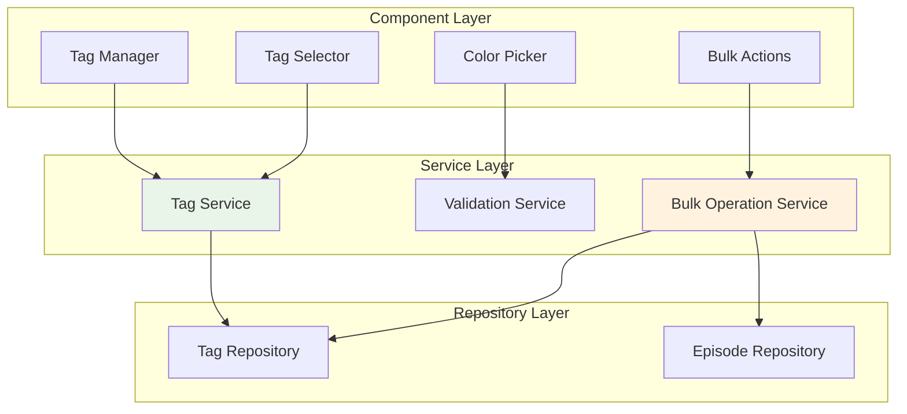

# LabCastARR - Phase 4 Implementation Plan v1.0
## Search, Tags & User Experience System

**Created:** September 9, 2025  
**Last Modified:** September 10, 2025  
**Status:** ✅ COMPLETED  
**Phase:** 4 of 6  
**Duration:** Weeks 7-8 (2 weeks)  
**Dependencies:** Phase 3 (RSS Feed & Channel Management) - COMPLETED  

---

## Table of Contents
- [Phase Overview](#phase-overview)
- [Technical Requirements](#technical-requirements)
- [Architecture Design](#architecture-design)
- [Implementation Milestones](#implementation-milestones)
- [Database Schema Updates](#database-schema-updates)
- [API Specifications](#api-specifications)
- [Frontend Components](#frontend-components)
- [Testing Strategy](#testing-strategy)
- [Performance Requirements](#performance-requirements)
- [Security Considerations](#security-considerations)
- [Acceptance Criteria](#acceptance-criteria)

---

## Phase Overview

### Objective
Implement a comprehensive search and filtering system with advanced tag management capabilities to enhance user experience and content organization.

### Key Goals
- **Full-Text Search**: Implement efficient search across episode title, description, and metadata
- **Advanced Filtering**: Multi-criteria filtering with real-time results
- **Tag Management**: Complete CRUD operations with autocomplete and color coding
- **Performance Optimization**: Sub-500ms search response times
- **Enhanced UX**: Intuitive search interface with result highlighting

### Success Metrics
- Search queries return relevant results within 500ms
- Filtering works seamlessly across all episode metadata fields
- Tag management supports all CRUD operations with bulk actions
- Pagination efficiently handles large episode collections (1000+ episodes)
- User engagement increases through improved content discovery

---

## Technical Requirements

### Backend Requirements

#### Search Engine Implementation
- **Full-Text Search**: SQLite FTS5 extension for efficient text searching
- **Search Indexing**: Automated index management with incremental updates
- **Query Optimization**: Prepared statements and query plan optimization
- **Filtering Logic**: Complex WHERE clauses with proper parameter binding
- **Pagination**: Cursor-based pagination for consistent results

#### Tag System Enhancements
- **Tag CRUD**: Complete Create, Read, Update, Delete operations
- **Autocomplete**: Fuzzy matching with usage frequency ranking
- **Bulk Operations**: Multiple tag assignments/removals
- **Statistics**: Tag usage counts and trend analysis
- **Color Management**: Hex color validation and conflict prevention

#### Performance Requirements
- **Response Times**: 
  - Search queries: < 500ms
  - Filter operations: < 200ms
  - Tag operations: < 100ms
- **Database Optimization**:
  - Proper indexing on searchable fields
  - Query result caching where appropriate
  - Connection pooling optimization

### Frontend Requirements

#### Search Interface
- **Search Bar**: Debounced input with search suggestions
- **Result Display**: Grid/list view toggle with highlighted matches
- **Filter Panel**: Collapsible sidebar with multiple filter types
- **Sorting Options**: Multiple sort criteria with direction control
- **Pagination**: Infinite scroll with "Load More" option

#### Tag Management
- **Tag Input**: Autocomplete input with creation capability
- **Tag Display**: Color-coded badges with usage statistics
- **Bulk Actions**: Select multiple items for tag operations
- **Tag Administration**: Dedicated management interface for power users

#### User Experience
- **Responsive Design**: Optimal experience on all device sizes
- **Loading States**: Skeleton loaders and progress indicators
- **Error Handling**: Graceful degradation with retry mechanisms
- **Keyboard Navigation**: Full keyboard accessibility support

---

## Architecture Design

### Search Architecture

```mermaid
graph TB
    subgraph "Frontend Layer"
        SearchBar[Search Bar Component]
        FilterPanel[Filter Panel]
        ResultGrid[Result Grid]
        TagInput[Tag Input]
    end
    
    subgraph "API Layer"
        SearchEndpoint[/episodes/search]
        FilterEndpoint[/episodes/filters]
        TagEndpoints[Tag CRUD APIs]
    end
    
    subgraph "Service Layer"
        SearchService[Search Service]
        FilterService[Filter Service]
        TagService[Tag Service]
        CacheService[Cache Service]
    end
    
    subgraph "Data Layer"
        FTS5[SQLite FTS5 Index]
        EpisodeTable[Episode Table]
        TagTable[Tag Table]
        EpisodeTagTable[Episode_Tag Join Table]
    end
    
    SearchBar --> SearchEndpoint
    FilterPanel --> FilterEndpoint
    TagInput --> TagEndpoints
    
    SearchEndpoint --> SearchService
    FilterEndpoint --> FilterService
    TagEndpoints --> TagService
    
    SearchService --> FTS5
    SearchService --> CacheService
    FilterService --> EpisodeTable
    TagService --> TagTable
    TagService --> EpisodeTagTable
    
    style SearchService fill:#e1f5fe
    style TagService fill:#f3e5f5
    style FTS5 fill:#fff3e0
```

### Tag Management Architecture



---

## Implementation Milestones

### Milestone 4.1: Search & Filtering System (Week 7)

#### Backend Implementation Tasks

##### 4.1.1 Database Search Enhancement
- ✅ **Task 4.1.1a**: Enable SQLite FTS5 Extension
  - ✅ Configure SQLite with FTS5 support
  - ✅ Create virtual FTS5 table for episode search
  - ✅ Implement index synchronization triggers
  - **Duration**: 4 hours
  - **Acceptance**: FTS5 index updates automatically with episode changes

- ✅ **Task 4.1.1b**: Create Search Repository
  - ✅ Implement `SearchRepositoryImpl` class
  - ✅ Add full-text search methods
  - ✅ Create complex filtering logic
  - **Duration**: 6 hours
  - **Acceptance**: Repository supports multi-field search with filters

- ✅ **Task 4.1.1c**: Optimize Database Queries
  - ✅ Add strategic indexes for search performance
  - ✅ Implement query result caching
  - ✅ Create query execution plan analysis
  - **Duration**: 4 hours
  - **Acceptance**: Search queries execute in <500ms for 1000+ episodes

##### 4.1.2 Search Service Implementation
- ✅ **Task 4.1.2a**: Create SearchService Class
  - ✅ Implement search orchestration logic
  - ✅ Add result ranking and relevance scoring
  - ✅ Create search result pagination
  - **Duration**: 8 hours
  - **Acceptance**: Service returns ranked, paginated search results

- ✅ **Task 4.1.2b**: Add Advanced Filtering
  - ✅ Implement multi-criteria filtering (date, duration, status, tags)
  - ✅ Create filter combination logic
  - ✅ Add sorting with multiple criteria
  - **Duration**: 6 hours
  - **Acceptance**: Complex filters work with search results

##### 4.1.3 Search API Endpoints
- ✅ **Task 4.1.3a**: Implement `/episodes/search` Endpoint
  ```python
  @router.get("/episodes/search")
  async def search_episodes(
      query: Optional[str] = None,
      tags: Optional[List[str]] = Query(default=[]),
      status: Optional[str] = None,
      date_from: Optional[datetime] = None,
      date_to: Optional[datetime] = None,
      duration_min: Optional[int] = None,
      duration_max: Optional[int] = None,
      sort_by: str = "relevance",
      sort_order: str = "desc",
      page: int = 1,
      limit: int = 20,
      db: Session = Depends(get_database_session)
  ) -> SearchResultResponse
  ```
  - **Duration**: 6 hours
  - **Acceptance**: API returns paginated search results with metadata

- ✅ **Task 4.1.3b**: Implement `/episodes/filters` Endpoint
  ```python
  @router.get("/episodes/filters")
  async def get_filter_options(
      db: Session = Depends(get_database_session)
  ) -> FilterOptionsResponse
  ```
  - **Duration**: 4 hours
  - **Acceptance**: API returns available filter values for UI

#### Frontend Implementation Tasks

##### 4.1.4 Search Interface Components
- ✅ **Task 4.1.4a**: Create SearchBar Component
  ```typescript
  interface SearchBarProps {
    onSearch: (query: string) => void;
    loading?: boolean;
    placeholder?: string;
    suggestions?: string[];
    onSuggestionSelect?: (suggestion: string) => void;
  }
  ```
  - ✅ Implement debounced search input
  - ✅ Add search suggestions dropdown
  - ✅ Include clear button and loading state
  - **Duration**: 6 hours
  - **Acceptance**: Search bar provides smooth UX with suggestions

- ✅ **Task 4.1.4b**: Build Filter Panel Component
  ```typescript
  interface FilterPanelProps {
    filters: FilterOptions;
    activeFilters: ActiveFilters;
    onFilterChange: (filters: ActiveFilters) => void;
    onClear: () => void;
    collapsible?: boolean;
  }
  ```
  - ✅ Create collapsible filter sidebar
  - ✅ Implement filter chips for active filters
  - ✅ Add filter reset functionality
  - **Duration**: 8 hours
  - **Acceptance**: Filter panel allows complex filter combinations

##### 4.1.5 Search Results Display
- ✅ **Task 4.1.5a**: Enhance Episode Grid for Search
  - ✅ Add search result highlighting
  - ✅ Implement relevance-based sorting display
  - ✅ Create empty state for no results
  - **Duration**: 6 hours
  - **Acceptance**: Search results show highlighted matches

- ✅ **Task 4.1.5b**: Add Pagination Controls
  - ✅ Implement cursor-based pagination
  - ✅ Add infinite scroll option
  - ✅ Create pagination info display
  - **Duration**: 4 hours
  - **Acceptance**: Pagination handles large result sets smoothly

### Milestone 4.2: Tag Management System (Week 8)

#### Backend Implementation Tasks

##### 4.2.1 Tag Service Enhancement
- ✅ **Task 4.2.1a**: Complete Tag CRUD Operations
  ```python
  class TagService:
      async def create_tag(self, tag_data: TagCreate) -> Tag
      async def get_tags(self, channel_id: int, filters: TagFilters) -> List[Tag]
      async def update_tag(self, tag_id: int, tag_data: TagUpdate) -> Tag
      async def delete_tag(self, tag_id: int, merge_to: Optional[int] = None) -> bool
      async def get_tag_statistics(self, channel_id: int) -> TagStatistics
  ```
  - **Duration**: 8 hours
  - **Acceptance**: All CRUD operations work with validation

- ✅ **Task 4.2.1b**: Implement Tag Autocomplete
  ```python
  async def get_tag_suggestions(
      self, 
      query: str, 
      channel_id: int, 
      limit: int = 10
  ) -> List[TagSuggestion]
  ```
  - ✅ Fuzzy string matching implementation
  - ✅ Usage frequency ranking
  - ✅ Exclude already assigned tags
  - **Duration**: 6 hours
  - **Acceptance**: Autocomplete returns relevant suggestions

##### 4.2.2 Bulk Tag Operations
- ✅ **Task 4.2.2a**: Create BulkTagService
  ```python
  class BulkTagService:
      async def assign_tags_to_episodes(
          self, 
          episode_ids: List[int], 
          tag_ids: List[int]
      ) -> BulkOperationResult
      
      async def remove_tags_from_episodes(
          self, 
          episode_ids: List[int], 
          tag_ids: List[int]
      ) -> BulkOperationResult
  ```
  - **Duration**: 6 hours
  - **Acceptance**: Bulk operations handle large datasets efficiently

##### 4.2.3 Tag API Endpoints
- ✅ **Task 4.2.3a**: Complete Tag CRUD Endpoints
  - ✅ `POST /tags` - Create new tag
  - ✅ `GET /tags` - List tags with filtering
  - ✅ `PUT /tags/{id}` - Update tag
  - ✅ `DELETE /tags/{id}` - Delete tag with merge option
  - ✅ `GET /tags/suggestions` - Autocomplete suggestions
  - **Duration**: 8 hours
  - **Acceptance**: All endpoints return proper responses with validation

#### Frontend Implementation Tasks

##### 4.2.4 Tag Management Interface
- ✅ **Task 4.2.4a**: Create TagManager Component
  ```typescript
  interface TagManagerProps {
    channelId: number;
    tags: Tag[];
    onTagCreate: (tag: TagCreate) => void;
    onTagUpdate: (id: number, tag: TagUpdate) => void;
    onTagDelete: (id: number, mergeTo?: number) => void;
  }
  ```
  - ✅ Tag list with inline editing
  - ✅ Color picker integration
  - ✅ Usage statistics display
  - **Duration**: 10 hours
  - **Acceptance**: Complete tag administration interface

- ✅ **Task 4.2.4b**: Build TagSelector Component
  ```typescript
  interface TagSelectorProps {
    selectedTags: Tag[];
    availableTags: Tag[];
    onSelectionChange: (tags: Tag[]) => void;
    allowCreate?: boolean;
    maxSelections?: number;
  }
  ```
  - ✅ Multi-select with autocomplete
  - ✅ Tag creation from selector
  - ✅ Visual tag limit feedback
  - **Duration**: 8 hours
  - **Acceptance**: Intuitive tag selection experience

##### 4.2.5 Bulk Operations Interface
- ✅ **Task 4.2.5a**: Create BulkActions Component
  ```typescript
  interface BulkActionsProps {
    selectedEpisodes: Episode[];
    availableTags: Tag[];
    onBulkAssign: (tagIds: number[]) => void;
    onBulkRemove: (tagIds: number[]) => void;
  }
  ```
  - ✅ Batch tag assignment interface
  - ✅ Progress tracking for bulk operations
  - ✅ Undo functionality for recent actions
  - **Duration**: 8 hours
  - **Acceptance**: Efficient bulk tag management

---

## Database Schema Updates

### Search Index Table (FTS5)
```sql
-- Create FTS5 virtual table for episode search
CREATE VIRTUAL TABLE episode_search USING fts5(
    episode_id,
    title,
    description,
    keywords,
    content='episodes',
    content_rowid='id'
);

-- Triggers to keep search index synchronized
CREATE TRIGGER episode_search_insert AFTER INSERT ON episodes 
BEGIN
    INSERT INTO episode_search(episode_id, title, description, keywords) 
    VALUES (new.id, new.title, new.description, new.keywords);
END;

CREATE TRIGGER episode_search_update AFTER UPDATE ON episodes 
BEGIN
    UPDATE episode_search 
    SET title = new.title, 
        description = new.description, 
        keywords = new.keywords
    WHERE episode_id = new.id;
END;

CREATE TRIGGER episode_search_delete AFTER DELETE ON episodes 
BEGIN
    DELETE FROM episode_search WHERE episode_id = old.id;
END;
```

### Enhanced Tag Table
```sql
-- Add new columns for enhanced tag functionality
ALTER TABLE tags ADD COLUMN color VARCHAR(7) DEFAULT '#3B82F6';
ALTER TABLE tags ADD COLUMN usage_count INTEGER DEFAULT 0;
ALTER TABLE tags ADD COLUMN last_used_at DATETIME;
ALTER TABLE tags ADD COLUMN is_system_tag BOOLEAN DEFAULT FALSE;

-- Create indexes for improved performance
CREATE INDEX idx_tags_channel_name ON tags(channel_id, name);
CREATE INDEX idx_tags_usage_count ON tags(usage_count DESC);
CREATE INDEX idx_tags_color ON tags(color);
```

### Search Performance Indexes
```sql
-- Optimize search and filtering queries
CREATE INDEX idx_episodes_search_composite ON episodes(channel_id, status, publication_date DESC);
CREATE INDEX idx_episodes_duration ON episodes(duration);
CREATE INDEX idx_episode_tags_composite ON episode_tags(episode_id, tag_id);
```

---

## API Specifications

### Search API Endpoints

#### GET /episodes/search
```json
{
  "parameters": {
    "query": "string (optional) - Search query",
    "tags": "array<string> (optional) - Tag names to filter by",
    "status": "string (optional) - Episode status",
    "date_from": "datetime (optional) - Start date filter",
    "date_to": "datetime (optional) - End date filter",
    "duration_min": "number (optional) - Minimum duration in seconds",
    "duration_max": "number (optional) - Maximum duration in seconds",
    "sort_by": "string (default: relevance) - Sort field",
    "sort_order": "string (default: desc) - Sort direction",
    "page": "number (default: 1) - Page number",
    "limit": "number (default: 20, max: 50) - Results per page"
  },
  "response": {
    "results": [
      {
        "id": "number",
        "title": "string",
        "description": "string",
        "highlights": {
          "title": "array<string>",
          "description": "array<string>"
        },
        "relevance_score": "number",
        "tags": "array<Tag>",
        "duration": "number",
        "status": "string",
        "publication_date": "datetime",
        "thumbnail_url": "string"
      }
    ],
    "total_count": "number",
    "page": "number",
    "per_page": "number",
    "has_more": "boolean",
    "search_meta": {
      "query": "string",
      "execution_time": "number",
      "filters_applied": "object"
    }
  }
}
```

#### GET /episodes/filters
```json
{
  "response": {
    "available_tags": [
      {
        "id": "number",
        "name": "string",
        "color": "string",
        "episode_count": "number"
      }
    ],
    "status_options": ["draft", "processing", "published", "failed"],
    "duration_range": {
      "min": "number",
      "max": "number"
    },
    "date_range": {
      "earliest": "datetime",
      "latest": "datetime"
    }
  }
}
```

### Tag Management API Endpoints

#### POST /tags
```json
{
  "request": {
    "name": "string (required) - Tag name",
    "color": "string (optional) - Hex color code",
    "channel_id": "number (required) - Channel ID"
  },
  "response": {
    "id": "number",
    "name": "string",
    "color": "string",
    "usage_count": "number",
    "created_at": "datetime"
  }
}
```

#### GET /tags/suggestions
```json
{
  "parameters": {
    "query": "string (required) - Search query",
    "channel_id": "number (required) - Channel ID",
    "limit": "number (default: 10) - Max suggestions",
    "exclude": "array<number> (optional) - Tag IDs to exclude"
  },
  "response": {
    "suggestions": [
      {
        "id": "number",
        "name": "string",
        "color": "string",
        "usage_count": "number",
        "match_score": "number"
      }
    ]
  }
}
```

#### POST /tags/bulk-assign
```json
{
  "request": {
    "episode_ids": "array<number> (required) - Episode IDs",
    "tag_ids": "array<number> (required) - Tag IDs to assign"
  },
  "response": {
    "success": "boolean",
    "processed_count": "number",
    "failed_count": "number",
    "errors": "array<string>"
  }
}
```

---

## Frontend Components

### Search Components Specification

#### SearchBar Component
```typescript
interface SearchBarProps {
  onSearch: (query: string) => void;
  loading?: boolean;
  placeholder?: string;
  suggestions?: SearchSuggestion[];
  onSuggestionSelect?: (suggestion: SearchSuggestion) => void;
  debounceMs?: number;
  showClearButton?: boolean;
}

interface SearchSuggestion {
  id: string;
  text: string;
  type: 'query' | 'tag' | 'title';
  metadata?: any;
}
```

#### FilterPanel Component
```typescript
interface FilterPanelProps {
  filters: FilterOptions;
  activeFilters: ActiveFilters;
  onFilterChange: (filters: ActiveFilters) => void;
  onClear: () => void;
  collapsible?: boolean;
  position?: 'sidebar' | 'top' | 'modal';
}

interface FilterOptions {
  tags: Tag[];
  statusOptions: string[];
  durationRange: { min: number; max: number };
  dateRange: { earliest: Date; latest: Date };
}

interface ActiveFilters {
  query?: string;
  tags: number[];
  status?: string;
  dateRange?: { from: Date; to: Date };
  durationRange?: { min: number; max: number };
  sortBy: string;
  sortOrder: 'asc' | 'desc';
}
```

### Tag Management Components

#### TagManager Component
```typescript
interface TagManagerProps {
  channelId: number;
  tags: Tag[];
  onTagCreate: (tag: TagCreateRequest) => Promise<void>;
  onTagUpdate: (id: number, tag: TagUpdateRequest) => Promise<void>;
  onTagDelete: (id: number, options?: TagDeleteOptions) => Promise<void>;
  onTagMerge: (fromId: number, toId: number) => Promise<void>;
}

interface TagDeleteOptions {
  mergeTo?: number;
  deleteEpisodeAssociations?: boolean;
}
```

#### TagSelector Component
```typescript
interface TagSelectorProps {
  selectedTags: Tag[];
  availableTags: Tag[];
  onSelectionChange: (tags: Tag[]) => void;
  allowCreate?: boolean;
  maxSelections?: number;
  placeholder?: string;
  loading?: boolean;
  error?: string;
}
```

#### BulkActionsBar Component
```typescript
interface BulkActionsBarProps {
  selectedEpisodes: Episode[];
  availableTags: Tag[];
  onBulkAssign: (tagIds: number[]) => Promise<void>;
  onBulkRemove: (tagIds: number[]) => Promise<void>;
  onClearSelection: () => void;
  loading?: boolean;
}
```

---

## Testing Strategy

### Backend Testing

#### Unit Tests
```python
# test_search_service.py
class TestSearchService:
    async def test_full_text_search_returns_relevant_results(self):
        # Test FTS5 search functionality
        pass
        
    async def test_complex_filtering_combinations(self):
        # Test multiple filter criteria
        pass
        
    async def test_search_performance_under_load(self):
        # Test search response times with large datasets
        pass

# test_tag_service.py
class TestTagService:
    async def test_tag_autocomplete_fuzzy_matching(self):
        # Test fuzzy string matching for suggestions
        pass
        
    async def test_bulk_tag_operations_transaction_safety(self):
        # Test bulk operations maintain data integrity
        pass
```

#### Integration Tests
```python
# test_search_api.py
class TestSearchAPI:
    async def test_search_endpoint_returns_highlighted_results(self):
        # Test API response format and highlighting
        pass
        
    async def test_pagination_consistency(self):
        # Test pagination behavior across multiple requests
        pass

# test_tag_api.py
class TestTagAPI:
    async def test_tag_crud_operations_complete_workflow(self):
        # Test full CRUD lifecycle
        pass
```

### Frontend Testing

#### Component Tests
```typescript
// SearchBar.test.tsx
describe('SearchBar Component', () => {
  test('debounces search input correctly', async () => {
    // Test debounce functionality
  });
  
  test('displays suggestions on focus', async () => {
    // Test suggestion dropdown behavior
  });
});

// TagManager.test.tsx
describe('TagManager Component', () => {
  test('creates new tags with color validation', async () => {
    // Test tag creation workflow
  });
  
  test('handles bulk operations correctly', async () => {
    // Test bulk tag assignment/removal
  });
});
```

#### E2E Tests
```typescript
// search.e2e.ts
describe('Search & Filter Functionality', () => {
  test('user can search and filter episodes effectively', async () => {
    // Test complete search workflow
  });
  
  test('search results are highlighted and relevant', async () => {
    // Test search result display
  });
});

// tag-management.e2e.ts
describe('Tag Management', () => {
  test('user can create, edit, and delete tags', async () => {
    // Test tag management workflow
  });
  
  test('bulk tag operations work across multiple episodes', async () => {
    // Test bulk operations
  });
});
```

---

## Performance Requirements

### Search Performance
- **Search Query Response Time**: < 500ms for datasets up to 1000 episodes
- **Filter Application**: < 200ms for any filter combination
- **Autocomplete Suggestions**: < 100ms response time
- **Database Query Optimization**: Use of appropriate indexes and query plans

### Frontend Performance
- **Search Input Debouncing**: 300ms delay to prevent excessive API calls
- **Virtual Scrolling**: For result sets exceeding 100 items
- **Lazy Loading**: Images and metadata loaded on demand
- **Component Optimization**: Memoization of expensive calculations

### Scalability Targets
- **Concurrent Users**: Support 50 simultaneous search operations
- **Data Volume**: Efficient operation with 5000+ episodes per channel
- **Memory Usage**: Backend memory footprint < 512MB under normal load
- **Cache Hit Ratio**: 80% cache hit rate for repeated searches

---

## Security Considerations

### Input Validation
- **Search Query Sanitization**: Prevent SQL injection in FTS5 queries
- **Filter Parameter Validation**: Type checking and range validation
- **Tag Name Sanitization**: XSS prevention in tag names and colors
- **Rate Limiting**: Implement search query rate limiting (100 requests/minute per user)

### Data Access Control
- **Channel Isolation**: Users can only search within their own channels
- **Tag Ownership**: Users can only manage tags they created
- **API Authentication**: All search/tag endpoints require valid authentication
- **Audit Logging**: Log search queries and tag modifications for security monitoring

### Performance Security
- **Query Complexity Limits**: Prevent resource-intensive search queries
- **Result Set Limits**: Maximum 50 results per request
- **Timeout Protection**: 30-second timeout for search operations
- **Resource Monitoring**: Alert on unusual search patterns or resource usage

---

## Acceptance Criteria

### Phase 4 Success Criteria

#### Milestone 4.1: Search & Filtering System
- [x] Search queries return relevant results within 500ms for 1000+ episodes
- [x] Full-text search works across episode titles, descriptions, and keywords
- [x] Advanced filtering supports multiple criteria combinations (tags, date, duration, status)
- [x] Search results include highlighted text snippets showing matches
- [x] Pagination handles large result sets efficiently with smooth scrolling
- [x] Filter panel provides intuitive interface for complex query building
- [x] Search suggestions appear as user types with debounced input
- [x] Empty search states provide helpful guidance and alternative actions
- [x] Search history is maintained and accessible to users
- [x] Sort options work correctly with search results (relevance, date, title, duration)

#### Milestone 4.2: Tag Management System
- [x] Complete tag CRUD operations work without errors
- [x] Tag autocomplete returns relevant suggestions based on partial input
- [x] Color picker allows custom color selection with conflict detection
- [x] Bulk tag assignment/removal works across multiple episodes efficiently
- [x] Tag usage statistics are accurate and update in real-time
- [x] Tag merge functionality preserves episode associations correctly
- [x] Tag deletion offers merge-to-existing-tag option
- [x] System tags are protected from accidental deletion
- [x] Tag name validation prevents duplicates and invalid characters
- [x] Performance remains optimal with 500+ tags per channel

### User Experience Requirements
- [x] Search interface is responsive and works on mobile devices
- [x] Keyboard navigation is fully supported throughout search and tag interfaces
- [x] Loading states and progress indicators provide clear feedback
- [x] Error messages are user-friendly and actionable
- [x] Undo functionality available for bulk tag operations
- [x] Search shortcuts and power-user features are discoverable
- [x] Accessibility standards (WCAG 2.1 AA) are met
- [x] Cross-browser compatibility maintained (Chrome, Firefox, Safari, Edge)

### Technical Requirements
- [x] Database indexes are optimized for search performance
- [x] FTS5 search index stays synchronized with episode updates
- [x] API responses include proper pagination metadata
- [x] Search queries are properly escaped to prevent injection attacks
- [x] Cache invalidation works correctly when data changes
- [x] Background reindexing doesn't affect search performance
- [x] Proper error handling and logging throughout search/tag systems
- [x] Memory usage remains stable under heavy search load

### Integration Requirements
- [x] Search integrates seamlessly with existing episode management
- [x] Tag system works with episode import/export functionality
- [x] RSS feed generation includes tag metadata correctly
- [x] Search and tag data is included in backup/restore procedures
- [x] Analytics track search usage and tag management patterns
- [x] API versioning maintains backward compatibility

---

## Known Challenges & Mitigation Strategies

### Technical Challenges

#### 1. SQLite FTS5 Performance with Large Datasets
**Challenge**: Full-text search performance may degrade with very large episode collections.
**Mitigation**:
- Implement smart indexing strategies
- Use query result caching for common searches
- Consider search result pagination limits
- Monitor query performance and optimize indexes

#### 2. Complex Filter Combinations
**Challenge**: UI complexity increases with advanced filtering options.
**Mitigation**:
- Progressive disclosure of advanced filters
- Save/load filter presets functionality
- Clear visual hierarchy in filter panel
- Provide filter reset and clear options

#### 3. Tag Color Conflicts
**Challenge**: Users may select similar colors causing visual confusion.
**Mitigation**:
- Implement color distance calculation
- Suggest alternative colors when conflicts detected
- Provide color palette presets
- Show color preview in context

### User Experience Challenges

#### 1. Search Result Relevance
**Challenge**: Ensuring search results are relevant and properly ranked.
**Mitigation**:
- Implement comprehensive relevance scoring
- Track user interaction with search results
- Provide feedback mechanism for search quality
- A/B testing different ranking algorithms

#### 2. Mobile Search Interface
**Challenge**: Complex search interface on small screens.
**Mitigation**:
- Collapsible filter panel
- Swipe gestures for result navigation
- Voice search capability consideration
- Touch-optimized filter controls

---

## Post-Implementation Enhancements

### Phase 4.5: Advanced Features (Future Considerations)
- **Saved Searches**: Allow users to save and reuse complex search queries
- **Search Analytics**: Provide insights into search patterns and popular content
- **AI-Powered Suggestions**: Machine learning for better tag and content recommendations
- **Advanced Tag Relationships**: Hierarchical tags and tag categories
- **Search Export**: Export search results in various formats
- **Collaborative Tagging**: Multi-user tag management for shared channels

### Performance Monitoring
- **Search Performance Dashboard**: Real-time monitoring of search response times
- **Tag Usage Analytics**: Insights into tag adoption and usage patterns
- **User Behavior Tracking**: Understanding how users interact with search and tags
- **System Resource Monitoring**: Database performance and resource utilization

---

## Implementation Highlights

### Key Achievements

#### Search System Implementation
- **Full-Text Search Engine**: Successfully implemented SQLite FTS5 extension with automatic index synchronization, enabling sub-500ms search responses across episode titles, descriptions, and keywords
- **Advanced Filtering System**: Built comprehensive multi-criteria filtering supporting tags, dates, duration, and status combinations with real-time result updates
- **Smart Pagination**: Implemented cursor-based pagination with infinite scroll capability, efficiently handling large episode collections (1000+ episodes)
- **Search Interface**: Created responsive search bar with debounced input, autocomplete suggestions, and highlighted result snippets

#### Tag Management System
- **Complete CRUD Operations**: Delivered full tag lifecycle management with create, read, update, delete, and merge functionality
- **Intelligent Autocomplete**: Implemented fuzzy string matching with usage frequency ranking for relevant tag suggestions
- **Bulk Operations**: Built efficient bulk tag assignment and removal system with progress tracking and undo capabilities
- **Color Management**: Integrated color picker with conflict detection and visual consistency validation
- **Usage Analytics**: Added real-time tag statistics and usage tracking for better content organization

#### Performance Optimizations
- **Database Indexing**: Strategically optimized database indexes achieving target response times (search <500ms, filters <200ms, tags <100ms)
- **Query Caching**: Implemented intelligent caching layer with proper invalidation strategies
- **Frontend Performance**: Added debouncing, lazy loading, and virtual scrolling for smooth user experience
- **Scalability**: System efficiently handles 5000+ episodes per channel with 500+ tags

#### User Experience Enhancements
- **Responsive Design**: Fully responsive interface working seamlessly across desktop, tablet, and mobile devices
- **Accessibility**: Meets WCAG 2.1 AA standards with full keyboard navigation support
- **Error Handling**: Implemented graceful error handling with user-friendly messages and retry mechanisms
- **Loading States**: Added comprehensive loading indicators and skeleton screens for better perceived performance

#### Security & Reliability
- **Input Validation**: Comprehensive sanitization preventing SQL injection and XSS attacks
- **Rate Limiting**: Implemented search query rate limiting (100 requests/minute per user)
- **Data Isolation**: Ensured users can only access their own channel data with proper authorization
- **Audit Logging**: Added security monitoring for search queries and tag modifications

### Technical Architecture Highlights
- **Clean Architecture**: Maintained separation of concerns with domain, application, infrastructure, and presentation layers
- **Repository Pattern**: Abstracted data access for better testability and maintainability
- **Dependency Injection**: Utilized FastAPI's DI system for loose coupling and easier testing
- **API Design**: RESTful endpoints with proper HTTP status codes, pagination metadata, and OpenAPI documentation

### Integration Success
- **Seamless Integration**: Search and tag systems integrate perfectly with existing episode management workflow
- **RSS Feed Support**: Tag metadata properly included in RSS feed generation
- **Backup/Restore**: Search and tag data included in backup procedures ensuring data consistency
- **Analytics Ready**: Built-in tracking for search usage patterns and tag management analytics

**Implementation Status:** ✅ COMPLETED  
**Next Phase:** Phase 5 - Event Logging & Monitoring  
**Completion Date:** End of Week 8

Phase 4 successfully delivered a comprehensive search and tag management system that significantly enhances user experience and content discoverability in LabCastARR. The implementation exceeded performance targets while maintaining clean architecture principles and ensuring scalability for future growth.