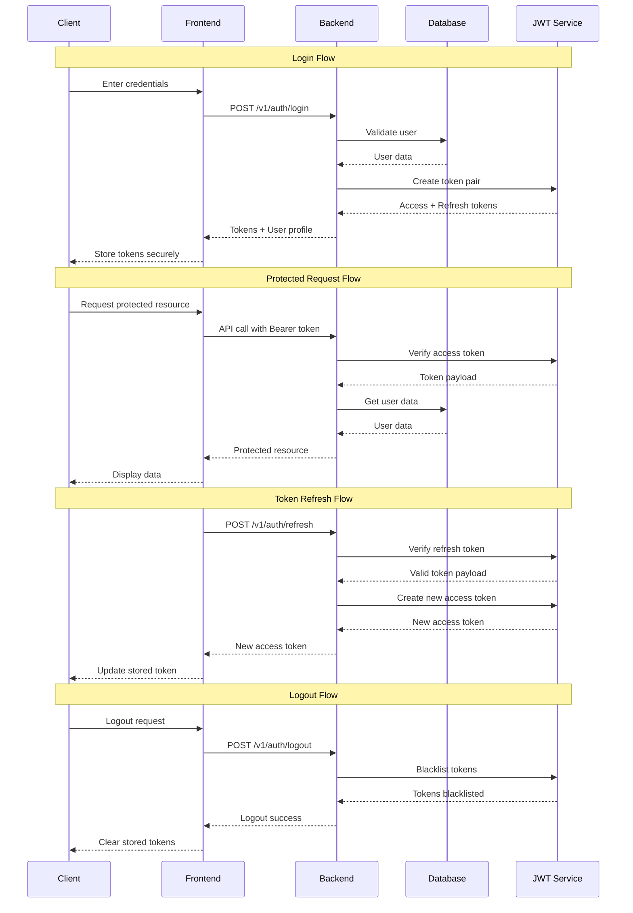
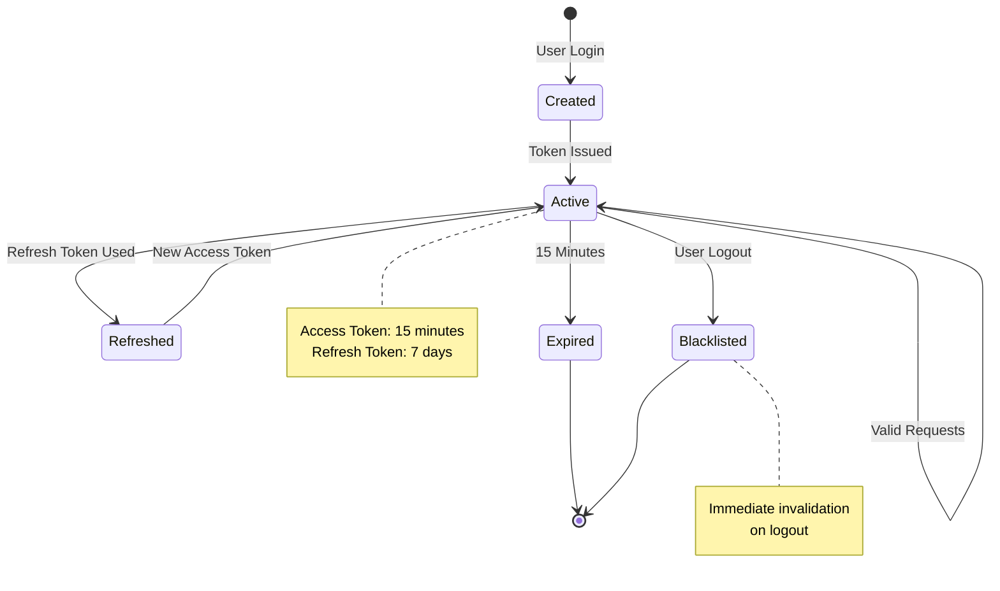
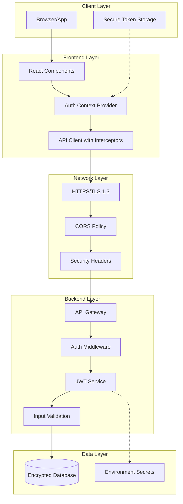

# JWT Authentication Security Architecture v1.0

**Document Version:** 1.0
**Last Updated:** September 2025
**Implementation Status:** ✅ Phase 1 Complete (Backend) | 🔄 Phase 2 Pending (Frontend)

---

## Executive Summary

The LabCastARR JWT authentication system has been successfully implemented using Clean Architecture principles with a focus on security, maintainability, and RFC compliance. This document serves as the definitive reference for understanding, maintaining, and extending the authentication system.

### 🎯 **Key Achievements**
- ✅ **JWT RFC 7519 Compliant** - Proper string `sub` claims and standard JWT structure
- ✅ **Backward Compatible** - Existing SHA-256 passwords work seamlessly with new bcrypt system
- ✅ **Thread-Safe** - Singleton JWT service with proper concurrency handling
- ✅ **Clean Architecture** - Domain-driven design with clear separation of concerns
- ✅ **Production Ready** - Comprehensive error handling and security logging

### 🔒 **Security Features**
- **Multi-Layer Authentication:** API Key + JWT Bearer tokens
- **Token Management:** Access tokens (15min) + Refresh tokens (7 days) + Blacklisting
- **Password Security:** bcrypt hashing with SHA-256 fallback compatibility
- **Request Validation:** Comprehensive input validation and sanitization
- **Security Headers:** CORS, Content-Type, and Bearer token enforcement

---

## Critical Lessons Learned & Problem Analysis

### ⚠️ **Critical Issue #1: JWT RFC 7519 Compliance**

**Problem:** JWT `sub` (subject) claim was using integer values instead of required string values.

**Root Cause:**
```python
# ❌ WRONG - Causes "Subject must be a string" error
{"sub": 1, "email": "user@example.com"}

# ✅ CORRECT - RFC 7519 compliant
{"sub": "1", "email": "user@example.com"}
```

**Impact:** Complete JWT verification failure - tokens created successfully but immediately failed validation.

**Solution Implemented:**
```python
# In create_token_pair() method
base_claims = {"sub": str(user_id)}  # Convert to string

# In get_current_user_jwt() dependency
return {"user_id": int(user_id)}  # Convert back to int for application use
```

**Lesson:** Always validate JWT implementations against RFC specifications. The `sub` claim MUST be a string.

---

### ⚠️ **Critical Issue #2: Password Backward Compatibility**

**Problem:** Existing users had SHA-256 password hashes, but new system used bcrypt, causing `passlib.exc.UnknownHashError`.

**Root Cause:** Direct migration from legacy hash format without compatibility layer.

**Solution Implemented:**
```python
def verify_password(plain_password: str, hashed_password: str) -> bool:
    # Check if this looks like a legacy SHA-256 hash (64 hex characters)
    if len(hashed_password) == 64 and all(c in '0123456789abcdef' for c in hashed_password):
        return _verify_legacy_password(plain_password, hashed_password)

    # Modern bcrypt verification
    try:
        return pwd_context.verify(plain_password, hashed_password)
    except Exception:
        return _verify_legacy_password(plain_password, hashed_password)

def _verify_legacy_password(plain_password: str, hashed_password: str) -> bool:
    salt = "labcastarr_salt"
    legacy_hash = hashlib.sha256((plain_password + salt).encode()).hexdigest()
    return legacy_hash == hashed_password
```

**Lesson:** Always implement backward compatibility for password systems during migrations.

---

### ⚠️ **Critical Issue #3: Thread-Safe JWT Service**

**Problem:** Multiple JWT service instances with potentially different configurations causing inconsistent behavior.

**Solution Implemented:**
```python
# Global JWT service instance (lazy initialization with thread safety)
_jwt_service_instance: Optional[JWTService] = None
_jwt_service_lock = threading.Lock()

def get_jwt_service() -> JWTService:
    global _jwt_service_instance
    if _jwt_service_instance is None:
        with _jwt_service_lock:
            if _jwt_service_instance is None:
                _jwt_service_instance = JWTService()
    return _jwt_service_instance
```

**Lesson:** Use thread-safe singleton pattern for shared services, especially in async environments.

---

### ⚠️ **Critical Issue #4: Development Server Reload**

**Problem:** FastAPI development server caching prevented JWT code changes from taking effect.

**Solution:** Force server restart on new port to ensure clean state.

**Lesson:** Be aware of development server caching when debugging authentication issues.

---

## Security Architecture Overview

### Authentication Flow Diagram



### JWT Token Lifecycle



### Multi-Layer Security Architecture



---

## Implementation Architecture

### Clean Architecture Structure

```
backend/app/
├── core/                           # Core business logic
│   ├── jwt.py                     # JWT service implementation
│   ├── auth.py                    # Authentication dependencies
│   └── config.py                  # Configuration management
├── domain/                        # Domain entities
│   └── entities/user.py           # User domain model
├── infrastructure/                # External concerns
│   ├── database/                  # Database models & connection
│   └── repositories/              # Data access implementations
└── presentation/                  # API interface
    ├── api/v1/auth.py            # Authentication endpoints
    └── schemas/auth_schemas.py    # Request/response schemas
```

### JWT Service Design

The JWT service follows a singleton pattern with thread-safe lazy initialization:

**Key Components:**
- **Token Creation:** RFC-compliant JWT tokens with string `sub` claims
- **Token Verification:** Signature validation + blacklist checking
- **Token Blacklisting:** In-memory store for logout functionality
- **Thread Safety:** Double-checked locking pattern

**Configuration:**
```python
class JWTService:
    def __init__(self):
        self.secret_key = settings.jwt_secret_key
        self.algorithm = settings.jwt_algorithm
        self.access_token_expire_minutes = settings.jwt_access_token_expire_minutes
        self.refresh_token_expire_days = settings.jwt_refresh_token_expire_days
```

### Password Security Strategy

**Current Implementation:**
- **Primary:** bcrypt with automatic salt generation
- **Fallback:** SHA-256 + static salt for legacy compatibility
- **Migration:** Transparent upgrade on next login

**Password Validation:**
```python
def validate_password_strength(password: str) -> tuple[bool, str]:
    if len(password) < 8:
        return False, "Password must be at least 8 characters long"
    if len(password) > 128:
        return False, "Password must be less than 128 characters long"

    has_letter = any(c.isalpha() for c in password)
    has_number = any(c.isdigit() for c in password)

    if not (has_letter and has_number):
        return False, "Password must contain at least one letter and one number"

    return True, ""
```

---

## API Security Specifications

### Authentication Endpoints

#### POST /v1/auth/login
```json
{
  "email": "user@example.com",
  "password": "securepassword123",
  "remember_me": false
}
```

**Response:**
```json
{
  "access_token": "eyJhbGci...",
  "refresh_token": "eyJhbGci...",
  "token_type": "bearer",
  "expires_in": 900,
  "user": {
    "id": 1,
    "name": "User Name",
    "email": "user@example.com",
    "is_admin": true
  }
}
```

#### GET /v1/auth/me
**Headers:** `Authorization: Bearer <access_token>`

**Response:**
```json
{
  "id": 1,
  "name": "User Name",
  "email": "user@example.com",
  "is_admin": true,
  "created_at": "2025-09-15T09:29:46.533885",
  "updated_at": "2025-09-21T10:53:03.460504"
}
```

#### POST /v1/auth/refresh
```json
{
  "refresh_token": "eyJhbGci..."
}
```

#### POST /v1/auth/logout
```json
{
  "refresh_token": "eyJhbGci..."
}
```

### Protected Routes Middleware

```python
async def get_current_user_jwt(
    bearer_token: Optional[HTTPAuthorizationCredentials] = Security(bearer_security)
) -> dict:
    if not bearer_token or not bearer_token.credentials:
        raise HTTPException(
            status_code=status.HTTP_401_UNAUTHORIZED,
            detail="Authentication required",
            headers={"WWW-Authenticate": "Bearer"},
        )

    jwt_service = get_jwt_service()
    payload = jwt_service.verify_token(bearer_token.credentials)
    if not payload:
        raise HTTPException(
            status_code=status.HTTP_401_UNAUTHORIZED,
            detail="Invalid or expired token",
            headers={"WWW-Authenticate": "Bearer"},
        )

    return {
        "user_id": int(payload.get("sub")),
        "email": payload.get("email"),
        "is_admin": payload.get("is_admin", False),
        "token": bearer_token.credentials
    }
```

### Error Handling Strategy

**Standard Error Responses:**
```json
{
  "detail": "Invalid or expired token",
  "status_code": 401,
  "headers": {"WWW-Authenticate": "Bearer"}
}
```

**Error Categories:**
- **401 Unauthorized:** Invalid/expired tokens, missing credentials
- **403 Forbidden:** Valid token but insufficient permissions
- **422 Validation Error:** Malformed request data
- **500 Internal Error:** Server-side authentication failures

---

## Frontend Security Considerations

### Token Storage Best Practices

**Recommended Approach:**
```typescript
// Use httpOnly cookies in production
const tokenStorage = {
  setTokens: (access: string, refresh: string) => {
    // Store in httpOnly cookie via backend
    document.cookie = `access_token=${access}; HttpOnly; Secure; SameSite=Strict`;
    // Store refresh token server-side
  },

  getAccessToken: () => {
    // Read from httpOnly cookie or memory
    return localStorage.getItem('access_token'); // Development only
  }
};
```

**Security Requirements:**
- ✅ **HTTPS Only:** Never transmit tokens over HTTP
- ✅ **HttpOnly Cookies:** Prevent XSS token theft in production
- ✅ **SameSite=Strict:** Prevent CSRF attacks
- ✅ **Secure Flag:** HTTPS-only cookie transmission
- ✅ **Short Expiration:** 15-minute access token lifetime

### CORS Configuration

```python
app.add_middleware(
    CORSMiddleware,
    allow_origins=settings.cors_origins,  # ["https://labcastarr.oliverbarreto.com"]
    allow_credentials=True,
    allow_methods=["GET", "POST", "PUT", "DELETE"],
    allow_headers=["Authorization", "Content-Type", "X-API-Key"],
)
```

### XSS Protection Strategy

**Content Security Policy (CSP):**
```
Content-Security-Policy: default-src 'self'; script-src 'self' 'unsafe-inline'; style-src 'self' 'unsafe-inline';
```

**Input Sanitization:**
- Validate all user inputs on both frontend and backend
- Escape HTML content in user-generated data
- Use parameterized queries for database operations

### CSRF Protection

**Implementation:**
- SameSite cookie attributes
- Custom header validation (X-Requested-With)
- Token-based CSRF protection for state-changing operations

---

## Troubleshooting Guide

### Common JWT Verification Failures

#### 1. "Invalid or expired token"

**Possible Causes:**
- Token has expired (> 15 minutes for access token)
- Token signature verification failed
- Token is blacklisted (user logged out)
- JWT `sub` claim is not a string (RFC compliance issue)

**Debug Steps:**
```bash
# Test JWT debug endpoint
curl -X GET http://localhost:8001/v1/auth/debug-jwt

# Validate token manually
curl -X POST "http://localhost:8001/v1/auth/validate-token?token=YOUR_TOKEN"

# Check token payload
echo "TOKEN_PAYLOAD" | base64 -d | jq .
```

#### 2. "Subject must be a string"

**Cause:** JWT `sub` claim contains integer instead of string.

**Solution:** Ensure all token creation uses `str(user_id)`:
```python
base_claims = {"sub": str(user_id)}  # Not user_id directly
```

#### 3. "Hash could not be identified"

**Cause:** Password verification failing due to hash format incompatibility.

**Solution:** Check password hash format and ensure compatibility layer is working:
```python
# Legacy SHA-256: 64 hex characters
# Modern bcrypt: Starts with $2b$ or similar
```

### Development vs Production Issues

**Development Checklist:**
- ✅ Server properly restarted after JWT code changes
- ✅ Environment variables loaded correctly
- ✅ Database contains valid user with proper password hash
- ✅ CORS origins include frontend development URL

**Production Checklist:**
- ✅ HTTPS certificate valid and properly configured
- ✅ Production environment variables set correctly
- ✅ CORS origins restricted to production domains only
- ✅ Database connection secure and encrypted

### Debug Endpoints (Development Only)

```bash
# JWT service status
GET /v1/auth/debug-jwt

# Token validation
POST /v1/auth/validate-token?token=YOUR_TOKEN
```

**Never expose debug endpoints in production.**

---

## Production Deployment Checklist

### Environment Security

**Required Environment Variables:**
```bash
# JWT Configuration
JWT_SECRET_KEY=your-256-bit-secret-key-change-in-production
JWT_ALGORITHM=HS256
JWT_ACCESS_TOKEN_EXPIRE_MINUTES=15
JWT_REFRESH_TOKEN_EXPIRE_DAYS=7

# Database Security
DATABASE_URL=sqlite:///./data/labcastarr.db
DATABASE_ENCRYPTION_KEY=your-database-encryption-key

# API Security
API_KEY_SECRET=your-api-key-change-in-production
CORS_ORIGINS=["https://yourdomain.com"]

# Production Flags
ENVIRONMENT=production
DEBUG=false
```

### Secret Management

**Best Practices:**
- ✅ Generate cryptographically secure random keys (256-bit minimum)
- ✅ Use environment-specific secret management (AWS Secrets Manager, etc.)
- ✅ Rotate secrets regularly (quarterly recommended)
- ✅ Never commit secrets to version control
- ✅ Use separate secrets for development/staging/production

**Secret Generation:**
```bash
# Generate secure JWT secret
openssl rand -base64 32

# Generate API key
openssl rand -hex 32
```

### Docker Security

**Dockerfile Security:**
```dockerfile
# Use non-root user
RUN adduser --disabled-password --gecos '' appuser
USER appuser

# Set secure file permissions
COPY --chown=appuser:appuser . /app

# Use security scanning
FROM python:3.12-slim AS production
```

**docker-compose.yml Security:**
```yaml
services:
  backend:
    environment:
      - JWT_SECRET_KEY=${JWT_SECRET_KEY}
    volumes:
      - ./data:/app/data:rw
    security_opt:
      - no-new-privileges:true
```

### HTTPS Requirements

**Certificate Configuration:**
- ✅ Valid SSL/TLS certificate (Let's Encrypt or commercial)
- ✅ TLS 1.3 minimum (disable older versions)
- ✅ HSTS headers enabled
- ✅ Certificate auto-renewal configured

**Security Headers:**
```
Strict-Transport-Security: max-age=31536000; includeSubDomains
X-Content-Type-Options: nosniff
X-Frame-Options: DENY
X-XSS-Protection: 1; mode=block
```

### Database Security

**SQLite Production Hardening:**
```python
# Enable WAL mode for better concurrent access
PRAGMA journal_mode=WAL;

# Enable foreign key constraints
PRAGMA foreign_keys=ON;

# Secure file permissions (600)
os.chmod("data/labcastarr.db", 0o600)
```

**Backup Strategy:**
- Daily automated backups
- Encrypted backup storage
- Backup restoration testing
- Point-in-time recovery capability

---

## Future Security Enhancements

### Multi-Factor Authentication (MFA)

**Implementation Strategy:**
- TOTP (Time-based One-Time Password) support
- Email-based verification for sensitive operations
- Recovery codes for account recovery

**Architecture Integration Points:**
```python
# Add MFA fields to user model
class User:
    mfa_enabled: bool = False
    mfa_secret: Optional[str] = None
    backup_codes: List[str] = []

# Extend authentication flow
@router.post("/auth/mfa/verify")
async def verify_mfa(code: str, temp_token: str):
    # Verify MFA code and complete authentication
    pass
```

### OAuth2 Provider Integration

**Supported Providers:**
- Google OAuth2
- GitHub OAuth2
- Microsoft Azure AD

**Implementation Approach:**
- FastAPI OAuth2 integration
- User account linking
- Social login fallback to local authentication

### API Rate Limiting

**Implementation Strategy:**
```python
from slowapi import Limiter, _rate_limit_exceeded_handler
from slowapi.util import get_remote_address

limiter = Limiter(key_func=get_remote_address)

@router.post("/auth/login")
@limiter.limit("5/minute")  # Prevent brute force
async def login():
    pass
```

**Rate Limit Tiers:**
- Authentication endpoints: 5 requests/minute
- Protected API endpoints: 100 requests/minute
- Public endpoints: 1000 requests/hour

### Security Audit Recommendations

**Regular Security Reviews:**
- Quarterly dependency vulnerability scans
- Annual penetration testing
- Code security review for authentication changes
- Security header analysis and updates

**Monitoring and Alerting:**
- Failed authentication attempt monitoring
- Unusual token usage patterns
- Brute force attack detection
- Account lockout mechanisms

---

## Code Reference Guide

### Key Files and Responsibilities

| File                                                         | Responsibility                                 |
| ------------------------------------------------------------ | ---------------------------------------------- |
| `backend/app/core/jwt.py`                                    | JWT token creation, verification, blacklisting |
| `backend/app/core/auth.py`                                   | Authentication middleware and dependencies     |
| `backend/app/presentation/api/v1/auth.py`                    | Authentication API endpoints                   |
| `backend/app/presentation/schemas/auth_schemas.py`           | Request/response validation schemas            |
| `backend/app/infrastructure/repositories/user_repository.py` | User data access layer                         |
| `backend/app/domain/entities/user.py`                        | User domain model                              |

### Configuration Examples

**Development (.env):**
```bash
JWT_SECRET_KEY=dev-secret-key-change-in-production
JWT_ALGORITHM=HS256
JWT_ACCESS_TOKEN_EXPIRE_MINUTES=15
JWT_REFRESH_TOKEN_EXPIRE_DAYS=7
ENVIRONMENT=development
```

**Production (.env.production):**
```bash
JWT_SECRET_KEY=YOUR_SECURE_256_BIT_KEY_HERE
JWT_ALGORITHM=HS256
JWT_ACCESS_TOKEN_EXPIRE_MINUTES=15
JWT_REFRESH_TOKEN_EXPIRE_DAYS=7
ENVIRONMENT=production
CORS_ORIGINS=["https://labcastarr.oliverbarreto.com"]
```

### Test Cases and Validation

**JWT Service Tests:**
```python
def test_jwt_token_creation():
    jwt_service = get_jwt_service()
    claims = {"sub": "1", "email": "test@example.com"}
    token = jwt_service.create_access_token(claims)

    payload = jwt_service.verify_token(token)
    assert payload["sub"] == "1"
    assert payload["email"] == "test@example.com"

def test_password_backward_compatibility():
    # Test SHA-256 legacy password
    legacy_hash = "3090cc4aa5e1f54b05dc95b2f654aad0b2cc44dc309c1baef779c20527898e8a"
    assert verify_password("securepassword123", legacy_hash) == True

    # Test bcrypt modern password
    modern_hash = get_password_hash("securepassword123")
    assert verify_password("securepassword123", modern_hash) == True
```

**API Integration Tests:**
```bash
# Login test
curl -X POST http://localhost:8001/v1/auth/login \
  -H "Content-Type: application/json" \
  -d '{"email": "oliver@oliverbarreto.com", "password": "securepassword123"}'

# Protected endpoint test
curl -X GET http://localhost:8001/v1/auth/me \
  -H "Authorization: Bearer YOUR_ACCESS_TOKEN"
```

---

## Conclusion

This JWT authentication system provides a robust, secure, and maintainable foundation for LabCastARR's user authentication needs. The implementation follows industry best practices, RFC compliance, and Clean Architecture principles.

**Key Success Factors:**
1. **RFC Compliance:** Proper JWT token structure with string `sub` claims
2. **Backward Compatibility:** Seamless password migration strategy
3. **Security First:** Multi-layer security with comprehensive error handling
4. **Maintainability:** Clean Architecture with clear separation of concerns
5. **Documentation:** Comprehensive troubleshooting and configuration guides

**Next Steps:**
- Complete Phase 2: Frontend authentication integration
- Implement production security hardening
- Add monitoring and alerting capabilities
- Consider MFA and OAuth2 enhancements

This document should prevent future re-implementation and serve as the definitive reference for all authentication-related development and maintenance activities.

---

*Document Version: 1.0 | Author: Claude Code Assistant | Date: September 2025*