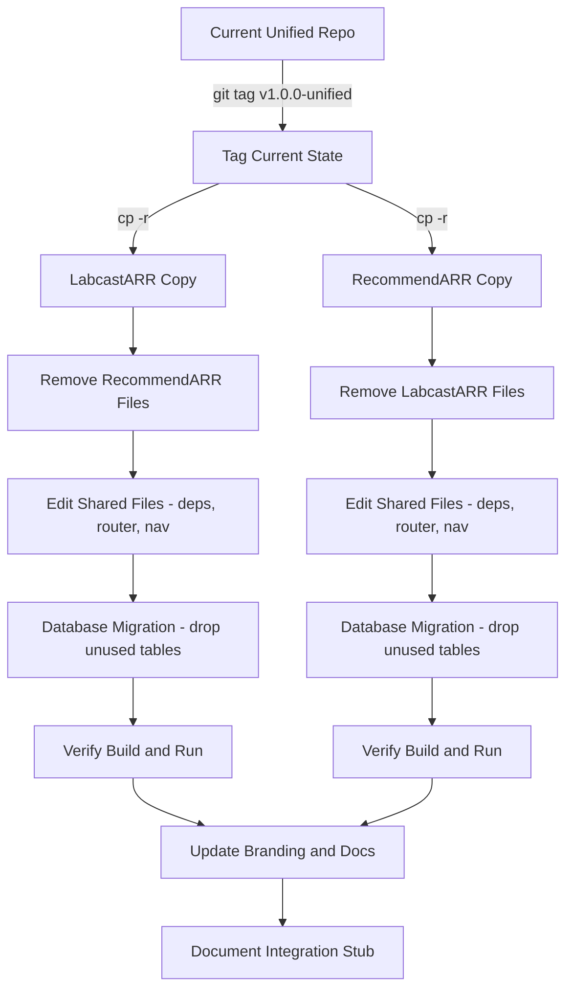

# Fork and Prune: LabcastARR / RecommendARR Separation

## Current Architecture Analysis

The codebase has a clean separation of concerns across all layers (domain, application, infrastructure, presentation). Each file can be categorized as:

- **LabcastARR-only**: Channels, episodes, RSS feeds, media, tags, search, audio download/conversion, file upload, shortcuts
- **RecommendARR-only**: Followed channels, YouTube video discovery (RSS + yt-dlp strategies), video state management, backfill
- **Shared**: Users, auth, events, notifications, celery infrastructure, UI components, layout, configuration

### Cross-Feature Integration Points (to be removed now, re-added later via API)

- `youtube_videos.episode_id` FK to `episodes.id` (when a discovered video becomes a podcast episode)
- `followed_channels.auto_approve_channel_id` FK to `channels.id`
- `create_episode_from_video_task.py` Celery task (bridges discovery to episode creation)
- YouTube metadata service (shared by both -- each app keeps its own copy)

---

## Separation Strategy

### Step 0: Preparation

- Create a clean git tag/branch on the current repo (e.g., `v1.0.0-unified`) as the last unified version
- Copy the entire project directory into two new directories: `labcastarr/` and `recommendarr/`
- Each new project gets its own fresh git repo

### Step 1: Prune RecommendARR code from LabcastARR

LabcastARR keeps all podcast management features and removes channel-following/video-discovery code.

**Backend files to REMOVE from LabcastARR:**

| Layer                | Files to Remove                                                                                                           |
| -------------------- | ------------------------------------------------------------------------------------------------------------------------- |
| Domain entities      | `followed_channel.py`, `youtube_video.py`, `notification.py`                                                              |
| Domain repos         | `followed_channel_repository.py`, `youtube_video_repository.py`                                                           |
| Domain services      | `channel_discovery_service.py`, `video_discovery_strategy.py`                                                             |
| Application services | `followed_channel_service.py`, `youtube_video_service.py`, `notification_service.py`                                      |
| Infra repositories   | `followed_channel_repository_impl.py`, `youtube_video_repository_impl.py`                                                 |
| Infra services       | `channel_discovery_service_impl.py`, `youtube_rss_service.py`, `rss_discovery_strategy.py`, `ytdlp_discovery_strategy.py` |
| Infra tasks          | `channel_check_tasks.py`, `channel_check_rss_tasks.py`, `backfill_channel_task.py`, `create_episode_from_video_task.py`   |
| DB models            | `followed_channel.py`, `youtube_video.py`, `notification.py`, `user_settings.py`                                          |
| API routes           | `followed_channels.py`, `youtube_videos.py`, `notifications.py`                                                           |
| Schemas              | `followed_channels_schemas.py`, `youtube_video_schemas.py`, `notification_schemas.py`, `user_settings_schemas.py`         |

**Backend files to EDIT in LabcastARR:**

- `core/dependencies.py` -- Remove RecommendARR dependency providers (followed*channel, youtubevideo*, notification*, user_settings*)
- `presentation/api/v1/router.py` -- Remove RecommendARR route registrations
- `infrastructure/celery_beat_schedule.py` -- Remove periodic channel-check schedules
- `main.py` -- Remove any RecommendARR-related startup logic
- Alembic migrations -- Create a new migration that drops `followed_channels`, `youtube_videos`, `user_settings`, `notifications` tables (or keep them dormant)

**Frontend files to REMOVE from LabcastARR:**

- Pages: `app/subscriptions/` (entire directory with `channels/` and `videos/` subpages)
- Components: `features/subscriptions/` (entire directory)
- Hooks: `use-followed-channels.ts`, `use-youtube-videos.ts`, `use-task-status.ts`
- Remove subscription-related types from `types/index.ts` (`FollowedChannel`, `YouTubeVideo`, `YouTubeVideoState`, `BulkActionRequest`)

**Frontend files to EDIT in LabcastARR:**

- `components/layout/main-layout.tsx` -- Remove "Subscriptions" navigation link
- `components/layout/sidepanel.tsx` -- Remove subscription nav items
- `components/layout/notification-bell.tsx` -- Remove or simplify (keep if notifications are used for episode events)
- `hooks/use-notifications.ts` -- Keep only if used for episode-related notifications, otherwise remove
- `lib/api-client.ts` -- Remove followed-channels and youtube-videos API methods
- `types/index.ts` -- Remove RecommendARR types

---

### Step 2: Prune LabcastARR code from RecommendARR

RecommendARR keeps channel following and video discovery, removes all podcast/episode management.

**Backend files to REMOVE from RecommendARR:**

| Layer                | Files to Remove                                                                                                                                                                                                                           |
| -------------------- | ----------------------------------------------------------------------------------------------------------------------------------------------------------------------------------------------------------------------------------------- |
| Domain entities      | `channel.py`, `episode.py`, `tag.py`                                                                                                                                                                                                      |
| Domain repos         | `channel.py`, `episode.py`, `tag.py`, `search_repository.py`                                                                                                                                                                              |
| Domain services      | `feed_generation_service.py`                                                                                                                                                                                                              |
| Domain value objects | `video_id.py`, `duration.py`, `audio_quality.py`                                                                                                                                                                                          |
| Application services | `channel_service.py`, `episode_service.py`, `upload_processing_service.py`, `metadata_processing_service.py`, `tag_service.py`, `bulk_tag_service.py`, `search_service.py`                                                                |
| Infra repositories   | `channel_repository.py`, `episode_repository.py`                                                                                                                                                                                          |
| Infra services       | `feed_generation_service_impl.py`, `media_file_service.py`, `upload_service.py`, `download_service.py`, `youtube_service.py`, `file_service.py`, `audio_format_selection_service.py`, `celery_download_service.py`, `itunes_validator.py` |
| Infra tasks          | `download_episode_task.py`, `create_episode_from_video_task.py`                                                                                                                                                                           |
| DB models            | `channel.py`, `episode.py`, `tag.py`                                                                                                                                                                                                      |
| API routes           | `channels.py`, `episodes.py`, `feeds.py`, `media.py`, `tags.py`, `search.py`, `shortcuts.py`                                                                                                                                              |
| Schemas              | `channel_schemas.py`, `channel_schemas_simple.py`, `episode_schemas.py`, `feed_schemas.py`, `tag_schemas.py`, `search_schemas.py`                                                                                                         |

**Backend files to EDIT in RecommendARR:**

- `core/dependencies.py` -- Remove LabcastARR dependency providers (channel*, episode*_, tag*, feed*, download, upload_, media*, search*, youtube_service, file_service)
- `presentation/api/v1/router.py` -- Remove LabcastARR route registrations
- `infrastructure/celery_beat_schedule.py` -- Keep only channel-check schedules
- `main.py` -- Remove channel/episode startup logic (default channel creation, etc.)
- `domain/entities/followed_channel.py` -- Remove `auto_approve_channel_id` reference (or keep as nullable for future API integration)
- `infrastructure/database/models/followed_channel.py` -- Remove FK to `channels.id` for auto_approve
- `infrastructure/database/models/youtube_video.py` -- Remove FK to `episodes.id`, remove `episode_id` column (or keep nullable for future integration)
- Alembic migrations -- Create a new migration that drops `channels`, `episodes`, `tags`, `episode_tags` tables

**Frontend files to REMOVE from RecommendARR:**

- Pages: `app/channel/`, `app/episodes/`, `app/settings/`, `app/search/`, `app/setup/`
- Components: `features/episodes/`, `features/channels/`, `features/settings/`, `features/feeds/`, `features/tags/`, `features/search/`, `features/media/`
- Hooks: `use-episodes.ts`, `use-channels.ts`, `use-feeds.ts`, `use-search.ts`

**Frontend files to EDIT in RecommendARR:**

- `app/page.tsx` -- Redesign home page (currently shows channel dashboard with episodes)
- `components/layout/main-layout.tsx` -- Remove channel/episode navigation links; make Subscriptions the primary navigation
- `components/layout/sidepanel.tsx` -- Remove podcast-related nav items
- `lib/api.ts` -- Remove episode, channel, tag, feed, search API methods
- `lib/api-client.ts` -- Remove episode/channel methods
- `types/index.ts` -- Remove LabcastARR types (Channel, Episode, Tag, Feed, Search)
- `hooks/use-youtube-videos.ts` -- Remove `createEpisodeFromVideo` and any episode-creation logic
- `features/subscriptions/youtube-video-card.tsx` -- Remove "Create Episode" button (replace with a placeholder for future LabcastARR integration)

---

### Step 3: Update Project Identity for Each App

**For both projects:**

- Update `README.md` with the new app name and description
- Update `CLAUDE.md` to reflect the single-concern app
- Update `package.json` name field (frontend)
- Update `pyproject.toml` name/description (backend)
- Update Docker Compose service names
- Update environment variable examples
- Update documentation in `docs/`
- Update app title/branding in the frontend layout components

---

### Step 4: Database Migration Strategy

For each app, create a **new Alembic migration** that:

- Drops tables belonging to the removed feature
- Removes orphaned indexes and foreign keys
- Keeps shared tables (`users`, `events`, `celery_task_status`) intact

Alternatively, since both apps start fresh after the fork, we could reset the migration history and create a single initial migration with only the relevant tables.

---

### Step 5: Future Integration Preparation (Stub Only)

In RecommendARR, leave a stub/placeholder in the YouTube video card UI and in the `youtube_video_service.py` for a future "Publish to LabcastARR" action that will call LabcastARR's API with a token key. No implementation now -- just a comment and a disabled UI element.

---

## Execution Order

The recommended order is to work on one app at a time, completing all pruning before moving to the next:

1. Tag the current unified repo
2. Create LabcastARR copy and prune RecommendARR code
3. Verify LabcastARR builds and runs (backend + frontend + Docker)
4. Create RecommendARR copy and prune LabcastARR code
5. Verify RecommendARR builds and runs
6. Update project identity, documentation, and branding for both
7. Document the integration stub for future work

